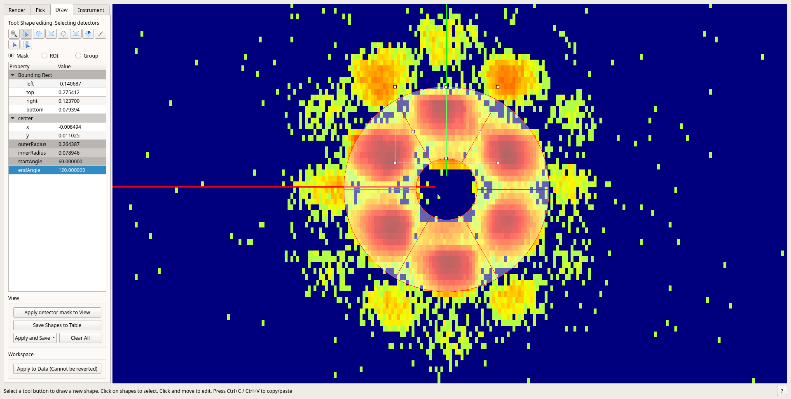

============
SANS Changes
============

.. contents:: Table of Contents
   :local:

New Features
------------

- :ref:`SANSILLReduction <algm-SANSILLReduction>` has a new property `SolventInputWorkspace`, to provide reduced solvent data to be subtracted from the sample data.
- **Sectors drawn in the instrument viewer can now be used to define wedges in** :ref:`Q1DWeighted <algm-Q1DWeighted>`.

Improvements
------------

- :ref:`SANSILLAutoProcess <algm-SANSILLAutoProcess>` has new property: `StitchReferenceIndex` to denote the index of ws that should be a reference for scaling during stitching
- :ref:`SANSILLAutoProcess <algm-SANSILLAutoProcess>` has a new property `SolventFiles`, to communicate with :ref:`SANSILLReduction <algm-SANSILLReduction>` the file names of the reduced solvent data.
- In :ref:`SANSILLAutoProcess <algm-SANSILLAutoProcess>`, the detector distance, the collimation position and the wavelength are appended to the names of the output workspaces (values are taken from the sample logs).
- :ref:`SANSILLReduction <algm-SANSILLReduction>` adds sample log information to reduced data about facility, sample transmission numor, and all SampleRuns numors, with relevant algebra.
- The core algorithm for ISIS SANS reductions underwent a significant rewrite to improve processing wavelength slices. For 15 slices the reduction time dropped by 55% compared to the previous release.
- Workspace names for ISIS SANS reductions no longer append the wavelength to the name. The prepended wavelength is still present. For example `12345_rear_1d_1.0_10.0_...p0_t4_1.0_10.0` will now be called `12345_rear_1d_1.0_10.0_...p0_t4`, where `1.0_10.0` is the wavelength of that workspace.
- ISIS SANS can load summed nexus files without requiring "-add" in the name.
- ISIS SANS can now load summed event transmission data

Bugfixes
--------

- Fix a bug that made it impossible to process flux in :ref:`SANSILLAutoProcess <algm-SANSILLAutoProcess>`.
- On D16 using :ref:`SANSILLAutoProcess <algm-SANSILLAutoProcess>`, now uses the correct monitor for normalization, fix a bug where processing transmission would yield undefined values at 90 degrees when using ThetaDependent correction, and improve the q binning used.
- Fixed the ISIS SANS interface crashing if a new row is created using the enter key, then the user immediately uses process or load without clicking away.
- ISIS SANS beam finder no longer attempts to scale LAB (and HAB) values from m into mm for LARMOR. This resolves an issue where the angle was
  incorrectly scaled by 1000 in the GUI (but correctly used the unscaled value).
  All other fields in the beam finder are still scaled into mm for LARMOR, such as tolerance and radius limits.
  Other instruments will continue to show mm for all applicable fields as per previous releases.

:ref:`Release 6.1.0 <v6.1.0>`
