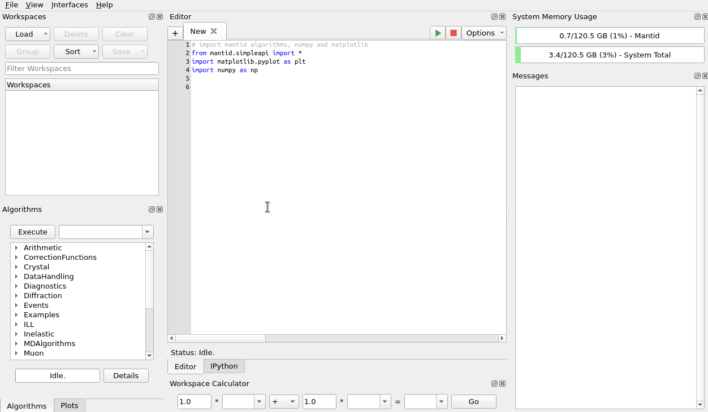
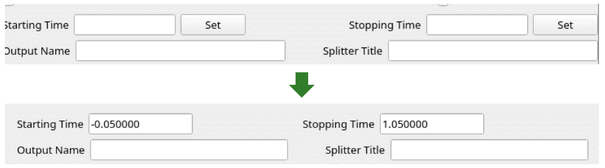

=================
Framework Changes
=================

.. contents:: Table of Contents
   :local:

Algorithms
----------

New features
############
- Algorithm :ref:`algm-SaveASCII` now supports 1D :ref:`MDHistoWorkspace`.
- Algorithm :ref:`algm-CompressEvents` is now able to combine events together in logarithmically increasing size groups.
- Algorithm :ref:`algm-PolarizationCorrectionWildes` now accepts input workspace order.
- Algorithms :ref:`algm-Abins` and :ref:`algm-Abins2D` can now import phonopy .yaml data.
  The force constants are stored in a file named ``FORCE_CONSTANTS`` or
  ``force_constants.hdf5`` in the same directory as the YAML file.
  This is recommended when using large force constants arrays as the
  YAML loader can be very slow.
- Algorithms :ref:`algm-Abins` and :ref:`algm-Abins2D` now support frozen atoms in data from GAUSSIAN.

  - Similarly to the frozen-atoms ("selective dynamics") support for
    VASP outputs, frozen atoms will be disregarded in the calculation
    of inelastic scattering structure factor.

- Algorithms :ref:`algm-Abins` and :ref:`algm-Abins2D` now support JSON file import.
  The Euphonic JSON formats are convenient to create with Python
  scripts, and recommended for users who wish to somehow customise or
  manipulate their data before using it with Abins(2D).
  Supported formats are:

  - ``AbinsData``: dump of internal object, intended for development and testing.
  - ``euphonic.QpointPhononModes``: an equivalent set of data dumped from
    the Euphonic library.
  - ``euphonic.ForceConstants``: force constants which may be manipulated
    in Euphonic, and will be converted to phonon modes on a q-point
    mesh when Abins(2D) is run.

- New algorithm :ref:`LoadErrorEventsNexus <algm-LoadErrorEventsNexus>` to load events from the ``bank_error_events`` bank of a NeXus file.
- Re-implementation of :ref:`LoadEventNexus <algm-LoadEventNexus>` when specifying the ``CompressTolerance``. This uses significantly less memory to create fewer events overall.
  However, the execution time of ``LoadEventNexus`` itself is generally longer; workflows that benefit from ``CompressEvents`` generally run faster.
- Algorithm :ref:`FindSXPeaks <algm-FindSXPeaks-v1>` supports new peak finding strategy ``AllPeaksNSigma``.
  Credits to the author of SXD2001 for the idea of using NSigma as a threshold (albeit in SXD2001 the peak finding is done in 3D).
  Gutmann, M. J. (2005). SXD2001. ISIS Facility, Rutherford Appleton Laboratory, Oxfordshire, England.
- Algorithm :ref:`FindSXPeaks <algm-FindSXPeaks-v1>` now includes validation rules to remove spurious peaks due to noise,
  by allowing user to provide additional arguments as below:

  - ``MinNBinsPerPeak``, the Minimum number of bins contributing to a peak in an individual spectrum
  - ``MinNSpectraPerPeak``, ``MaxNSpectraPerPeak`` Minimum & Maximum number of spectra contributing to a peak after they are grouped.

Bugfixes
############
- Algorithm :ref:`LoadNexusProcessed <algm-LoadNexusProcessed>` is now faster to load a NeXus file.
- Algorithm ``DSFinterp``, which was deprecated, has been removed.
- :ref:`algm-Abins` and :ref:`algm-Abins2D` no longer influence each other:

  - :ref:`algm-Abins` algorithm sets the value
    ``abins.parameters.sampling["bin_width"]`` while running. Previously this
    overrided the default sampling of :ref:`algm-Abins2D` instruments if set.
  - This did not cause results to be incorrect, but sampled
    them on a different mesh to the expected one and could limit
    resolution.
  - Now the value is saved and restored after use by :ref:`algm-Abins`; it can
    still be modified by users who wish to fiddle with the :ref:`algm-Abins2D`
    behaviour.

- Algorithm :ref:`Load <algm-Load>` now loads a single file faster.
- Algorithm :ref:`FindPeaks <algm-FindPeaks>` no longer crashes when the number of bins in the workspace are not sufficient to run :ref:`algm-SmoothData` algorithm.

Fit Functions
-------------

Bugfixes
############
- Search box for fitting functions in Fit interface no longer shows duplicate functions.
- Fit Function ``DSFinterp1DFit``, which was deprecated, has been removed.
- :ref:`func-CompositeFunction` will now throw an exception if ``getNumberDomains()`` is called and there is an inconsistent number of domains in any of the member functions.

Data Handling
-------------

New features
############
- Algorithm :ref:`algm-LoadEventAsWorkspace2D` accepts new boolean parameter ``LoadNexusInstrumentXML``. Default is *true*.
- File search/loading will now look in instrument data cache **on IDAaaS**.
  The instrument data cache is the directory ``/data/instrument/`` present on IDAaaS, and contains the same raw data as the data archive from the past 3 years.
  This new feature will speed up file loading times for external users **on IDAaaS** that do not have access to the data archive.
  Please note that if you are **not** on IDAaaS, avoid creating the directory ``/data/instrument/`` as this will trigger a search for files inside that directory.
  Here is a demonstration on IDAaaS showing that an instrument file can now be loaded even when the archive is turned off (purely for demonstration purposes):

Bugfixes
############
- Algorithm :ref:`algm-Load-v1` now guarantees that properties ``LoaderName`` and ``LoaderVersion`` are set by end of algorithm.
- Algorithm :ref:`algm-GenerateGroupingPowder` now allows just one of the properties ``GroupingWorkspace`` and ``GroupingFilename`` be set.

Data Objects
------------

New features
############
- Sped up processing of IDF XML during loading when ``side-by-side-view-location`` parameter is not used.

Python
------

New features
############
- :ref:`Peak Shapes <the-peak-shape>` (NoShape, PeakShapeSpherical, PeakShapeEllipsoid) and :meth:`mantid.api.IPeak.setPeakShape` are now exposed to Python allowing you to manually create and set the peak shapes.

Bugfixes
############
- :ref:`Filter_Events_Interface` is now stricter with inputs and no longer crashes due to invalid value of `TOF Correction To Sample`.

  - The two sliders of the interface are now prevented from crossing each other and are automatically updated from the user input, no longer requiring a `Set` button:

Dependencies
------------------

New features
############
- Dropped support for end-of-life numpy 1.22 and 1.23, and extended support to 1.25 and 1.26.

MantidWorkbench
---------------

See :doc:`mantidworkbench`.
:ref:`Release 6.10.0 <v6.10.0>`
