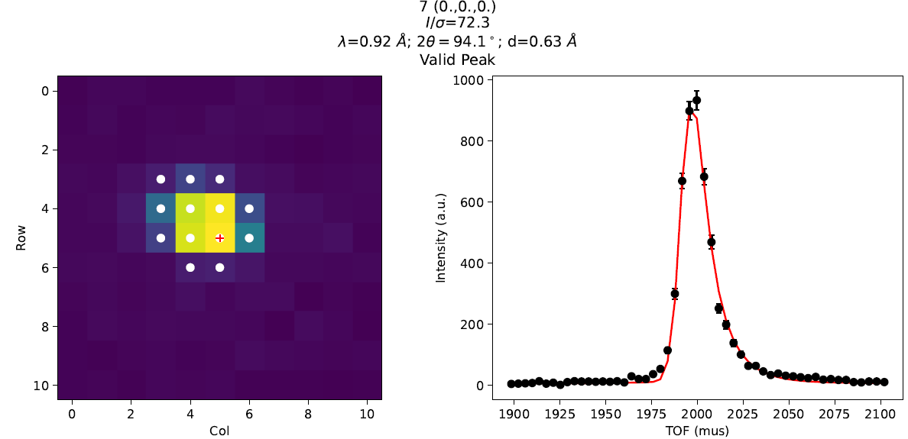

.. _v6.10.0:

===========================
Mantid 6.10.0 Release Notes
===========================

.. contents:: Table of Contents
   :local:

We are proud to announce version 6.10.0 of Mantid.

In this release, we changed the way files are loaded into Mantid:
On ISIS Data Analysis as a Service Platform (IDAaaS), loading files will look
into the instrument data cache path ``/data/instrument``
first before looking for the file on the data archive.
This change will speed up loading raw data files on IDAaaS, especially
for users who do not have access to the data archive or users whose
instrument data is not reliably accessed from the archive.
Other important highlights include:

- New algorithm :ref:`algm-IntegratePeaks1DProfile` to integrate single-crystal
  Bragg peaks in a workspace with an x-unit of TOF adapted from an algorithm in
  SXD2001 by Gutmann, M. J. (2005).
- New algorithms for supporting the polarised SANS data reduction:
  :ref:`algm-DepolarizedAnalyserTransmission`, :ref:`algm-FlipperEfficiency`
  and :ref:`algm-HeliumAnalyserEfficiency`.
- Improvements to the way Mantid handles event compression. The algorithm
  :ref:`algm-CompressEvents` now has the ability to combine events together in
  logarithmically increasing size groups.
  We re-implemented :ref:`LoadEventNexus <algm-LoadEventNexus>` when specifying the
  ``CompressTolerance`` (the execution time of
  ``LoadEventNexus`` is generally longer, but workflows using
  ``CompressEvents`` generally run faster).
- New option to find peaks using the ratio of variance/mean in
  :ref:`algm-FindSXPeaksConvolve` - this is a peak finding criterion used in
  DIALS software (Winter, G., et al. Acta Crystallographica Section D,
  Structural Biology 74.2 (2018): 85-97).
- New detector grouping options on the :ref:`interface-indirect-diffraction` interface
  (including ``All``, ``Groups``, ``Custom`` and ``File`` options).
- New way to easily load multiple files into :ref:`Elwin Tab <elwin>` of
  :ref:`Data Processor Interface <interface-inelastic-data-processor>`.
- The `Inelastic Data Analysis` interface has been renamed to the
  :ref:`Inelastic QENS Fitting <interface-inelastic-qens-fitting>` interface
  and the `Inelastic Data Manipulation` interface has been renamed to the
  :ref:`Inelastic Data Processor <interface-inelastic-data-processor>` interface.
  The new names provides better descriptions of what the interfaces do.

These are just some of the many improvements in this release, so please take a
look at the release notes, which are filled with details of the
important changes and improvements in many areas. The development team
has put a great effort into making all of these improvements within
Mantid, and we would like to thank all of our beta testers for their
time and effort helping us to make this another reliable version of Mantid.

Throughout the Mantid project we put a lot of effort into ensuring
Mantid is a robust and reliable product. Thank you to everyone that has
reported any issues to us. Please keep on reporting any problems you
have, or crashes that occur on our `forum`_.

Installation packages can be found on our `download page`_
which now links to the assets on our `GitHub release page`_, where you can also
access the source code for the release.

Citation
--------

Please cite any usage of Mantid as follows:

- *Mantid 6.10.0: Manipulation and Analysis Toolkit for Instrument Data.; Mantid Project*. `doi: 10.5286/SOFTWARE/MANTID6.10 <https://dx.doi.org/10.5286/SOFTWARE/MANTID6.10>`_

- Arnold, O. et al. *Mantid-Data Analysis and Visualization Package for Neutron Scattering and mu-SR Experiments.* Nuclear Instruments
  and Methods in Physics Research Section A: Accelerators, Spectrometers, Detectors and Associated Equipment 764 (2014): 156-166
  `doi: 10.1016/j.nima.2014.07.029 <https://doi.org/10.1016/j.nima.2014.07.029>`_
  (`download bibtex <https://raw.githubusercontent.com/mantidproject/mantid/master/docs/source/mantid.bib>`_)

Changes
-------

.. toctree::
   :hidden:
   :glob:

   *

- :doc:`Framework <framework>`
- :doc:`Mantid Workbench <mantidworkbench>`
- :doc:`Diffraction <diffraction>`
- :doc:`Muon Analysis <muon>`
- Low Q

  - :doc:`Reflectometry <reflectometry>`

  - :doc:`SANS <sans>`
- Spectroscopy

  - :doc:`Direct Geometry <direct_geometry>`

  - :doc:`Indirect Geometry <indirect_geometry>`

  - :doc:`Inelastic <inelastic>`

Full Change Listings
--------------------

For a full list of all issues addressed during this release please see the `GitHub milestone`_.

.. _download page: https://download.mantidproject.org

.. _forum: https://forum.mantidproject.org

.. _GitHub milestone: https://github.com/mantidproject/mantid/pulls?utf8=%E2%9C%93&q=is%3Apr+milestone%3A%22Release+6.10%22+is%3Amerged

.. _GitHub release page: https://github.com/mantidproject/mantid/releases/tag/v6.10.0
