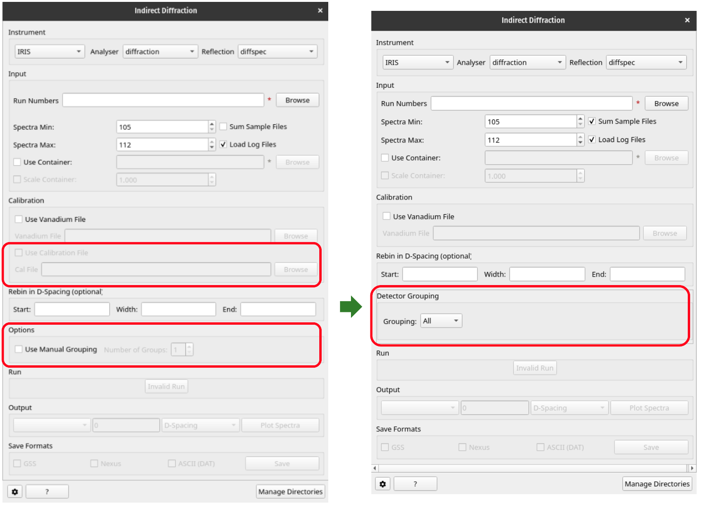

=========================
Indirect Geometry Changes
=========================

.. contents:: Table of Contents
   :local:

New Features
------------
- Algorithm :ref:`algm-ISISIndirectEnergyTransfer` now has sample logs for multiple run reductions. The ``run_number`` log stores the run numbers used in the reduction, separated by commas. The ``multi_run_reduction`` log informs about the reduction done on chopped runs or regular runs.
- Reduced output workspace of algorithm :ref:`algm-ISISIndirectEnergyTransfer` with multiple runs now has string with first and last run numbers.
- :ref:`interface-indirect-diffraction` interface now supports ``File``, ``Custom`` and ``Groups`` detector grouping for all instruments.

Bugfixes
--------
- :ref:`interface-indirect-data-reduction` on old TOSCA data no longer throws out-of-range error.
- Masking detectors in the :ref:`algm-ISISIndirectEnergyTransfer` no longer masks the wrong spectrum on old TOSCA data.
  The algorithm now uses spectra indices instead of workspace indices, accounting for shifts in the position of spectra after the mask is calculated.
- :ref:`ISIS Energy Transfer tab <ISISEnergyTransfer>` no longer throws an error when providing a number of detector groups which is larger than the number of spectra in a reduction.
- :ref:`interface-indirect-data-reduction` interface now updates ``EFixed`` when switching to the ``graphite`` analyser.

Algorithms
----------

New features
############
- Algorithms :ref:`algm-ISISIndirectDiffractionReduction` and :ref:`algm-OSIRISDiffractionReduction` now support custom properties ``GroupingString``, ``GroupingFile`` and ``NGroups`` to be used for the grouping of detectors.
- Algorithm :ref:`algm-SaveAscii-v1` algorithm can now be found in the algorithm list using the ``SaveAsciiTOSCA`` alias.

Bugfixes
############
- Algorithm :ref:`algm-ISISIndirectDiffractionReduction` now calibrates vanadium files when a calibration file is not provided for OSIRIS diffspec mode.

:ref:`Release 6.10.0 <v6.10.0>`
