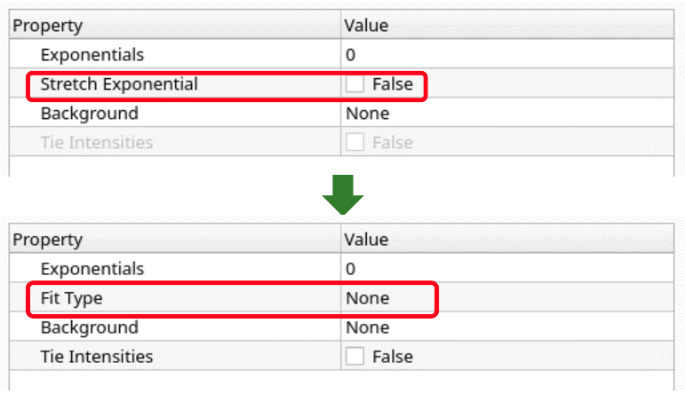
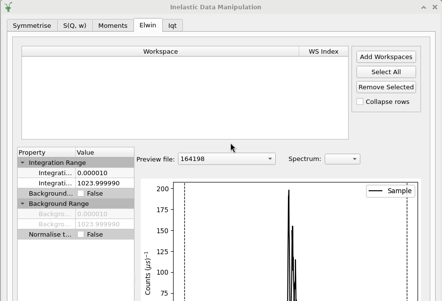

=================
Inelastic Changes
=================

.. contents:: Table of Contents
   :local:

New Features
------------
- Dialogs for selecting and opening workspaces no longer crash when setting spectra limits using a string with the format ``SpectraStart-SpectraEnd``, where Spectra Start is larger than Spectra End.
- IqtFit tab of the :ref:`interface-inelastic-qens-fitting` interface now supports new ``TeixeiraWaterIqt`` fitting function, to fit linewidth and molecular residence time in intermediate scattering functions with Teixeira's model for water.
- IqtFit tab of :ref:`interface-inelastic-qens-fitting` now has a ``Fit Type`` box for selecting a Stretched Exponential function. This allows further fit functions to be added in the future.

- Tabs where ``Open SliceViewer`` is available now support option to plot data as a 3D Surface.
- :ref:`Elwin Tab <elwin>` of  :ref:`Data Processor Interface <interface-inelastic-data-processor>` now has new workspace dialog widget with the capacity to select and open multiple compatible workspaces at once.

  - :ref:`Elwin Tab <elwin>` of  :ref:`Data Processor Interface <interface-inelastic-data-processor>` no longer has a files tab. Workspaces can still be added from files in the multifile dialog of the workspaces tab.
  - :ref:`Elwin Tab <elwin>` of  :ref:`Data Processor Interface <interface-inelastic-data-processor>` now allows to display in the workspace table either one row per spectra, or just one row per workspace.

- New documentation techniques page on :ref:`Applying absorption corrections <applying_corrections>`.
- :ref:`Inelastic Bayes Fitting <interface-inelastic-bayes-fitting>` interface is now available on a MacOS operating system.
- The `Inelastic Data Analysis` interface has been renamed to the :ref:`Inelastic QENS Fitting <interface-inelastic-qens-fitting>` interface. The new name provides a better description of what it does.

.. figure::  ../../images/6_10_release/qens-interface.png
   :width: 400px

- :ref:`interface-inelastic-data-processor` now has checkbox ``EnforceNormalization``. This option is set to ``True`` by default (no change to the current algorithms/workflow occurs). When it is set to ``False``, the ``LHSWorkspace`` from the output from ``ExtractFFTSpectrum`` is used in both branches to perform the final workspace division and the two intermediate workspace divisions are skipped.
- A deprecation warning has been added to the Calculate Paalman Pings tab of :ref:`Inelastic Corrections interface <interface-inelastic-corrections>`. This tab will be removed in two minor releases time if we are not informed otherwise.
- Algorithm :ref:`ElasticWindowMultiple <algm-ElasticWindowMultiple>` will add the integration range to the output workspaces sample logs, calling it either from script or from the :ref:`Elwin Tab <elwin>` of :ref:`Data Processor Interface <interface-inelastic-data-processor>`.
- The `Inelastic Data Manipulation` interface has been renamed to the :ref:`Inelastic Data Processor <interface-inelastic-data-processor>` interface. The new name provides a better description of what it does.

Bugfixes
--------
- :ref:`Elwin Tab <elwin>` of :ref:`interface-inelastic-data-processor` no longer crashing when all items of the table are selected with the keyboard and `Remove Selected` button is clicked.
- Add `Select All` push button on :ref:`Elwin Tab <elwin>` to select all rows when clicked.
- Fixed a bug where it wasn't possible to use a custom fit function on the IqtFit tab of :ref:`Inelastic QENS Fitting <interface-inelastic-qens-fitting>`.
- Disable ``Add`` button and change the button text to *Loading* from workspace dialogs to prevent warnings or crashes if ``Add`` button is pressed but files are still loading.
- Calling ``Open Slice Viewer`` from Indirect/Inelastic interfaces when there are less than two histograms in the workspace no longer crashes Mantid.
- Fit Property Browser of :ref:`QENS Fitting <interface-inelastic-qens-fitting>` interface no longer crashes Mantid when trying to set a fit function with a parameter having a tie to itself.
- Loading data into the F(Q)Fit tab in the :ref:`QENS Fitting interface <interface-inelastic-qens-fitting>` is now 30% faster.
- Full Function Browser and Template Function Browser no longer go out of sync on the :ref:`QENS Fitting <interface-inelastic-qens-fitting>` interface.
- :ref:`Elwin Tab <elwin>` no longer occasionally ignores properties ``Background Subtraction`` and ``Normalise to Lowest Temp``.

Algorithms
----------

New features
############
- Algorithm :ref:`algm-TransformToIqt` and :ref:`algm-CalculateIqt` has checkbox with title ``EnforceNormalization``. This option is set to ``True`` by default (no change to the current algorithms/workflow occurs). When it is set to ``False``, the ``LHSWorkspace`` from the output from ``ExtractFFTSpectrum`` is used in both branches to perform the final workspace division and the two intermediate workspace divisions are skipped.

:ref:`Release 6.10.0 <v6.10.0>`
