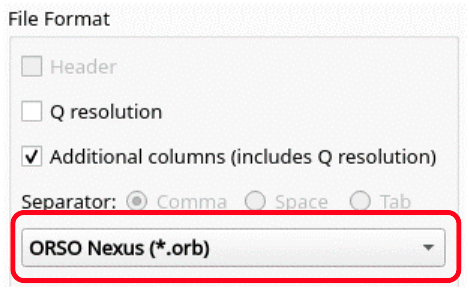

=====================
Reflectometry Changes
=====================

.. contents:: Table of Contents
   :local:

New Features
------------
- Increased the time between polling for new runs when using the Autoprocessing feature in the :ref:`ISIS Reflectometry GUI<interface-isis-refl>` from 15 seconds to 30 seconds.
- Algorithm :ref:`algm-SaveISISReflectometryORSO` is now able to save into either the ASCII or Nexus format. The :ref:`Save tab<refl_save>` (formerly the Save ASCII tab) has been re-named and updated to offer ORSO Nexus as an additional save format:

- Algorithm :ref:`algm-SaveISISReflectometryORSO` now outputs the individual angle and transmission files, flood correction files, calibration files and the reduction script in the ORSO file metadata.
- Algorithm :ref:`algm-SaveISISReflectometryORSO` is now able to save multiple datasets to a single file. Note that as part of this change the InputWorkspace parameter has been renamed to WorkspaceList and takes a comma separated list of workspace names. Existing scripts that call the algorithm will need to be updated to use this new parameter name. The :ref:`Save tab<refl_save>` has been updated with additional checkbox options to support this new functionality when saving in the ORSO format.

Bugfixes
--------
- Fixed a bug where it was not possible to pause execution of a batch of table rows.

:ref:`Release 6.10.0 <v6.10.0>`
