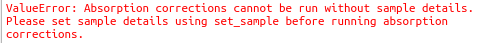
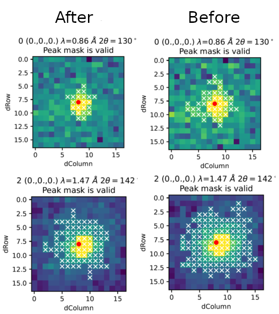
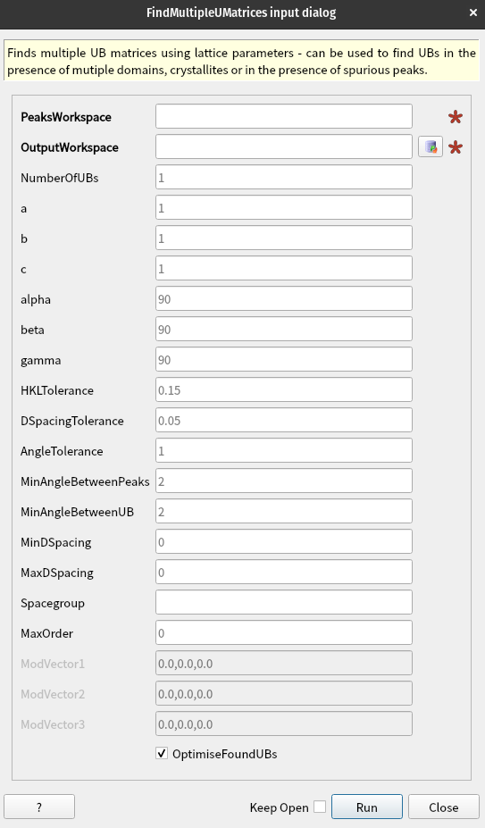

===================
Diffraction Changes
===================

.. contents:: Table of Contents
   :local:

Powder Diffraction
------------------

New features
############
- Algorithm :ref:`AlignAndFocusPowder <algm-AlignAndFocusPowder>` now supports logarithmic compression.
- Algorithm :ref:`AlignAndFocusPowderFromFiles <algm-AlignAndFocusPowderFromFiles>` now takes advantage of a new compression technique in :ref:`LoadEventNexus <algm-LoadEventNexus>` and :ref:`AlignAndFocusPowder <algm-AlignAndFocusPowder>`.
- Algorithm :ref:`SNSPowderReduction <algm-SNSPowderReduction>` now takes advantage of a new compression technique in :ref:`AlignAndFocusPowderFromFiles <algm-AlignAndFocusPowderFromFiles>` and :ref:`AlignAndFocusPowder <algm-AlignAndFocusPowder>`.
- Algorithm :ref:`LoadEventAndCompress <algm-LoadEventAndCompress>` now takes advantage of a new compression technique in :ref:`LoadEventNexus <algm-LoadEventNexus>`.
- Algorithms :ref:`FitPeaks <algm-FitPeaks>` and :ref:`PDCalibration <algm-PDCalibration>` now do a check after the fit for the minimum signal-to-sigma ratio, where peaks with a signal below the provided threshold will be rejected.
- :ref:`HRPD reduction scripts <isis-powder-diffraction-hrpd-ref>` now support the boolean option ``fit_prompt_pulse`` to fit and subtract prompt pulse (as opposed to the default method of masking of prompt pulse in TOF).
  You can either specify this option in the configuration file or with ``hrpd.HRPD(fit_prompt_pulse=True)``.

Bugfixes
############
- Algorithm :ref:`AlignAndFocusPowder <algm-AlignAndFocusPowder-v1>` now runs compression when ``logarithmic`` is selected.
- Applying absorption correction with missing sample details in :ref:`powder diffraction scripts <isis-powder-diffraction-ref>` now displays a clearer error message:

- Algorithm :ref:`DiffractionFocussing <algm-DiffractionFocussing-v2>` is now properly accumulating data when :ref:`CompressEvents <algm-CompressEvents-v1>` is run prior to it in ``PreserveEvents=False`` mode.
- Algorithm :ref:`PPDCalibration <algm-PDCalibration-v1>` is once again masking input pixels with empty event lists (bug was present since 6.9.0).
- :ref:`Calibration Diagnostics <Calibration Diagnostics>` plotting now successfully extracts the solid angle of detectors.
- :ref:`Polaris diffraction <isis-powder-diffraction-polaris-ref>` routine ``create_total_scattering_pdf`` no longer causes an unhandled error when calculating cross-sections of multi-atom unit cells for pdf normalisation.

Engineering Diffraction
-----------------------

Bugfixes
############
- The :ref:`fitting tab <ui engineering fitting>` of the :ref:`Engineering Diffraction interface<Engineering_Diffraction-ref>` no longer crashes when a fit is re-run for a function like a ``PseudoVoigt`` that contains a ``FWHM`` parameter as the peak function.

Single Crystal Diffraction
--------------------------

New features
############
- New algorithm :ref:`RotateSampleShape <algm-rotatesampleshape>` that defines the initial orientation of a sample with respect to the beam and instrument.
- :ref:`IntegratePeaksSkew <algm-IntegratePeaksSkew>` is better at determining background bins by minimising third-moment (skew).
  This is achieved by forcing skew > 0 (minimum skew we would expect in background).
  This change stops peak mask of :ref:`IntegratePeaksSkew <algm-IntegratePeaksSkew>` including too many pixels due to small diffuse scattering:

- New option not to integrate peaks that include a masked detector in the following algorithms:

  - :ref:`IntegratePeaksSkew <algm-IntegratePeaksSkew>`
  - :ref:`IntegratePeaksShoeboxTOF <algm-IntegratePeaksShoeboxTOF>`
  - :ref:`IntegratePeaks1DProfile <algm-IntegratePeaks1DProfile>`

- ISIS single-crystal reduction classes now have the method ``find_consistent_ub`` to find a UB that preserves indexing given a reference workspace (at different goniometer angle(s)).
- ISIS single-crystal reduction classes now have the method ``optimize_goniometer_axis`` to optimise the goniometer axes and angles given a sequence of workspaces at different goniometer angle with consistent UBs.
- ISIS single-crystal reduction classes now have the method ``calc_absorption_weighted_path_lengths`` that calculates tbar for each peak (saved in a column of the table) and optionally apply an attenuation correction to the integrated intensity of each peak.
  By default the correction will be applied if the class has the property ``scale_integrated = True``.
- Algorithm :ref:`AddAbsorptionWeightedPathLengths <algm-AddAbsorptionWeightedPathLengths>` now allows lean peaks to be used.
  There is also an option to apply the correction.
- New algorithm :ref:`FindMultipleUMatrices <algm-FindMultipleUMatrices>` to find multiple UB matrices (given lattice parameters) for samples with multiple domains or spurious peaks.

  - This algorithm will use the lattice parameters and spacegroup provided to optimise a number (``NumberOfUBs``)
    of UB matrices (B is hard-coded due to the lattice parameters provided) and return a group of peak workspaces
    (one for each UB) containing the peaks that are indexed most accurately by that UB.
    The algorithm is useful for finding a single UB in the presence of spurious peaks, or finding multiple UBs when there
    are multiple domains.

- Algorithm :ref:`ShowPossibleCells <algm-ShowPossibleCells>` now has a new output property, ``Cells``, that includes the cell information.
- New algorithm :ref:`SaveMDHistoToVTK <algm-SaveMDHistoToVTK>` that saves a :ref:`MDHistoWorkspace <MDHistoWorkspace>` as a ``VTK`` file so that it can be visualized by ``Paraview``.
- :ref:`IntegratePeaksShoeboxTOF <algm-IntegratePeaksShoeboxTOF>` has improved optimisation for shoebox position - would previously be centred on nearby stronger peaks if present.
- Execution time of :ref:`IntegratePeaks1DProfile <algm-IntegratePeaks1DProfile>` is at least 10 times faster.

Bugfixes
############
- :ref:`LoadWANDSCD <algm-LoadWANDSCD>` now keeps the ``sgl`` and ``sgu`` angles set by the goniometer.
- :ref:`ConverWANDSCDToQ <algm-ConvertWANDSCDToQ>` simplifies the underlying code by using histograms directly.

:ref:`Release 6.11.0 <v6.11.0>`
