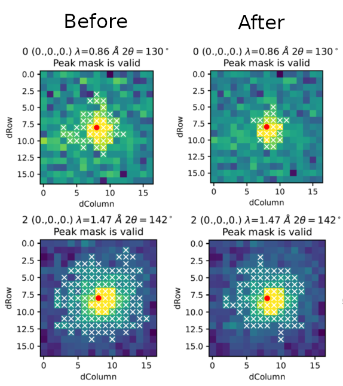

.. _v6.11.0:

===========================
Mantid 6.11.0 Release Notes
===========================

.. contents:: Table of Contents
   :local:

We are proud to announce version 6.11.0 of Mantid.

In this release we gave extra attention to fixing bugs and improving algorithms (for example by making them run faster or use less memory).
We also added several new algorithms. These are the highlights for this release:

- There is a new :ref:`Deprecation Policy <deprecation_policy>` for Mantid.
  One of the main changes is that we will deprecate algorithms that have not been used for 3 years or more.
- For single crystal diffraction, we added a new algorithm :ref:`FindMultipleUMatrices <algm-FindMultipleUMatrices>`
  to find multiple UB matrices when given lattice parameters for sample with multiple domains or spurious peaks.
- Also for single crystal diffraction,  :ref:`IntegratePeaksSkew <algm-IntegratePeaksSkew>` is better at determining background bins by minimising third-moment (skew).
  This is achieved by forcing skew > 0 (minimum skew we would expect in background).
  This change stops peak mask of :ref:`IntegratePeaksSkew <algm-IntegratePeaksSkew>` including too many pixels due to small diffuse scattering (seen in the figure above).
- For powder diffraction, the algorithms
  :ref:`AlignAndFocusPowder <algm-AlignAndFocusPowder>`,
  :ref:`AlignAndFocusPowderFromFiles <algm-AlignAndFocusPowderFromFiles>`,
  :ref:`SNSPowderReduction <algm-SNSPowderReduction>` and
  :ref:`LoadEventAndCompress <algm-LoadEventAndCompress>`
  were updated to use logarithmic compression, which uses less memory.
- For reflectometry, we added a new algorithm :ref:`algm-PolarizationEfficienciesWildes` for calculating the efficiencies of the polarizing components of an instrument with two flippers.
  This algorithm implements the approach from the A. R. Wildes 2006 paper `doi: 10.1080/10448630600668738 <https://doi.org/10.1080/10448630600668738>`_.
- For SANS, we added new algorithm :ref:`PolarizerEfficiency <algm-PolarizerEfficiency-v1>` for calculating the efficiency of a polariser.
- For Inelastic, renamed tabs of :ref:`QENS Fitting <interface-inelastic-qens-fitting>` from ``MSD Fit``, ``I(Q,t) Fit``, ``ConvFit`` and ``F(Q)`` to ``MSD``, ``I(Q,t)``, ``Convolution`` and ``Function(Q)`` respectively.
- For Inelastic, the :ref:`Elwin Tab <elwin>` of  :ref:`Data Processor Interface <interface-inelastic-data-processor>` now includes access to the Slice Viewer or 3D Plot from the output plot widget of the output workspaces containing more than 1 histogram.
- Again for Inelastic, :ref:`QENS Fitting Interface <interface-inelastic-qens-fitting>` now allows loading a ``_Result`` workspace from the ``I(Q, t)`` fitting tab into the ``Function (Q)`` fitting tab if one of the fit parameters is A0.
- Finally, for developers, the Mantid developer environments are now created using a new ``mantid-developer`` Conda meta-package, hosted on our Conda channel.
  This change does not affect users but greatly simplifies our development process, as package dependencies are now automatically sorted on different operating systems.

These are just some of the many improvements in this release, so please take a
look at the release notes, which are filled with details of the
important changes and improvements in many areas. The development team
has put a great effort into making all of these improvements within
Mantid, and we would like to thank all of our beta testers for their
time and effort helping us to make this another reliable version of Mantid.

Throughout the Mantid project we put a lot of effort into ensuring
Mantid is a robust and reliable product. Thank you to everyone that has
reported any issues to us. Please keep on reporting any problems you
have, or crashes that occur on our `forum`_.

Installation packages can be found on our `download page`_
which now links to the assets on our `GitHub release page`_, where you can also
access the source code for the release.

Citation
--------

Please cite any usage of Mantid as follows:

- *Mantid 6.11.0: Manipulation and Analysis Toolkit for Instrument Data.; Mantid Project*. `doi: 10.5286/SOFTWARE/MANTID6.11 <https://dx.doi.org/10.5286/SOFTWARE/MANTID6.11>`_

- Arnold, O. et al. *Mantid-Data Analysis and Visualization Package for Neutron Scattering and mu-SR Experiments.* Nuclear Instruments
  and Methods in Physics Research Section A: Accelerators, Spectrometers, Detectors and Associated Equipment 764 (2014): 156-166
  `doi: 10.1016/j.nima.2014.07.029 <https://doi.org/10.1016/j.nima.2014.07.029>`_
  (`download bibtex <https://raw.githubusercontent.com/mantidproject/mantid/master/docs/source/mantid.bib>`_)

Changes
-------

.. toctree::
   :hidden:
   :glob:

   *

- :doc:`Framework <framework>`
- :doc:`Mantid Workbench <mantidworkbench>`
- :doc:`Diffraction <diffraction>`
- :doc:`Muon Analysis <muon>`
- Low Q

  - :doc:`Reflectometry <reflectometry>`

  - :doc:`SANS <sans>`
- Spectroscopy

  - :doc:`Direct Geometry <direct_geometry>`

  - :doc:`Indirect Geometry <indirect_geometry>`

  - :doc:`Inelastic <inelastic>`

Full Change Listings
--------------------

For a full list of all issues addressed during this release please see the `GitHub milestone`_.

.. _download page: https://download.mantidproject.org

.. _forum: https://forum.mantidproject.org

.. _GitHub milestone: https://github.com/mantidproject/mantid/pulls?utf8=%E2%9C%93&q=is%3Apr+milestone%3A%22Release+6.11%22+is%3Amerged

.. _GitHub release page: https://github.com/mantidproject/mantid/releases/tag/v6.11.0
