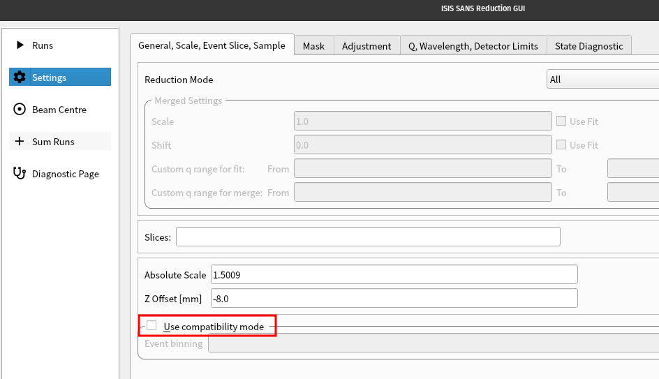

============
SANS Changes
============

.. contents:: Table of Contents
   :local:

New Features
------------
- The :ref:`compatibility_mode` feature in the :ref:`ISIS SANS GUI <ISIS_Sans_interface_contents>` is no longer selected by default.
  This feature should be considered deprecated and will be removed completely in a future release.

- New algorithm :ref:`PolarizerEfficiency <algm-PolarizerEfficiency-v1>` for calculating the efficiency of a polariser.

Bugfixes
--------
- Fix the calculation in algorithm :ref:`algm-HeliumAnalyserEfficiency` to calculate the efficiency using the mid-point of the wavelength bins.
  The error calculation now also propagates the uncertainty in the wavelength.
- Event binning tooltips have been improved to clarify :ref:`compatibility_mode` and the effect of leaving the text entry blank.
- The plot results checkbox is now hidden by default to prevent issues when both scaling and plot results are enabled.
  You can enable it via your properties file if needed.
  This change will help us decide whether to keep it hidden or fix the underlying issue.
- The ``Optimize Event Slices`` checkbox has been removed from the ``General, Scale, Event Slice, Sample`` settings on
  the ISIS SANS :ref:`ISIS_SANS_Settings_Tab-ref` menu to avoid an issue with the ``SANSSingleReduction2`` algorithm
  not working.
- The ISIS SANS :ref:`ISIS_SANS_Beam_Centre_Tab-ref` no longer crashes when no direction checkbox is selected.
  Also improved the error message when this happens.

:ref:`Release 6.11.0 <v6.11.0>`
