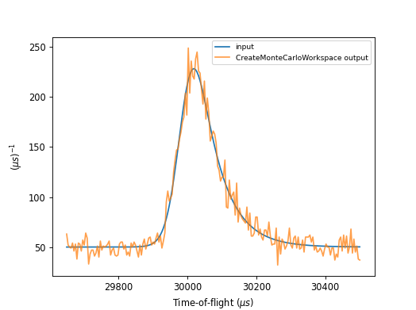

.. _v6.12.0:

===========================
Mantid 6.12.0 Release Notes
===========================

.. contents:: Table of Contents
   :local:

We are proud to announce version 6.12.0 of Mantid.

Here are some of the highlights for this release:

- Drop support for NumPy version 1. We now build against NumPy v2.0 and support up to v2.1. `Read about the changes <https://numpy.org/news/#numpy-200-released>`_. **Users should note that NumPy 2 introduces some breaking API changes. See the** `NumPy 2 Migration Guide <https://numpy.org/doc/stable/numpy_2_0_migration_guide.html>`_ **for more details.**
- :ref:`IntegratePeaks1DProfile <algm-IntegratePeaks1DProfile>` now uses :ref:`MultiDomainFunction<func-MultiDomainFunction>` to tie peak profile parameters across pixels.
- :ref:`PEARL powder <isis-powder-diffraction-pearl-ref>` has a new ``trans_custom`` focus mode. This allows the user to specify modules to include in the transverse bank focusing using the parameter ``trans_mod_nums``. The module numbers in the range 1-9 can be specified using the same string syntax as run-numbers - e.g. ``trans_mod_nums="1-3,5"`` corresponds to focusing modules 1,2,3 and 5.
- New algorithm :ref:`algm-ReflectometryISISCreateTransmission` for creating transmission workspaces that are suitable for passing to :ref:`algm-PolarizationEfficienciesWildes`.
- New algorithm :ref:`CreateMonteCarloWorkspace <algm-CreateMonteCarloWorkspace>` that creates a randomly distributed workspace by sampling from the probability distribution of the input workspace (see image above).
- Updated Matplotlib from version 3.7 to version 3.9. See release notes for `version 3.8 <https://matplotlib.org/stable/users/prev_whats_new/whats_new_3.8.0.html>`_  and `version 3.9 <https://matplotlib.org/stable/users/prev_whats_new/whats_new_3.9.0.html>`_.
- ``setPlotType()`` can now be called on Matrix Workspaces to specify the :ref:`plot type <MatrixWorkspace_Plotting>`.
- The :ref:`algorithm profiler <AlgorithmProfiler>` is now available to Linux users. To enable profiling, the :ref:`Algorithm Profiling Settings <Algorithm_Profiling>` must be set.
- :ref:`MSlice <MSlice-ref>` has a new observer for workspaces in the Analysis Data Service in Mantid. Consequently, modifications to workspaces in Mantid are now synchronised with MSlice for shared workspaces. For example, this change now ensures that a deleted workspace in Mantid is also deleted in MSlice, which mitigates a common past error of `RuntimeError: Variable invalidated, data has been deleted`. The behaviour of the MSlice interface is thereby made consistent with that of other interfaces.

These are just some of the many improvements in this release, so please take a
look at the release notes, which are filled with details of the
important changes and improvements in many areas. The development team
has put a great effort into making all of these improvements within
Mantid, and we would like to thank all of our beta testers for their
time and effort helping us to make this another reliable version of Mantid.

Throughout the Mantid project we put a lot of effort into ensuring
Mantid is a robust and reliable product. Thank you to everyone that has
reported any issues to us. Please keep on reporting any problems you
have, or crashes that occur on our `forum`_.

Installation packages can be found on our `download page`_
which now links to the assets on our `GitHub release page`_, where you can also
access the source code for the release.

Citation
--------

Please cite any usage of Mantid as follows:

- *Mantid 6.12.0: Manipulation and Analysis Toolkit for Instrument Data.; Mantid Project*. `doi: 10.5286/SOFTWARE/MANTID6.12 <https://dx.doi.org/10.5286/SOFTWARE/MANTID6.12>`_

- Arnold, O. et al. *Mantid-Data Analysis and Visualization Package for Neutron Scattering and mu-SR Experiments.* Nuclear Instruments
  and Methods in Physics Research Section A: Accelerators, Spectrometers, Detectors and Associated Equipment 764 (2014): 156-166
  `doi: 10.1016/j.nima.2014.07.029 <https://doi.org/10.1016/j.nima.2014.07.029>`_
  (`download bibtex <https://raw.githubusercontent.com/mantidproject/mantid/master/docs/source/mantid.bib>`_)

Changes
-------

.. toctree::
   :hidden:
   :glob:

   *

- :doc:`Framework <framework>`
- :doc:`Mantid Workbench <mantidworkbench>`
- :doc:`Diffraction <diffraction>`
- :doc:`Muon Analysis <muon>`
- Low Q

  - :doc:`Reflectometry <reflectometry>`

  - :doc:`SANS <sans>`
- Spectroscopy

  - :doc:`Direct Geometry <direct_geometry>`

  - :doc:`Indirect Geometry <indirect_geometry>`

  - :doc:`Inelastic <inelastic>`

Full Change Listings
--------------------

For a full list of all issues addressed during this release please see the `GitHub milestone`_.

.. _download page: https://download.mantidproject.org

.. _forum: https://forum.mantidproject.org

.. _GitHub milestone: https://github.com/mantidproject/mantid/pulls?utf8=%E2%9C%93&q=is%3Apr+milestone%3A%22Release+6.12%22+is%3Amerged

.. _GitHub release page: https://github.com/mantidproject/mantid/releases/tag/v6.12.0
