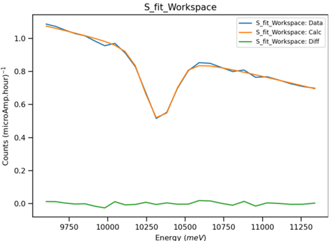

===================
Diffraction Changes
===================

.. contents:: Table of Contents
   :local:

Powder Diffraction
------------------

.. _6_13_powder_diffraction:

New features
############
- A new algorithm, :ref:`AlignAndFocusPowderSlim <algm-AlignAndFocusPowderSlim>` has been added - for VULCAN only. This
  replicates the functionality of :ref:`AlignAndFocusPowderFromFiles <algm-AlignAndFocusPowderFromFiles>`, but performs
  all the work on the events directly from the file to reduce memory usage.

- Several improvements have been made to :ref:`algm-PEARLTransfit`:

  - Perform an initial fit with a fixed ``GaussianFWHM`` for calibration runs to improve the robustness of the
    calibration.
  - Accounted for covariance in error calculation for effective temperature.
  - Added a new input parameter ``RebinInEnergy``. If False then the energy bins will be determined from the TOF bins in
    the input workspace rather than the ``Ediv`` parameter.
  - See the image for an example of the improved fit.

- Both user-defined sample and container geometry have been enabled together with the definition of gauge volume to
  account for the beam size. This has been implemented in :ref:`SNSPowderReduction <algm-SNSPowderReduction>` and
  ``mantid.utils.absorptioncorrutils``.

Bugfixes
############
- The output workspace of :ref:`algm-PDFFourierTransform-v2` now has the correct binning and the correct use of bin edge
  and bin center in the evaluated integral.
- :ref:`HB2AReduce <algm-HB2AReduce>` now handles the special case where the runs to merge do not share common columns.
- :ref:`algm-PEARLTransfit`:

  - Empty bins that were causing fits to Ta10 resonance to fail are no longer produced when using the default ``Ediv``
    value.
  - Corrected error propagation for effective and sample temperature.

Engineering Diffraction
-----------------------

New features
############
- In the :ref:`Fitting tab <ui engineering fitting>` on the
  :ref:`Engineering Diffraction interface<Engineering_Diffraction-ref>` data can now be loaded that is in d-spacing as
  well as in time-of-flight.
- A new version of :ref:`algm-PoldiAutoCorrelation-v6` has been added that supports the new, post-upgrade, detector
  geometry on POLDI (as of December 2024). For older POLDI data please use the previous version
  (:ref:`algm-PoldiAutoCorrelation-v5`) by calling the algorithm with the keyword argument ``Version=5``.
- ``poldi_utils`` contains helper functions to load post-detector upgrade POLDI data (currently ASCII format with no
  meta-data) and simulate the spectra in a :ref:`Workspace2D <Workspace2D>` from an input powder spectrum.

  - The functions can be used in a script by importing them using ``from plugins.algorithms.poldi_utils import *``.

- The :ref:`Engineering Diffraction <Engineering_Diffraction-ref>` interface's
  :ref:`Calibration <ui engineering calibration>` tab has been improved:

  - Renamed ``Crop Calibration`` to ``Set Calibration Region of Interest`` to more accurately reflect its functionality.
  - Renamed ``Custom CalFile`` to ``Custom Grouping File`` and allowed the provided file to be ``.xml`` as well as
    ``.cal``. This brings it inline with the current detector grouping IO algorithms,
    :ref:`algm-SaveDetectorsGrouping-v1` and :ref:`algm-LoadDetectorsGroupingFile-v1`.
  - Changed the naming suffix for custom file ``example_group.xml`` from ``_Custom`` to ``_Custom_example_group`` so
    they don't get overwritten when custom grouping is changed (this also makes it more clear to the user what grouping
    is being used).
  - Changed the naming suffix for a cropped spectrum list (``example_list``) from ``_Cropped`` to
    ``_Cropped_example_list`` as above.

- Added a warning to the :ref:`Focus tab <ui engineering focus>` for when the vanadium normalisation has been loaded
  from the ADS.
- The :ref:`ui engineering gsas` tab's error messages have been improved to allow easier troubleshooting of problems
  relating to the import of the GSAS-II scripting interface.

  - This also avoids using a hard-coded path, which is invalid for newer version of GSAS-II (versions 5758 and later).

- A new algorithm :ref:`algm-CreatePoleFigureTableWorkspace` has been added which creates a table with the information
  required to produce a pole figure (a collection of alphas, betas, and intensities), for use in texture analysis.

Bugfixes
############
- The ``Rietveld`` option in the :ref:`GSAS-II UI <ui engineering gsas>` ``Refinement Method`` combo box has been
  disabled - only ``Pawley`` refinements are currently supported.
- When Focusing, either within the interface or in a script, you should no longer be able to unknowingly apply an
  outdated vanadium correction.

  - Previously, when focusing had already been run on a user defined region of interest (Custom or Cropped), the
    vanadium correction was calculated and saved in the ADS as ``engggui_curves_Custom`` or ``engggui_curves_Cropped``.
    If this ROI was then updated and recalibrated, when focus was run again, it would load the existing
    ``engggui_curves`` from the ADS which would be from the old ROI. Now, the naming of these files should be more
    unique to the specific ROI, and in the case where a file is loaded from the ADS which may be wrong, a warning is
    supplied to the user.

- ``CEO2.cif``, no longer contains a formatting issue which was causing a loop error when trying to load into Mantid
  Workbech using ``LoadCIF``.
- Add ``<side-by-side-view-location>`` elements to the detector banks in ``SNAP_Definition.xml``.
- Within  :ref:`algm-AbsorptionCorrection` algorithm, when ``Rasterize`` is called, it now takes both the Integration
  ``Volume Shape`` and the ``Sample Shape`` to calculate L1 paths. Before, it would only take the integration volume and
  would assume that the paths within this shape are equal to the paths within the sample.
- The :ref:`Fitting tab <ui engineering fitting>` of :ref:`Engineering Diffraction interface<Engineering_Diffraction-ref>`
  will no longer crash when deleting multiple workspaces in the ADS. This also fixed an issue of clearing the whole plot
  in the same tab when deleting workspaces in the ADS.

Single Crystal Diffraction
--------------------------

New features
############
- Added ``detectorbin`` peak shape for the peaks integrated with
  :ref:`IntegratePeaks1DProfile <algm-IntegratePeaks1DProfile>` integration algorithm.
- By accessing the ``detectorbin`` peak shape, users can now view the detector IDs and the corresponding range in the X
  dimension associated with each detector for each successfully integrated peak from the algorithm.

Bugfixes
############
- :ref:`PredictPeaks <algm-PredictPeaks>` now correctly filters the angle range when using the
  ``CalculateGoniometerForCW`` option and not using the default goniometer convention.

:ref:`Release 6.13.0 <v6.13.0>`
