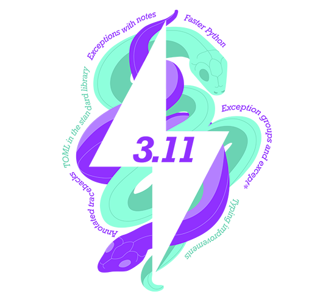

=================
Framework Changes
=================

.. contents:: Table of Contents
   :local:

Algorithms
----------

New features
############
- :ref:`algm-PaalmanPingsAbsorptionCorrection` has been updated to use beam properties from :ref:`algm-SetBeam` to
  determine ``GaugeVolume`` if no volume is defined.
- :ref:`CreateDetectorTable<algm-CreateDetectorTable>` now has an optional argument, ``IncludeDetectorPosition``, which,
  if ``True``, will add a column, ``Position``, to the end of the ``DetectorTable``. This column has the detector
  position as a ``V3D`` type object for each spectrum in the table.
- :ref:`algm-Divide` now has an optional argument, ``IsDistribution``, to force the output distribution type.
- :ref:`DiffractionFocussing <algm-DiffractionFocussing-v2>` has a new optional boolean parameter ``FullBinsOnly``. When
  set, final bins of width less than the step-size are omitted from the output spectra.
- New algorithm :ref:`algm-CreateBootstrapWorkspaces` creates randomly simulated samples for performing Bootstrap
  analysis.
- The method ``getAlwaysStoreInADS`` has been exposed to python from C++, now accessible from an instance of
  ``PythonAlgorithm``. This is a more reliable way than ``isChild`` to check if output workspaces are to be stored in
  the ADS.
- A new option has been added to :ref:`algm-GetIPTS` to maintain a list of IPTS for supplied runs. This does not persist
  across sessions.
- In :ref:`algm-SetGoniometer`, you can now directly pass a comma separated string of 9 values corresponding to the (row
  major) flattened rotation matrix.
- In :ref:`algm-MonteCarloAbsorption`, when a gauge volume has been defined with :ref:`algm-DefineGaugeVolume`, the
  algorithm now uses this gauge volume to generate the scattering points for calculating attenuation within the sample.
- ``AnyShapeAbsorption`` can now determine the gauge volume by using the BeamProfile
- A new algorithm :ref:`algm-DebyeWallerFactorCorrectionMD` to scale the MDEvents by the inverse of Debye-Waller form
  factor.
- New algorithm :ref:`algm-CombineTableWorkspaces` allows combination of a pair of :ref:`Table Workspaces`, provided
  they have matching column names and data types.
- Introduced a new python algorithm, :ref:`algm-RefineSingleCrystalGoniometer`, that refines the UB-matrix and
  goniometer offsets simultaneously. This improves the indexing of the peaks for those cases when there is sample
  misorientation and :ref:`algm-FindUBUsingIndexedPeaks` is insufficient.

Bugfixes
############
- :ref:`GenerateGroupingPowder <algm-GenerateGroupingPowder>` now correctly calculates the number of pixels in a group,
  which may have been incorrect under certain conditions. This could lead to incorrect grouping of pixels in the output
  workspace. The issue was caused by an incorrect handling of the pixel indices when calculating the groups. The fix
  ensures that pixel indices are correctly handled, resulting in accurate grouping of pixels in the output workspace.
- In the script generated by :ref:`GeneratePythonFitScript <algm-GeneratePythonFitScript>`, titles for the subplots have
  been replaced by meaningful legends so that labels of output subplots do not overlap.
- The ``Unweighted least squares`` cost function in :ref:`algm-Fit` now works as expected when compared with the scipy
  library.

  - As part of the fix a new parameter named ``IgnoreInvalidData`` defaulted to ``false`` has been introduced into
    :ref:`CalculatePolynomialBackground <algm-CalculatePolynomialBackground>` and :ref:`algm-DirectILLTubeBackground`
    algorithms so that it can be forwarded to the :ref:`algm-Fit` algorithm.
  - In :ref:`algm-PoldiFitPeaks2D`, the ``IgnoreInvalidData`` parameter is defaulted to ``true`` when invoking
    :ref:`algm-Fit` to preserve existing behaviour.
  - The ``IgnoreInvalidData`` parameter defaulted to ``false`` has been introduced into
    :ref:`algm-ReflectometryBackgroundSubtraction`.

- ``InstrumentArrayConverter`` and ``PeakData`` utility classes used in peak integration algorithms have been moved into
  a common module located at ``plugins.algorithms.peakdata_utils.py``.

  - If using these classes in your scripts,
    ``from plugins.algorithms.IntegratePeaksSkew import InstrumentArrayConverter, PeakData`` must be replaced by
    ``from plugins.algorithms.peakdata_utils import InstrumentArrayConverter, PeakData``.

- :ref:`ConvertUnits <algm-ConvertUnits>` now works as expected when the input workspace is a
  :ref:`ragged workspaces <Ragged_Workspace>` with point data.
- :ref:`algm-IntegratePeaksShoeboxTOF` will no longer throw an out of bounds error when integrating peaks.
- :ref:`algm-Divide` now properly clears units when dividing two :ref:`ragged_workspace <Ragged_Workspace>` with
  identical Y-axis Units. This issue could cause errors in downstream data reduction workflows where the resulting
  workspace should be unitless. The fix ensures proper unit handling for :ref:`ragged_workspace <Ragged_Workspace>`
  division operations.
- :ref:`GroupDetectors <algm-GroupDetectors-v2>` will no longer freeze on large datasets while adding ``EventList``
  objects to the Output Workspace. Testing with TOPAZ-50006 execution time was reduced from 2+ hours to ~30 seconds.
- :ref:`algm-LoadAndMerge` will no longer store workspaces in the ADS when set not to. This caused the leaking of
  temporary workspaces in algorithms that call :ref:`algm-LoadAndMerge` as a child. Legacy behaviour can be achieved by
  passing ``StoreInADS=True`` to the algorithm.
- Add ``MandatoryValidator<OptionalBool>`` to property declaration in the :ref:`algm-Divide` algorithm
- :ref:`SaveNexusProcessed <algm-SaveNexusProcessed>` will no longer crash due to a slab size to data size mismatch when
  writing ragged workspaces.
- When working with large datasets, :ref:`SumSpectra <algm-SumSpectra>` will no longer freeze when adding an
  ``EventList`` of weighted events to the ``OutputWorkspace``.

Deprecated
############
- :ref:`algm-IntegratePeaksMD-v1` has been deprecated, use :ref:`algm-IntegratePeaksMD-v2` instead.
- :ref:`UnwrapMonitorsInTOF <algm-UnwrapMonitorsInTOF>` has been deprecated. There is no replacement.
- :ref:`UnwrapSNS <algm-UnwrapSNS>` has been deprecated. There is no replacement.
- Property ``UnwrapRef`` has been deprecated for algorithms that previously called deprecated algorithm
  :ref:`algm-UnwrapSNS`:

  - :ref:`AlignAndFocusPowder <algm-AlignAndFocusPowder>`,
  - :ref:`AlignAndFocusPowderFromFiles <algm-AlignAndFocusPowderFromFiles>`
  - :ref:`SNSPowderReduction <algm-SNSPowderReduction>`

- :ref:`LoadEventPreNexus <algm-LoadEventPreNexus>` has been deprecated. There is no replacement.
- :ref:`IntegratePeaksCWSD <algm-IntegratePeaksCWSD>` has been deprecated. There is no replacement.

Removed
############
- The ``AlignDetectors`` algorithm was deprecated in :ref:`Release 6.1 <v6.1.0>` and has now been removed. Please use a
  combination of :ref:`ApplyDiffCal <algm-ApplyDiffCal>` and :ref:`ConvertUnits <algm-ConvertUnits>` instead.
- The ``Transpose3D`` algorithm (also known as ``SINQTranspose3D``) was deprecated in :ref:`Release 3.9.0 <v3.9.0>` and
  has now been removed. Use :ref:`algm-TransposeMD` instead.
- Removed the obsolete algorithm ``LoadLLB``.
- Removed the obsolete algorithm ``SaveISISNexus``. It is being removed before the normal comment period rather than
  undergoing extensive changes to accommodate the consolidation of nexus APIs in mantid.
- Removed obsolete ``LoadDSpacemap`` and ``SaveDSpacemap`` algorithms.
- The algorithm ``CentroidPeaksMD v1`` was deprecated in :ref:`Release 3.9.0 <v3.9.0>` and has now been removed. Use
  :ref:`CentroidPeaksMD v2 <algm-CentroidPeaksMD-v2>` instead.
- The algorithm ``LoadNexusMonitors v1`` was deprecated in :ref:`Release 3.9.0 <v3.9.0>` and has now been removed. Use
  :ref:`LoadNexusMonitors v2 <algm-LoadNexusMonitors-v2>` instead.
- The ``LoadSNSspec`` algorithm was deprecated on 2017-01-30 and has now been removed.
- Removed the obsolete algorithm ``NexusTester``

Data Handling
-------------

New features
############
- :ref:`LoadSpec <algm-LoadSpec>` has been updated to be declared as a file loader

Deprecated
############
- Both :ref:`LoadPreNexus <algm-LoadPreNexus>` and :ref:`LoadPreNexusMonitors <algm-LoadPreNexusMonitors>` have been
  deprecated. There are no replacements.

Removed
############
- ``SaveToSNSHistogramNexus`` has been removed, because it is unused.

Python
------

New features
############
- ``Instrument.getFilename()`` and ``Instrument.setFilename()`` have been exposed to python.
- A new method named ``getFittingParameter`` has been added to ``Mantid::Geometry::Component`` class and exposed to
  python. This allows access to fitting parameters from components in an instrument definition file.
- Exposed ``ExperimentInfo.populateInstrumentParameters`` to the Python api.  This will facilitate the update of parameterized
  instruments from Python, allowing parameters to be directly transferred as properties without converting to and from ``string``.

Bugfixes
############
- :class:`ConfigService.setDataSearchDirs <mantid.kernel.ConfigServiceImpl.setDataSearchDirs>` will no longer crash when
  comma separated paths are used in the ``datasearch.directories`` setting of the ``mantid.user.properties`` file.
- :meth:`mantid.api.Run.addProperty` no longer ignores the ``name`` and ``units`` parameters if the ``value`` is of type
  :class:`mantid.kernel.Property`. Now only if the ``name`` and ``units`` are empty will the existing values on the
  ``Property`` be used.

Dependencies
------------

.. _6_13_dependencies:

New features
############
- Upgraded to Python 3.11.

  - See release notes from Python `here <https://docs.python.org/3/whatsnew/3.11.html>`_.
  - See Python's `migration guide <https://docs.python.org/3/whatsnew/3.11.html#porting-to-python-3-11>`_ for changes
    that could break scripts.

- This release has replaced use of the `NeXus API <https://github.com/nexusformat/code>`_ with its own implementation
  that is heavily influenced by that code. There are two main purposes for no longer depending on the NeXus-API:

  1. The API was `announced as only undergoing bugfixes as of 2014 <https://www.nexusformat.org/content/NIACAPI.html>`_.
     The last release was `v4.4.3 <https://github.com/nexusformat/code/releases/tag/v4.4.3>`_ on 2016-09-12.
  2. In order to make changes to improve performance, Mantid needs to change the underlying implementation calling
     HDF5.

  The net effect is that we have a ``Nexus`` abstraction that only supports HDF5-based files, which are the vast
  majority of the files that Mantid needs to write, and a ``LegacyNexus`` abstraction which has reduced its support to
  HDF4 and HDF5 based files (dropping ``xml``).

  Much of this release cycle was spent creating the new abstraction and moving all existing code to use it. Ideally,
  users should see very little difference. There may be improved performance for files that have many groups/datasets at
  a level within the file. This is due to an in-memory cache of the data layout.

  Those interested in the details of the changes can see them in the (developer centric)
  `github issue <https://github.com/mantidproject/mantid/issues/38332>`_.

Build Tools
-----------

Bugfixes
############
- CMake now successfully builds with ``-DUSE_SANITIZER=address``. For more details see
  :doc:`RunningSanitizers <mantid-dev:RunningSanitizers>`.

MantidWorkbench
---------------

See :doc:`mantidworkbench`.

:ref:`Release 6.13.0 <v6.13.0>`
