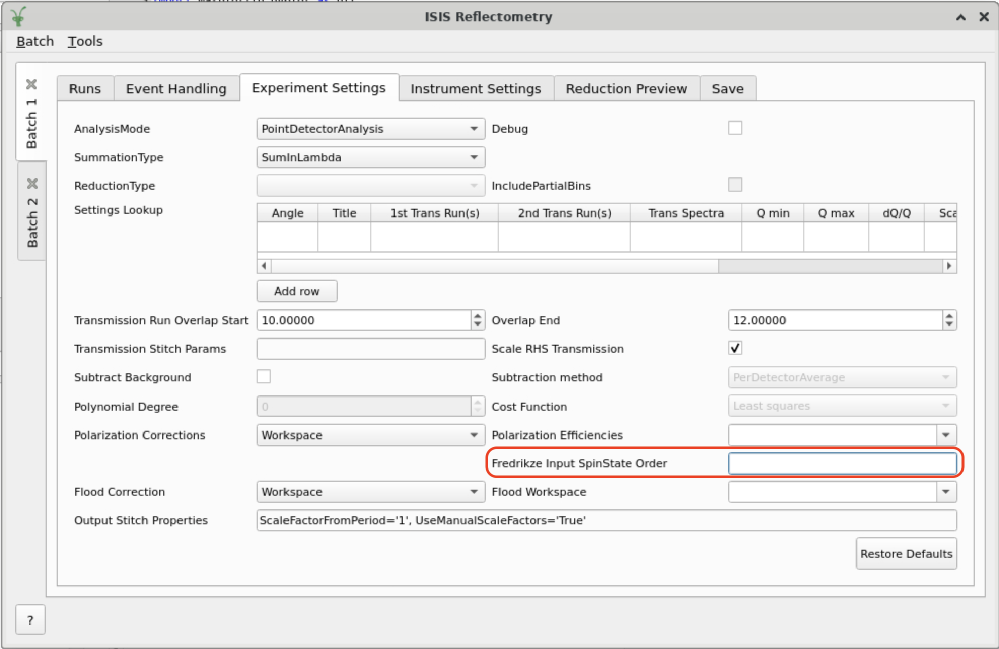

=====================
Reflectometry Changes
=====================

.. contents:: Table of Contents
   :local:

New Features
------------

- A new field, ``Fredrikze Input Spin State Order``, has been added to the
  :ref:`Experiment Settings Tab <refl_exp_instrument_settings>` on the ISIS Reflectometry interface (see image). This
  allows the spin state order of the input workspace group to be supplied when the reduction performs a Fredrikze
  polarization correction.
- The flipper configuration for the input workspace group from the :ref:`interface-isis-refl`, when performing a Wildes
  polarization correction, can now be passed to the reduction by adding a parameter called ``WildesFlipperConfig`` to
  your instrument's parameter file. Additionally, a default configuration of ``01,01,10,11`` has been added to POLREF's
  parameter file.
- When a workspace is loaded on the ISIS Reflectometry GUI :ref:`Reduction Preview <refl_preview>` tab, region
  selectors are now added to the slice viewer plot to display any ROIs from matching experiment settings.
- The :ref:`algm-PolarizationEfficienciesWildes` algorithm now propagates errors correctly using the Taylor series
  method (first order). A new helper class has been introduced to do this using the Eigen ``autodiff`` module to
  calculate partials.
- A new :ref:`algm-ReflectometryISISCalculatePolEff` algorithm has been added. This algorithm provides a convenient
  wrapper for the :ref:`algm-ReflectometryISISCreateTransmission`, :ref:`algm-PolarizationEfficienciesWildes` and
  :ref:`algm-JoinISISPolarizationEfficiencies` algorithms.

:ref:`Release 6.13.0 <v6.13.0>`
