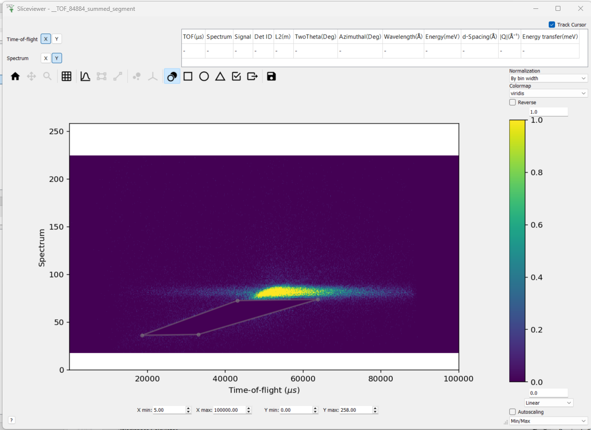

========================
Mantid Workbench Changes
========================

.. contents:: Table of Contents
   :local:

New Features
------------
- The ability to scale axes and colorbars to ``symlog`` has been added to plots. An option to specify the extent of the linear portion of the ``symlog`` axis (``linthresh``) has been added to the axes tab widget in the plot config dialog.
- Sequential fit output workspace names now include the numeric (spectra) axis to distinguish between different results.
- The sequential fit interface now has an option to create the results output in a workspace 2D format.
- The crosshair button is enabled in tiled plots (subplots).
- The crosshair has been optimised using matplotlib's blitting function for fast rendering. It very closely tracks mouse movement with minimal lag.
- MantidWorkbench now features a new, integrated HTML-based help viewer, replacing the previous Qt Assistant-based system. This modernization provides a more streamlined user experience and aligns with current web standards.
- In the :ref:`Filter Events Interface <Filter_Events_Interface>`, horizontal and vertical range markers have been added in lieu of sliders to simplify range filtering with the mouse.

Bugfixes
--------
- Opening the help window will no longer cause a crash in Windows conda installs of ``mantidworkbench``.
- ``Show Invisible Workspaces`` settings can now be updated from the settings menu.
- Workspaces starting with "_" will now appear in plot legends.
- Moving a range selector on a plot (especially in indirect/inelastic interfaces) will no longer cause a deprecation warning about ``np.bool`` scalars being interpreted as an index.
- Standalone Windows installations of MantidWorkbench (using the .exe installer) now ignore the user ``site-packages`` directory (``%APPDATA%\Python\Python311\site-packages``), preventing conflicts with packages from other Python installations.
- Input validation errors have been corrected for numerical text boxes of the :ref:`Filter Events Interface <Filter_Events_Interface>`.

InstrumentViewer
----------------

New features
############
- An experimental version of the new Instrument View has been made available in this release. To access this, right-click on a workspace in the ADS in Workbench, then click ``(Experimental) Show Instrument``. This feature is still in an early stage of development with further functionality being added over the v6.15 development period.

Bugfixes
############
- Added a warning to the ``Pick`` tab for a workspace with blocksize 1. In this case, the Instrument View will not provide a line plot until the workspace has been rebinned.

SliceViewer
-----------

New features
############
- Added a masking feature for Matrix Workspaces with a non-numeric y-axis. This enables direct application of the mask to the underlying workspace, or the outputting of a table workspace that can be applied subsequently using ``MaskFromTableWorkspace``.

:ref:`Release 6.14.0 <v6.14.0>`
