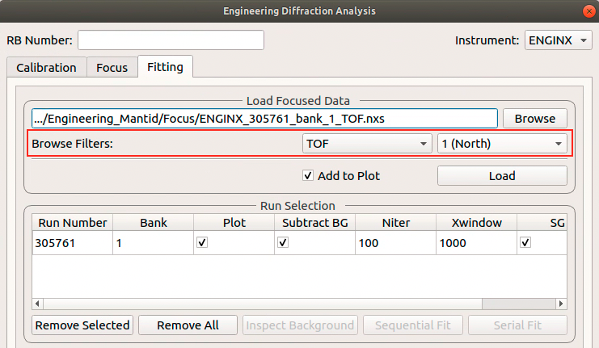

===================
Diffraction Changes
===================

.. contents:: Table of Contents
   :local:

Powder Diffraction
------------------
New features
############
- New algorithm :ref:`CalculatePlaczek <algm-CalculatePlaczek>` to compute both first and second Placzek correction factors.
- New algorithm :ref:`CalculatePlaczekSelfScattering2 <algm-CalculatePlaczekSelfScattering-v2>` utilizes :ref:`CalculatePlaczek <algm-CalculatePlaczek>` to compute first order correction.
- New algorithm :ref:`CombineDiffCal <algm-CombineDiffCal>` to calibrate groups of pixels after cross correlation so that diffraction peaks can be adjusted to the correct positions.
- New algorithm :ref:`MultipleScatteringCorrection <algm-MultipleScatteringCorrection>` to compute the multiple scattering correction factor for a sample using numerical integration.
- New algorithm :ref:`NOMADMedianDetectorTest <algm-NOMADMedianDetectorTest>` to mask pixels showing deficient or excessive total counts.
- New algorithm :ref:`SetSampleFromLogs <algm-SetSampleFromLogs>` inspects the sample environment logs for sample material and geometry information.
- New script for doing calibration by groups, :ref:`PowderDiffractionCalibration <calibration_tofpd_group_calibration-ref>`.

Improvements
############
* :ref:`AlignAndFocusPowder <algm-AlignAndFocusPowder-v1>` permits masking of discrete wavelength ranges to zero, for resonance filtering.
* Improved performance of :ref:`ApplyDiffCal <algm-ApplyDiffCal>` on large instruments e.g. WISH. This in turn improves the performance of :ref:`AlignAndFocusPowder <algm-AlignAndFocusPowder>`.
* :ref:`ConvertDiffCal <algm-ConvertDiffCal-v1>` now optionally updates a previous calibration when converting offsets.
* :ref:`LoadILLDiffraction <algm-LoadILLDiffraction>` now adds input run number also to a metadata field `run_list`, intended to contain a full list of numbers, handled by :ref:`MergeRuns <algm-MergeRuns>`.
* :ref:`LoadILLPolarizedDiffraction <algm-LoadILLPolarizedDiffraction>` now sorts the polarization orientations and enforces spin-flip, then non-spin-flip order.
* :ref:`LoadWANDSCD <algm-LoadWANDSCD-v1>` has a new option to perform normalization in the same loading process.
* :ref:`PDCalibration <algm-PDCalibration-v1>` has a new option to use the :ref:`IkedaCarpenterPV <func-IkedaCarpenterPV>` peak function.
* :ref:`PolDiffILLReduction <algm-PolDiffILLReduction>` received a number of improvements

  * Changes names of input workspaces to contain polarization information.
  * Transmission can be provided as a number or a workspace group.
  * New data averaging option depending on measurement 2theta.
  * Option to display all measured points on a scatter plot.
  * New option for self-attenuation treatment using measured transmission.

* Several improvements have been made to the group calibration routine including

  * More input control parameters, including peak function type for estimating offset after cross correlation and an option to turn on or off the smoothing of data for cross correlation purpose.
  * The workflow of group calibration script is also polished to make it smoother. Accordingly, unit tests have been updated.
  * Groups are now allowed with dedicated control parameters.
  * Documentation has been added as a guidance for general users.
  * Making it more generic.

* :ref:`SNAPReduce <algm-SNAPReduce-v1>` permits saving selected property names and values to file, to aid autoreduction.
* Add a custom ttmode to the PEARL powder diffraction scripts for running with a custom grouping file.
* Added a 3mf format file describing the PEARL sample and environment shapes for the P-E press. Also fixed a couple of minor issues in the 3mf file format loader used in :ref:`LoadSampleEnvironment  <algm-LoadSampleEnvironment>`.

Bugfixes
########
- Fixed a bug when filtering events in :ref:`AlignAndFocusPowder <algm-AlignAndFocusPowder-v1>` based on time-of-flight. The code now allows setting the minimum time-of-flight to zero (inclusive).
- Corrected the equation for pseudo-voigt FWHM and mixing parameter in peak profile function :ref:`Bk2BkExpConvPV <func-Bk2BkExpConvPV>`.
- Fixed the issue with the calibration diagnostics script when dealing with instruments of which the detector ID does not start from 0.
- Fixed the issue with :ref:`SNSPowderReduction <algm-SNSPowderReduction>` - when an invalid height unit is encountered while reading sample log the geometry is ignored and it relies purely on user input.
- Fixed a bug when converting TOF to d-spacing using diffractometer constants with non-zero DIFA when a parabolic model is selected.

Deprecation
###########
- Existing `CalibrateRectangularDetectors` is deprecated.
- Existing `GetDetOffsetsMultiPeaks` is deprecated.

Engineering Diffraction
-----------------------
New features
############
- New setting for default peak function to fit in the :ref:`Engineering Diffraction interface<Engineering_Diffraction-ref>` (initial default is :ref:`BackToBackExponential <func-BackToBackExponential>`).
- Added serial fit capability to :ref:`Fitting tab <ui engineering fitting>` in :ref:`Engineering Diffraction interface<Engineering_Diffraction-ref>` - this fits all loaded workspaces with same initial parameters.
- Added GSAS coefficients for parameters of peak profile function :ref:`Bk2BkExpConvPV <func-Bk2BkExpConvPV>` for ENGIN-X.
- Automatically subtracts background from runs on loading in :ref:`Engineering Diffraction interface<Engineering_Diffraction-ref>`.
- The most recently created or loaded Calibration is now selected by default in the load path when the interface is opened.
- The last used RB number is now saved for the next session.
- The generation of the files required for Vanadium normalization is now done on the :ref:`Focus tab <ui engineering focus>` of the :ref:`Engineering Diffraction interface<Engineering_Diffraction-ref>`. This means the Vanadium data can be updated without
  having to rerun the Ceria calibration. As part of this change the setting ``Force Vanadium Recalculation`` has been removed and the Vanadium run number input has been
  moved from the :ref:`Calibration tab <ui engineering calibration>` to the :ref:`Focus tab <ui engineering focus>`. The Vanadium run number is also no longer written to the prm generated on the Calibration tab `(Note: this is a breaking
  change and means .prm files generated from the EngDiff UI with older versions of Mantid won't load successfully)`.

Improvements
############
- **The usability of the file finder on the** :ref:`Fitting tab <ui engineering fitting>` **has been improved by the addition of file filters based on unit and/or bank.**

- The workflows for Calibration and Focusing in the :ref:`Engineering Diffraction interface<Engineering_Diffraction-ref>` and EnginX scripts have been replaced to make use of faster, better tested C++ algorithms (:ref:`PDCalibration <algm-PDCalibration>`). As a result some algorithms have been deprecated, and will likely be removed entirely in the next release. See below for more details.
- The cropping/region of interest selection for Calibration/Focusing is now chosen only on the :ref:`Calibration tab <ui engineering calibration>`, to avoid confusion and duplication of input.
- The region of interest for Calibration/Focusing can now be selected with a user-supplied custom calibration file.
- The Focused Run Files input box defaults to the last runs focused on the :ref:`Focus tab <ui engineering focus>`, even if multiple runs were focussed.
- The full calibration setting now has a default value consisting of the path to the ``ENGINX_full_instrument_calibration_193749.nxs file``.
- StartX and EndX for fitting region in :ref:`Fitting tab <ui engineering fitting>` can be manually entered in the fit browser.

Bugfixes
########
- Sequential fitting in the :ref:`Engineering Diffraction interface<Engineering_Diffraction-ref>` now uses the output of the last successful fit (as opposed to the previous fit) as the initial parameters for the next fit.
- If the user saves a project having previously opened and closed the :ref:`Engineering Diffraction interface<Engineering_Diffraction-ref>`, loading the project will not re-open the interface.
- The help button on the :ref:`Engineering Diffraction interface<Engineering_Diffraction-ref>` points to the correct page, having been broken in the last release.
- Using the Clear button on the Workspace widget while using the :ref:`Fitting tab <ui engineering fitting>` no longer causes errors when you try to load runs back in.
- On the :ref:`Fitting tab <ui engineering fitting>` of the :ref:`Engineering Diffraction interface<Engineering_Diffraction-ref>` the background can be inspected whether the background subtraction box is checked or not.
- Prevent crash when invalid arguments passed to background subtraction algorithm (:ref:`EnggEstimateFocussedBackground <algm-EnggEstimateFocussedBackground>`) in the :ref:`Fitting tab <ui engineering fitting>` of the :ref:`Engineering Diffraction interface<Engineering_Diffraction-ref>`.

Deprecation
###########
* The replacement of workflows for Calibration and Focusing in the :ref:`Engineering Diffraction interface<Engineering_Diffraction-ref>` and EnginX scripts means the following algorithms have been deprecated, and will likely be removed entirely in the next release:

  * :ref:`EnggCalibrate <algm-EnggCalibrate>`
  * :ref:`EnggCalibrateFull <algm-EnggCalibrateFull>`
  * :ref:`EnggFocus <algm-EnggFocus>`
  * :ref:`EnggVanadiumCorrections <algm-EnggVanadiumCorrections>`.

Single Crystal Diffraction
--------------------------
New features
############
- New algorithm :ref:`ApplyInstrumentToPeaks <algm-ApplyInstrumentToPeaks>` to update the instrument of peaks within a PeaksWorkspace.
- New algorithm :ref:`ConvertPeaksWorkspace <algm-ConvertPeaksWorkspace>` for quick conversion between PeaksWorkspace and LeanElasticPeaksWorkspace.
- New algorithm :ref:`FindGlobalBMatrix <algm-FindGlobalBMatrix>` that refines common lattice parameters across peak workspaces from multiple runs with a different U matrix (which encodes the orientation) per run.
- New algorithm :ref:`HB3AIntegrateDetectorPeaks <algm-HB3AIntegrateDetectorPeaks>` for integrating four-circle data from HB3A in detector space using simple cuboid integration with and without fitted background.
- New plotting script that provides diagnostic plots of :ref:`SCDCalibratePanels <algm-SCDCalibratePanels-v2>` on a per panel/bank basis.
- Exposed :meth:`mantid.api.IPeak.getCol` and :meth:`mantid.api.IPeak.getRow` to python.
- New definition file for D19 ILL instrument added.

Improvements
############

* Existing :ref:`DGSPlanner <dgsplanner-ref>` expanded to support WAND².
* Existing algorithm :ref:`IntegrateEllipsoids <algm-IntegrateEllipsoids-v1>` now can use a different integrator for satellite peaks.
* New option in :ref:`IntegrateEllipsoids <algm-IntegrateEllipsoids-v1>` to share Bragg peak background with satellite peaks.
* Existing algorithm :ref:`MaskPeaksWorkspace <algm-MaskPeaksWorkspace-v1>` now also supports tube-type detectors used at the CORELLI instrument.
* Improvements to :ref:`SCDCalibratePanels <algm-SCDCalibratePanels-v2>` including

  * major interface update
  * enabling the calibration of T0 and sample position
  * fine control of bank rotation calibration
  * better calibration of panel orientation for flat panel detectors
  * retains the value of small optimization results instead of zeroing them.

* Find detector in peaks will check which detector is closer when dealing with peak-in-gap situation for tube-type detectors.

Bugfixes
########
- :ref:`IndexPeaks <algm-IndexPeaks>` can now index peaks in a PeaksWorkspace with only a single run without optimising the UB (i.e. it is now possible to set ``CommonUBForAll=True`` in this instance).
- Expanded the Q space search radius in DetectorSearcher to avoid missing peaks when using :ref:`PredictPeaks <algm-PredictPeaks>`.

:ref:`Release 6.2.0 <v6.2.0>`
