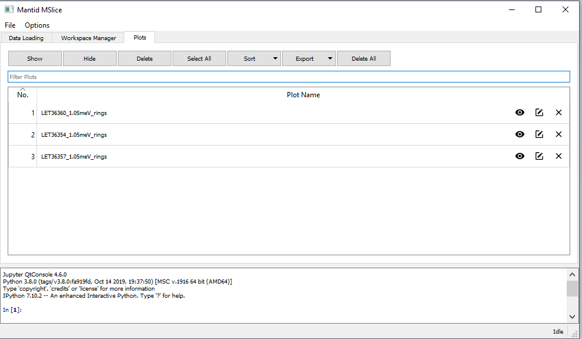
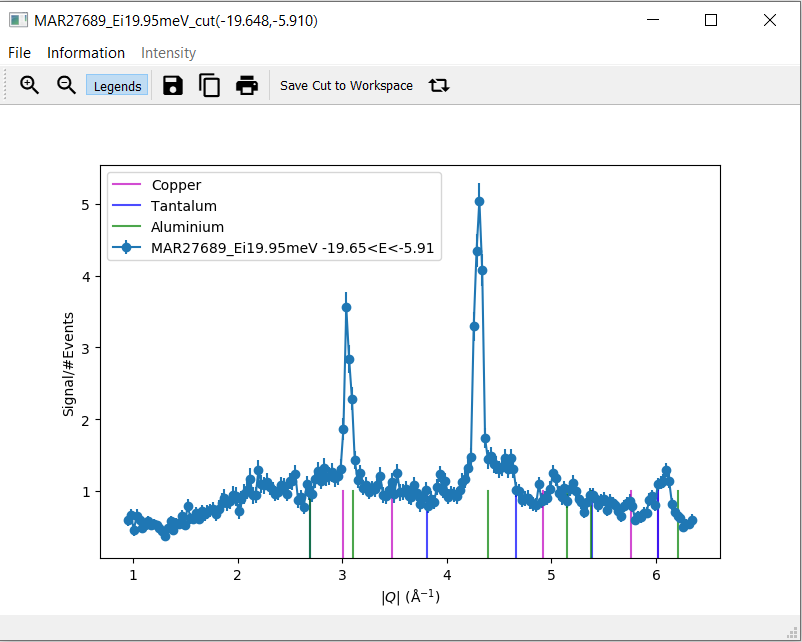

=======================
Direct Geometry Changes
=======================

.. contents:: Table of Contents
   :local:

Direct Geometry
---------------

New Algorithms
##############

- :ref:`ApplyDetailedBalanceMD <algm-ApplyDetailedBalanceMD>` to apply detailed balance to MDEvents.
- :ref:`DgsScatteredTransmissionCorrectionMD <algm-DgsScatteredTransmissionCorrectionMD>` weights the intensity of each detected event according to its final energy.

CrystalField
------------

Improvements
############
- Added documentation and warning messages in the :ref:`Crystal Field Python Interface` related to :ref:`IntensityScaling <cf_intensity_scaling>`.
- The order of detector efficiency correction and rebinning in :ref:`algm-DirectILLReduction` has been inversed.
- :ref:`LoadILLTOF <algm-LoadILLTOF>` now adds input run number to a metadata field `run_list`, intended to contain a full list of run numbers, handled by :ref:`MergeRuns <algm-MergeRuns>`.

BugFixes
########
- A bug has been fixed in :ref:`ConvertToMD <algm-ConvertToMD>` that sometimes crashes Mantid when files are summed together.
- Fixed a bug in the :ref:`Crystal Field Python Interface` which prevented the application of IntensityScaling factors.
- A bug has been fixed in the plot methods for CrystalField and CrystalFieldMultiSite.
- Peaks are (re)set upon rebuilding the single spectrum function as a multi-spectrum function
  due to the physical properties. This re-setting peaks is needed to maintain the intended ties.
- A bug has been fixed in :ref:`PyChop` that caused crashes when no Ei was specified.

MSlice
------

Improvements
############
- **Added new tab with plots manager to** :ref:`MSlice GUI<MSlice-ref>`.

- **Enable powder (Bragg) peaks on cut plots.**

- Added tests for script generation functions.
- Improved clipboard usage for scripts generated in :ref:`MSlice<MSlice-ref>` using a Linux environment.

BugFixes
########
- Fixed an issue that caused overplot information on slice plots to get lost after replotting.
- :ref:`MSlice GUI<MSlice-ref>` now opens to the loading tab instead of the plotting tab.
- Fixed a bug that caused an error when generating a script from a cut plot.
- Fixed a bug that caused crashes when resizing interactive cut plots.
- Added better exception handling for attempts to delete a workspace for a second time.
- Fixed a bug that caused crashes when selecting a Bragg peak when there is no Bragg peak in the data.

:ref:`Release 6.2.0 <v6.2.0>`
