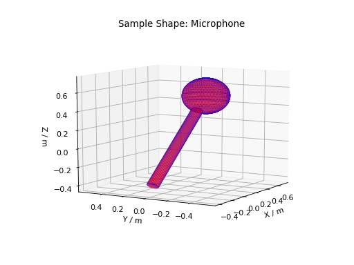

=================
Framework Changes
=================

.. contents:: Table of Contents
   :local:

Algorithms
----------

New Features
############

- A new algorithm :ref:`Stitch <algm-Stitch>` will perform stitching of multiple 2D workspaces by calculating the scale factors as medians of point-wise ratios in the overlap regions.

Improvements
############

- :ref:`CreateSampleWorkspace <algm-CreateSampleWorkspace>` has new property InstrumentName.
- :ref:`CrossCorrelate <algm-CrossCorrelate>` has additional parameter to set the maximum d-space shift during cross correlation.
- :ref:`Load <algm-Load>` will now set output properties of all types, not just workspaces.
- :ref:`LoadNexusMonitors <algm-LoadNexusMonitors-v2>` now utilizes the log filter provided by :ref:`LoadNexusLogs <algm-LoadNexusLogs>`.
- :ref:`LoadRaw <algm-LoadRaw>` will now ignore empty ICPalarm log files.
- :ref:`SaveAscii <algm-SaveAscii>` will no longer throw an error if `WriteXErrors` is requested, but there are no `Dx` data present in the workspace.
- The algorithm CalculateMultipleScattering has been renamed to :ref:`DiscusMultipleScatteringCorrection <algm-DiscusMultipleScatteringCorrection>` to avoid confusion with the new :ref:`MultipleScatteringCorrection <algm-MultipleScatteringCorrection>` algorithm

Bugfixes
########

* Fix bug in :ref:`DiscusMultipleScatteringCorrection <algm-DiscusMultipleScatteringCorrection>` where detector position was incorrectly determined on a workspace where the workspace index didn't match the detector
  index e.g. if the workspace was loaded with ``SpectrumMin`` specified to exclude some monitors.
* Fixed bug in :ref:`algm-ConvertToMDMinMaxLocal` where wrong min max calculated if the workspace includes monitor spectra or spectra without any detectors.
* Added parser for input Names to :ref:`algm-CreateMDHistoWorkspace` to allow inputs such as `Names='[H,0,0],[0,K,0],[0,0,L]'`.
* Fixed a bug in :ref:`FitGaussianPeaks <algm-FitGaussianPeaks>` algorithm in which a peak at the end of range would cause an error due to not enough data point being available to fit parameters.
* Fixed a rare divide-by zero error when running :ref:`GetEi <algm-GetEi>` on noisy data.
* Fixed a crash when running :ref:`IntegrateEPP <algm-IntegrateEPP>` on a workspace group via the algorithm dialog.
* Fix problem with filtering of events based on pulse time in :ref:`LoadEventNexus <algm-LoadEventNexus>`. There are two ways of filtering events by pulse time using this algorithm and both
  were giving incorrect results if the events in the input Nexus file were unsorted:

  * events can be filtered as part of the load by using the ``FilterByTimeStart`` and ``FilterByTimeStop`` parameters.
  * if the full event file is loaded, the filtering can be applied as a post process using the algorithm :ref:`FilterByTime <algm-FilterByTime>`.

* :ref:`LoadNexusLogs <algm-LoadNexusLogs>` now creates a warning message for logs that are poorly formed and the other logs are loaded. Previously it stopped loading logs at that point.
* Fixed a bug where :ref:`LoadRaw <algm-LoadRaw>` would not load all log files for raw files with an alternate data stream.
* Fixed a problem calculating default beam size in :ref:`MonteCarloAbsorption <algm-MonteCarloAbsorption>` when sample is offset from origin.

Deprecation
###########
- All remote algorithms have been deprecated as they have not been used since v3.8.

Fit Functions
-------------
New Features
############
- A new method, ``IPeakFunction.intensityError``, calculates the error in the integrated intensity of the peak due to uncertainties in the values of the fit parameters. For more details see :ref:`IPeakFunction<mantid.api.IPeakFunction>`.
- Exposed the method ``functionDeriv`` to the python interface.

Data Objects
------------
New Features
############
- **Sample shapes which are CSGObjects can now be plotted. Shapes can also be merged, such as a sphere with a cylindrical hole. For more details see** :ref:`Mesh_Plots`.

- CSGObject Sample Shapes defined with :ref:`SetSample <algm-SetSample>` can be manually rotated using the ``rotate`` and ``rotate-all`` tags.
  Also, Sample shapes (both MeshObjects and CSGObjects) are automatically rotated by any rotations from :ref:`SetGoniometer <algm-SetGoniometer>`.
  This works with :ref:`CopySample <algm-CopySample>`, so the copied shape can be plotted, but the goniometer angle set on the new workspace is applied.

Python
------
Bugfixes
########
- Fixed a crash that occurs in plotting MD workspaces when "Normalize to bin width" is set to False.

MantidWorkbench
---------------

See :doc:`mantidworkbench`.

:ref:`Release 6.2.0 <v6.2.0>`
