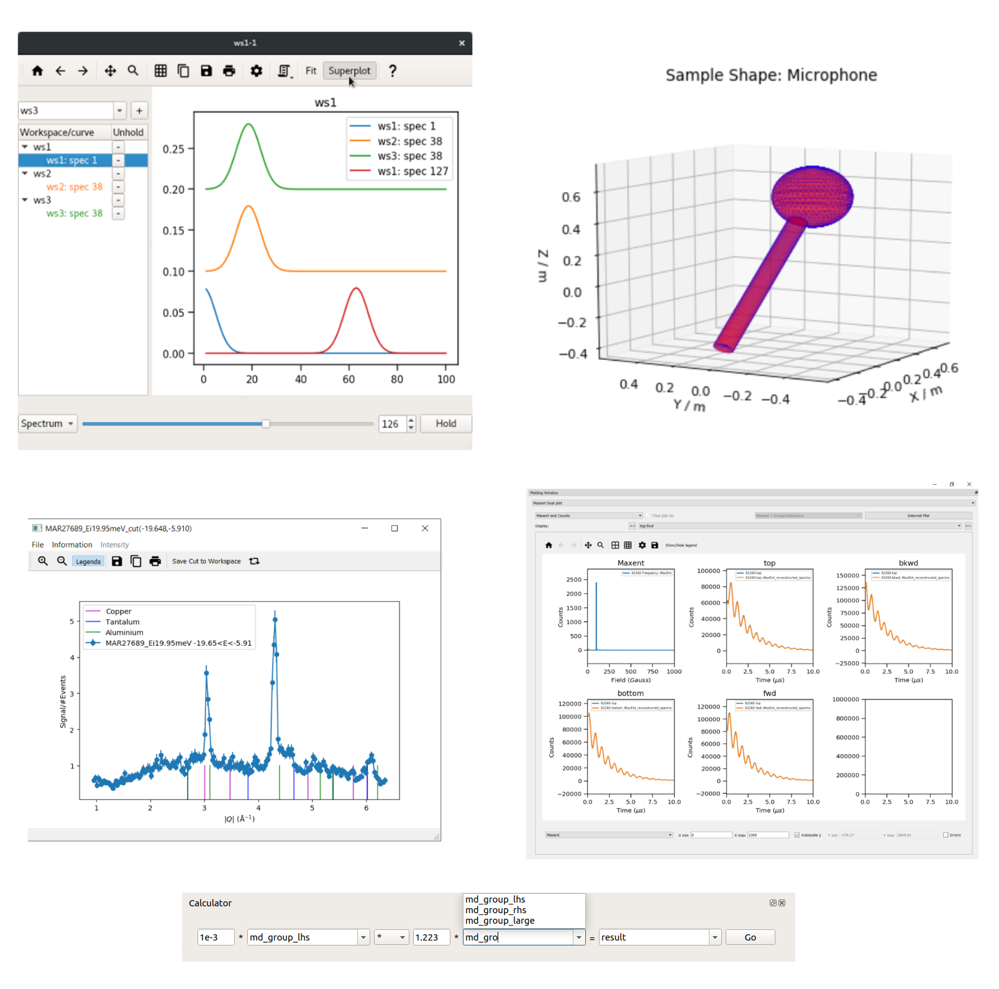

.. _v6.2.0:

===========================
Mantid 6.2.0 Release Notes
===========================

.. contents:: Table of Contents
   :local:

We are proud to announce version 6.2.0 of Mantid.

This release sees many new algorithms added or improved to extend the functionality of Mantid for users. In addition to this there are some significant new features
including:-

- Superplot, a new widget that facilitates over-plotting and data comparison for a large number of workspaces.
- The ablity to plot CSGObjects as Sample shapes and merge shapes for greater complexity.
- In MSlice you can now enable powder (Bragg) peaks on cut plots.
- Maxent Dual Plotting for Frequency Domain Analysis allowing raw and reconstructed data to be plotted together along with the frequency domain data.
- A new widget and workspace plugin, the Workspace Calculator. This allows users to quickly perform binary operations on selected workspace pairs, optionally with scaling.

These are just some of the many improvements in this release, so please take a
look at the release notes, which are filled with details of the
important changes and improvements in many areas. The development team
has put a great effort into making all of these improvements within
Mantid, and we would like to thank all of our beta testers for their
time and effort helping us to make this another reliable version of Mantid.

Throughout the Mantid project we put a lot of effort into ensuring
Mantid is a robust and reliable product. Thank you to everyone that has
reported any issues to us. Please keep on reporting any problems you
have, or crashes that occur on our `forum`_.

Installation packages can be found on our `download page`_
which now links to sourceforge to mirror our download files around the world. You can also
access the source code on `GitHub release page`_.

Citation
--------

Please cite any usage of Mantid as follows:

- *Mantid 6.2.0: Manipulation and Analysis Toolkit for Instrument Data.; Mantid Project*. `doi: 10.5286/SOFTWARE/MANTID6.2 <https://dx.doi.org/10.5286/SOFTWARE/MANTID6.2>`_

- Arnold, O. et al. *Mantid-Data Analysis and Visualization Package for Neutron Scattering and mu-SR Experiments.* Nuclear Instruments
  and Methods in Physics Research Section A: Accelerators, Spectrometers, Detectors and Associated Equipment 764 (2014): 156-166
  `doi: 10.1016/j.nima.2014.07.029 <https://doi.org/10.1016/j.nima.2014.07.029>`_
  (`download bibtex <https://raw.githubusercontent.com/mantidproject/mantid/master/docs/source/mantid.bib>`_)

Changes
-------

.. toctree::
   :hidden:
   :glob:

   *

- :doc:`Framework <framework>`
- :doc:`Mantid Workbench <mantidworkbench>`
- :doc:`Diffraction <diffraction>`
- :doc:`Muon Analysis <muon>`
- Low Q

  - :doc:`Reflectometry <reflectometry>`

  - :doc:`SANS <sans>`
- Spectroscopy

  - :doc:`Direct Geometry <direct_geometry>`

  - :doc:`Indirect Geometry <indirect_geometry>`

Full Change Listings
--------------------

For a full list of all issues addressed during this release please see the `GitHub milestone`_.

.. _download page: https://download.mantidproject.org

.. _forum: https://forum.mantidproject.org

.. _GitHub milestone: https://github.com/mantidproject/mantid/pulls?utf8=%E2%9C%93&q=is%3Apr+is%3Amerged+milestone%3A%22Release+6.2%22

.. _GitHub release page: https://github.com/mantidproject/mantid/releases/tag/v6.2.0
