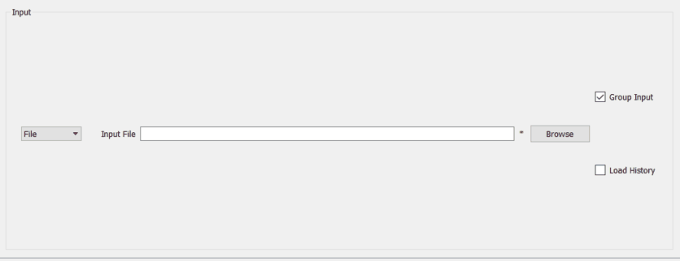

=========================
Indirect Geometry Changes
=========================

.. contents:: Table of Contents
   :local:

New Features
------------
- **The** :ref:`Elwin <elwin>` **tab in** :ref:`Inelastic Data Analysis <interface-inelastic-qens-fitting>` **has a new loader which now allows users to add workspaces.**

- Fit functions :ref:`ElasticIsoRotDiff <func-ElasticIsoRotDiff>` and :ref:`InelasticIsoRotDiff <func-InelasticIsoRotDiff>` have been made available in the :ref:`ConvFit <convfit>` tab in the :ref:`Inelastic Data Analysis <interface-inelastic-qens-fitting>` interface.

Improvements
------------
- Single input has been removed from the :ref:`Inelastic Data Analysis <interface-inelastic-qens-fitting>` Fit tabs. All data input is now done via the multiple input dialog.
- The data input widgets in the :ref:`Inelastic Data Analysis <interface-inelastic-qens-fitting>` Fit tabs has been made dockable and can be resized once undocked.
- Updated :ref:`Inelastic Data Analysis <interface-inelastic-qens-fitting>` and :ref:`Elwin<elwin>` and :ref:`I(Q,t) <iqt>` documentation with new screenshots and details of the new :ref:`Elwin <elwin>` loader.

Bugfixes
--------
- A bug has been fixed in :ref:`Inelastic Data Analysis <interface-inelastic-qens-fitting>` on the :ref:`F(Q)Fit <fqfit>` Multiple Input tab that allowed duplicate spectra to be added.
- A bug has been fixed that stopped additional spectra being added to :ref:`Inelastic Data Analysis <interface-inelastic-qens-fitting>` if spectra from that workspace had already been added.
- A bug has been fixed in :ref:`Inelastic Data Analysis <interface-inelastic-qens-fitting>` that limited the integration range on the tabs to between -1 and 1.
- A bug has been fixed in :ref:`Elwin <elwin>` tab that caused Mantid to crash if a file of the wrong format was loaded.

Algorithms
----------
New Features
############
- A new option ``Autoconvolution`` is added to the :ref:`Abins Algorithm <algm-Abins>`. This enables simulation of quantum orders up to order 10 by convolving the highest calculated spectrum (order 1 or 2) against
  the fundamentals spectrum repeatedly, before applying Debye-Waller terms. (NB: This has introduced small numerical differences from previous versions of Abins, because data is now binned before applying Debye-Waller terms. This difference will converge with small bin sizes.)

Improvements
############
- Introduced multithreading for detectors/spectra to :ref:`VesuvioCalculateMS <algm-VesuvioCalculateMS>` in order to speed up the :ref:`VesuvioAnalysis <algm-VesuvioAnalysis>` algorithm.
- The :ref:`Abins Algorithm <algm-Abins>` can now import XML data from VASP calculations using ``selective dynamics`` to restrict the set of atoms active in vibrations. The data is imported and processed as though these are the only atoms in the system, with appropriately-dimensioned
  displacement data. This approximation is useful for the study of light (e.g. organic) molecules adsorbed to surfaces of heavy (e.g. noble-metal) catalysts.
- :ref:`Abins Algorithm <algm-Abins>`: Thresholding of low-intensity modes has been changed. This impacts the second-order spectrum, especially at elevated temperature; excitations were being discarded on the basis of a low
  intensity in the fundamental spectrum, when they could contribute to a noticeable peak in the second-order spectrum.

Bugfixes
########
- :ref:`IndirectILLEnergyTransfer <algm-IndirectILLEnergyTransfer>` will now perform the monitor normalisation correctly; that is, in wavelength instead of energy. It will also provide the monitor workspace as a diagnostic output, if requested.

:ref:`Release 6.2.0 <v6.2.0>`
