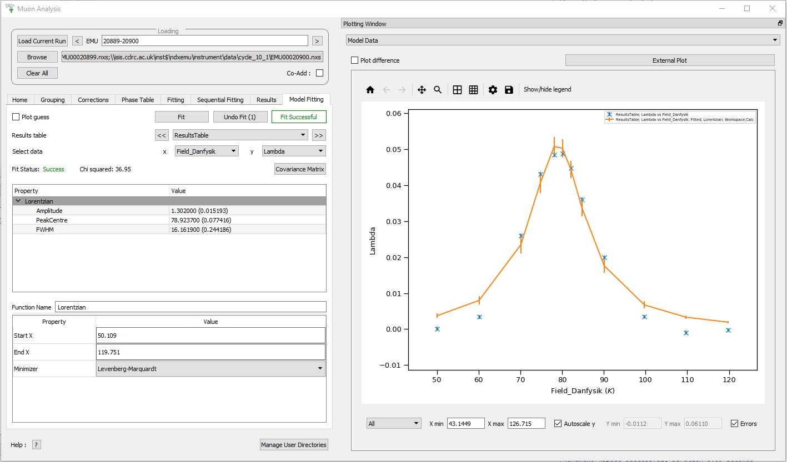

============
MuSR Changes
============

.. contents:: Table of Contents
   :local:

Frequency Domain Analysis
-------------------------

New Features
############

- The Frequency Domain Analysis interface now allows you to perform a sequential fit using the :ref:`Sequential Fitting Tab <muon_sequential_fitting_tab-ref>`.
- The :ref:`Sequential Fitting Tab <muon_sequential_fitting_tab-ref>` allows you to choose the type of dataset you want to fit.
- **New** :ref:`Maxent Dual Plot <Maxent_Dual_Plot-ref>` **option has been added to the plotting. This will show the reconstructed data and the
  raw data together, along with the frequency domain data.**

.. image::  ../../images/maxent_dual_plot.png
   :align: center
   :height: 800px

Improvements
############

- Frequency Domain Analysis can now use groups in :ref:`MuonMaxent <algm-MuonMaxent>` calculations.
- It is easier to select data for Maxent calculations.

Bugfixes
########

- In frequency domain analysis the phasetables calculated from :ref:`MuonMaxent <algm-MuonMaxent>` can be used for
  :ref:`PhaseQuad <algm-PhaseQuad>` calculations on the phase tab.

Muon Analysis
-------------

New Features
############

- Users can now copy sequential fitting parameters to all other runs using the ``Copy fit parameters to all`` checkbox.
- **The** :ref:`Model Fitting Tab <muon_model_fitting_tab-ref>` **allows you to perform fits across the sample logs and fit parameters stored in your results table.**

Muon Analysis and Frequency Domain Analysis
-------------------------------------------

New Features
############

- It is now possible to exclude a single range from a fit range when doing a fit on the :ref:`Fitting Tab <muon_fitting_tab-ref>`.
- Added a ``Covariance Matrix`` button to the :ref:`Fitting Tab <muon_fitting_tab-ref>` that can be used to open and inspect the normalised covariance parameters of a fit.
- It is now possible to plot the raw count data in the GUI.
- **It is now possible to perform an Automatic or Manual background correction in the new** :ref:`Corrections Tab <muon_corrections_tab-ref>`.

.. image::  ../../images/muon_corrections_tab.PNG
   :align: center
   :height: 800px

Improvements
############

- It is now possible to do a vertical resize of the plot in Muon Analysis and Frequency Domain Analysis.
- The plotting has been updated for better stability.
- The plotting now has autoscale active by default.
- It is now possible to load nexusV2 files in the GUI.
- Added a table to store phasequads in the phase tab. Also, phasequads no longer delete themselves automatically.
- The labels on the tabs in the GUIs will now show in full
- When running the :ref:`DynamicKobuToyabe <func-DynamicKuboToyabe>` fitting function you should now be able to see the BinWidth to 3 decimal places.
- It is now possible to select the normalisation (``analysis_asymmetry_norm``) and group (``analysis_group``) in the :ref:`Results Tab <muon-results-tab-ref>`.

Bugfixes
########
- The GUIs will no longer crash if there are any whitespaces in the run range (e.g. 6010- 3).
- The GUIs will now cope with a range of runs that span between two different decades where the second number
  in the range is smaller than the final digit of the first number in the range (e.g. 6018-3 can be used for the range 6018-6023).
- In the :ref:`Fitting Tab <muon_fitting_tab-ref>` the ``fit to raw`` checkbox can no longer be unchecked if no rebinned data is present.
- A bug has been fixed in the BinWidth for the :ref:`DynamicKobuToyabe <func-DynamicKuboToyabe>` Fitting Function which caused a crash and did not provide
  any information about why the value was invalid. It will now revert to last viable BinWidth used and explain why.
- The autoscale option when ``All`` is selected will now show the largest and smallest y value for all of the plots.

ALC
---

New Features
############

- Added an external plot button to the :ref:`ALC interface <MuonALC-ref>` which will plot in workbench the current tab's plot
- **Added a period info button to the** :ref:`ALC interface <MuonALC-ref>` **which displays a table of period information from the loaded runs
  (this is equivalent to the periods button in the** :ref:`Muon Analysis <Muon_Analysis-ref>` **and** :ref:`Frequency Domain Analysis <Frequency_Domain_Analysis-ref>` **Interfaces)**.

.. image::  ../../images/ALC_period_table.png
   :align: center
   :height: 500px

- If the sample log has a unit, it will now be displayed on the axis of the plot

Improvements
############
- The plots are no longer normalised by bin width

Elemental Analysis
------------------

Improvements
############
- Updated :ref:`LoadElementalAnalysisData <algm-LoadElementalAnalysisData>` algorithm to include Poisson errors for the counts data.

Algorithms
----------

Improvements
############
- Updated :ref:`LoadMuonLog <algm-LoadMuonLog>` to read units for most log values.
- :ref:`LoadMuonNexus <algm-LoadMuonNexus>`, :ref:`LoadMuonNexusV2 <algm-LoadMuonNexusV2>` and :ref:`LoadPSIMuonBin <algm-LoadPSIMuonBin>`
  have all been updated to return the same outputs. Check their documentation pages for more.
- It is now possible to exclude a fit range when executing the :ref:`CalculateMuonAsymmetry <algm-CalculateMuonAsymmetry>` algorithm.
- The :ref:`PlotAsymmetryByLogValue <algm-PlotAsymmetryByLogValue>` algorithm will include the units for the log value (when they are available)
- :ref:`LoadMuonNexusV2 <algm-LoadMuonNexusV2>` now loads the period information.

Bugfixes
########
- Fixed bug in :ref:`FitGaussianPeaks <algm-FitGaussianPeaks>` algorithm in which a peak at the end of range would cause an error due to not enough data point being available to fit parameters.

:ref:`Release 6.2.0 <v6.2.0>`
