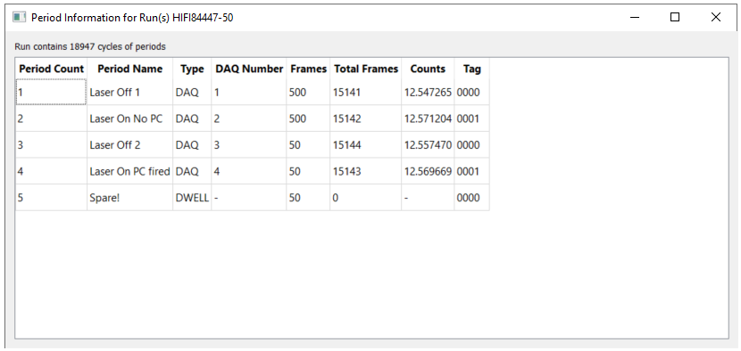

============
Muon Changes
============

.. contents:: Table of Contents
   :local:

Frequency Domain Analysis
-------------------------

New Features
############

- **New** :ref:`Maxent Dual Plot <Maxent_Dual_Plot-ref>` **option has been added to the plotting. This will show the reconstructed data and the
  raw data together, along with the frequency domain data.**

.. image::  ../../images/maxent_dual_plot.png
   :align: center
   :height: 800px

- The :ref:`Frequency Domain Analysis <Frequency_Domain_Analysis-ref>` interface now allows you to perform a sequential fit using the :ref:`Sequential Fitting Tab <muon_sequential_fitting_tab-ref>`.
- The :ref:`Sequential Fitting Tab <muon_sequential_fitting_tab-ref>` allows you to choose the type of dataset you want to fit.

Improvements
############

- :ref:`Frequency Domain Analysis <Frequency_Domain_Analysis-ref>` can now use groups in :ref:`MuonMaxent <algm-MuonMaxent>` calculations.
- It is easier to select data for :ref:`MuonMaxent <algm-MuonMaxent>` calculations.

Bugfixes
########

- In :ref:`Frequency Domain Analysis <Frequency_Domain_Analysis-ref>` the phasetables calculated from :ref:`MuonMaxent <algm-MuonMaxent>` can be used for
  :ref:`PhaseQuad <algm-PhaseQuad>` calculations on the :ref:`Phase Table tab <muon_phase_table_tab-ref>`.
- Can now fit to negative frequencies in the fitting tab.

Muon Analysis
-------------

New Features
############

- Users can now copy sequential fitting parameters to all other runs using the ``Copy fit parameters to all`` checkbox.

Muon Analysis and Frequency Domain Analysis
-------------------------------------------

New Features
############

- **It is now possible to perform an Automatic or Manual background correction in the new** :ref:`Corrections Tab <muon_corrections_tab-ref>`.

- Changing runs with autoscale on will update the fitting plots correctly.
- It is now possible to exclude a single range from a fit range when doing a fit on the :ref:`Fitting Tab <muon_fitting_tab-ref>`.
- Added a ``Covariance Matrix`` button to the :ref:`Fitting Tab <muon_fitting_tab-ref>` that can be used to open and inspect the normalised covariance parameters of a fit.

Improvements
############

- It is now possible to do a vertical resize of the plot in Muon Analysis and :ref:`Frequency Domain Analysis <Frequency_Domain_Analysis-ref>`.
- The plotting has been updated for better stability.
- The plotting now has autoscale active by default.
- It is now possible to load nexusV2 files in the GUI.
- Added a table to store :ref:`PhaseQuads <algm-PhaseQuad>` in the :ref:`Phase Table tab <muon_phase_table_tab-ref>`. Also, Phasequads no longer delete themselves automatically.
- The labels on the tabs in the GUIs will now show in full.
- When running the :ref:`DynamicKobuToyabe <func-DynamicKuboToyabe>` fitting function you should now be able to see the BinWidth to 3 decimal places.
- It is now possible to select the normalisation (``analysis_asymmetry_norm``) and group (``analysis_group``) in the :ref:`Results Tab <muon_results_tab-ref>`.

Bugfixes
########
- The fit ranges will now always allow you to encompass the entire x range of the loaded data.
- The GUIs will no longer crash if there are any whitespaces in the run range (e.g. 6010- 3).
- The GUIs will now cope with a range of runs that span between two different decades where the second number
  in the range is smaller than the final digit of the first number in the range (e.g. 6018-3 can be used for the range 6018-6023).
- In the :ref:`Fitting Tab <muon_fitting_tab-ref>` the ``fit to raw`` checkbox can no longer be unchecked if no rebinned data is present.
- A bug has been fixed in the BinWidth for the :ref:`DynamicKobuToyabe <func-DynamicKuboToyabe>` Fitting Function which caused a crash and did not provide
  any information about why the value was invalid. It will now revert to last viable BinWidth used and explain why.
- The autoscale option when ``All`` is selected will now show the largest and smallest y value for all of the plots.
- The global parameters in a results table will no longer be given a zero error arbitrarily if one with an error exists.
- The attribute values in a :ref:`Chebyshev <func-Chebyshev>` fitting function will no longer reset after performing a simultaneous fit.
- Fixed a crash caused by fitting to rebinned :ref:`PhaseQuad <algm-PhaseQuad>` data.
- When :ref:`PhaseQuad <algm-PhaseQuad>` data is rebinned it now divides by the fractional change in the bin size (to keep the asymmetry to about 0.3).

ALC
---

New Features
############

- **Added a period info button to the** :ref:`ALC interface <MuonALC-ref>` **which displays a table of period information from the loaded runs
  (this is equivalent to the periods button in the** :ref:`Muon Analysis <Muon_Analysis-ref>` **and** :ref:`Frequency Domain Analysis <Frequency_Domain_Analysis-ref>` **Interfaces)**.

- Added an external plot button to the :ref:`ALC interface <MuonALC-ref>` which will plot in workbench the current tab's plot
- If the sample log has a unit, it will now be displayed on the axis of the plot.

Improvements
############
- The plots are no longer normalised by bin width

Bugfixes
########
- A bug has been fixed in :ref:`ALC interface <MuonALC-ref>` that caused Mantid to crash when a user changed the PeakPicker in the :ref:`PeakFitting <ALCPeakFitting>` plot.
- A bug has been fixed in :ref:`ALC interface <MuonALC-ref>` where setting an invalid function would cause a crash.

Elemental Analysis
------------------

Improvements
############
- Updated :ref:`LoadElementalAnalysisData <algm-LoadElementalAnalysisData>` algorithm to include Poisson errors for the counts data.

Bugfixes
########

- No longer crashes when the input file contains a non-existent element.

Algorithms
----------

Improvements
############
- Updated :ref:`LoadMuonLog <algm-LoadMuonLog>` to read units for most log values.
- :ref:`LoadMuonNexus <algm-LoadMuonNexus>`, :ref:`LoadMuonNexusV2 <algm-LoadMuonNexusV2>` and :ref:`LoadPSIMuonBin <algm-LoadPSIMuonBin>`
  have all been updated to return the same outputs. Check their documentation pages for more information.
- It is now possible to exclude a fit range when executing the :ref:`CalculateMuonAsymmetry <algm-CalculateMuonAsymmetry>` algorithm.
- The :ref:`PlotAsymmetryByLogValue <algm-PlotAsymmetryByLogValue>` algorithm will include the units for the log value (when they are available)
- :ref:`LoadMuonNexusV2 <algm-LoadMuonNexusV2>` now loads the period information.

Bugfixes
########
- Fixed a bug in :ref:`FitGaussianPeaks <algm-FitGaussianPeaks>` algorithm in which a peak at the end of range would cause an error due to not enough data point being available to fit parameters.

:ref:`Release 6.2.0 <v6.2.0>`
