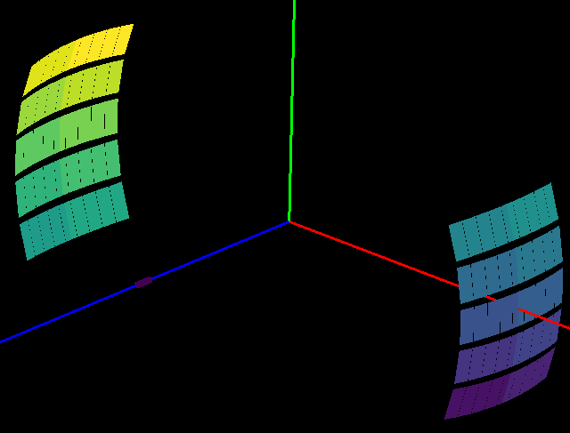

===================
Diffraction Changes
===================

.. contents:: Table of Contents
   :local:

Powder Diffraction
------------------
New features
############
- ``absorptioncorrutils`` now have the capability to calculate effective absorption correction (considering both absorption and multiple scattering).
- Extended :ref:`MultipleScatteringCorrection <algm-MultipleScatteringCorrection>` to both the sample and container case.
- Both :ref:`MultipleScatteringCorrection <algm-MultipleScatteringCorrection>` and :ref:`PaalmanPingsAbsorptionCorrection <algm-PaalmanPingsAbsorptionCorrection>` can use a different element size for container now.
- Added a new input for sample height information from :ref:`SNSPowderReduction <algm-SNSPowderReduction>` to Powder Diffraction Reduction GUI.
- :ref:`StripVanadiumPeaks <algm-StripVanadiumPeaks-v2>` has 3 additional peak positions of 0.41192, 0.4279, 0.4907 angstroms.

Improvements
############
* Several improvements have been made to :ref:`AnvredCorrection <algm-AnvredCorrection>` (and :ref:`SphericalAbsorption <algm-SphericalAbsorption>` which calls it)

  * the algorithm has been extended to evaluate the attenuation by more absorbing spherical (high muR) samples. Note - even with this change the calculation is still only accurate for muR < 8.
  * the algorithm will now take the radius of a spherical sample from the workspace if the radius isn't specified. If the sample is not a sphere this will produce an error.

* A number of improvements have been made to the :ref:`CalculatePlaczekSelfScattering v1 <algm-CalculatePlaczekSelfScattering-v1>` algorithm.

  * The parameter ``IncidentSpectra`` has been renamed to fix a typo, which is a breaking change for this algorithm.
  * The algorithm now validates that the ``IncidentSpectra`` is in units of Wavelength and will output in the same unit as the ``InputWorkspace``.
  * The addition of 1 to the Placzek correction has been moved out of this algorithm and into :ref:`TotScatCalculateSelfScattering <algm-TotScatCalculateSelfScattering>` .

* :ref:`D7AbsoluteCrossSections <algm-D7AbsoluteCrossSections>` now supports cross-section separation, normalisation and proper unit setting, including conversion to S(Q, w), of D7 Time-of-flight mode data.
* PEARL powder diffraction scripts now cope if ``absorption correction`` workspace is a different size to the ``Vanadium`` workspace without generating ``NaN`` values.
* Improved the ``tt_mode=Custom`` in the ISIS PEARL powder diffraction scripts. Specifically ``tt_mode=Custom`` now supports all the different ``focus_modes`` if the grouping file contains 14 groups.
* :ref:`FitPeaks <algm-FitPeaks>` and :ref:`PDCalibration <algm-PDCalibration>` no longer fit masked bins (bins with zero error).
* :ref:`PolDiffILLReduction <algm-PolDiffILLReduction>` now supports data reduction of D7 Time-of-flight mode, including elastic peak calibration, time-dependent background subtraction, detector-analyser energy efficiency correction, and frame-overlap correction.
* :ref:`SNSPowderReduction <algm-SNSPowderReduction>` now has an option to manually specify sample geometry for absorption correction.
* :ref:`TotScatCalculateSelfScattering <algm-TotScatCalculateSelfScattering>` now groups the correction by detector bank in ``MomentumTransfer`` (rather than ``TOF``).

Bugfixes
########
- Identification in :ref:`AlignComponents <algm-AlignComponents>` of the first and last ``detector-ID`` for an instrument component with unsorted detector-ID's as the smallest and largest ``detector-ID`` values.
- Fixed a bug such that attenuation calculated in :ref:`AnvredCorrection <algm-AnvredCorrection>` is now accurate to within 0.5% for typical muR.
- Restored behavior in :ref:`ConvertUnits <algm-ConvertUnits>` where negative ``TOF`` converts to negative ``d-Spacing`` when ``DIFA==0`` .
- :ref:`LoadPDFgetNFile <algm-LoadPDFgetNFile>` now returns standard units for atomic distance rather than the label.
- The integration range has been corrected inside :ref:`PDFFourierTransform v2 <algm-PDFFourierTransform-v2>`.
- :ref:`SaveFocusedXYE <algm-SaveFocusedXYE>` now correctly writes all spectra to a single file when ``SplitFiles`` is ``False``. Previously it wrote only a single spectrum.
- Added an option to enable (default on) finding the sample environment automatically using :ref:`SetSampleFromLogs <algm-SetSampleFromLogs>`. This is used to turn off the feature for vanadium measurements when using ``mantid.utils.absorptioncorrutils``.
- Fixed an issue in :ref:`WANDPowderReduction <algm-WANDPowderReduction>` where in some cases users ended up with zeros as output.
- Fixed a problem with the ``create_vanadium`` action when running with ``tt_mode=Custom`` in the ISIS PEARL powder diffraction scripts. Created a separate Vanadium file for each different custom grouping file rather than one for all custom runs

Deprecation
############
- ``GetDetOffsetsMultiPeaks``, which is deprecate since v6.2.0, is removed.
- ``CalibrateRectangularDetectors``, which is deprecate since v6.2.0, is removed.

Engineering Diffraction
-----------------------
New features
############
- **Now supports two texture grouping schemes:** ``Texture20`` **(10 groups per bank, 20 in total) and** ``Texture30`` **(15 groups per bank, 30 in total) for** ``ENGIN-X`` **in the** :ref:`Engineering Diffraction interface<Engineering_Diffraction-ref>` **. Note this involved changes to the** ``bankID`` **log values saved with focused data, so this means the UI will not load in previously focused** ``.nxs``  **files.**

Improvements
############
* Speed improvements that have improved performance include

  * parallelisation when calibrating and focusing data into multiple groups in the :ref:`Engineering Diffraction interface<Engineering_Diffraction-ref>`.
  * :ref:`FilterEvents <algm-FilterEvents>` execution speed improved by 35% in some cases.

* A number of improvements have been made to the :ref:`Fitting tab <ui engineering fitting>` of the Engineering Diffraction interface

  * Improved axes scaling in the plot
  * Automatically disabled zoom and pan when opening the fit browser (as they interfered with the interactive peak adding tool).
  * The plot is now made larger when undocked, unless the size of the overall interface has been expanded significantly
  * The tab has been made more tolerant to users deleting or renaming the workspaces in the workbench Workspaces widget.

* Updated the default values for :ref:`EnggEstimateFocussedBackground <algm-EnggEstimateFocussedBackground>` and in the fitting tab table to ``Niter = 50`` and ``XWindow = { 600 for TOF, 0.02 for d-Spacing }``.
* The file filter in the Focus tab for calibration Region includes ``No Region Filter``, ``North``, ``South`` and now also ``Cropped``, ``Custom``, ``Texture`` and ``Both Banks``. The text for ``No Unit/Region Filter`` is colored grey.

Bugfixes
########
- Save ``.prm`` file from :ref:`Calibration tab <ui engineering calibration>` with correct L2 and two-theta for each group in arbitrary groupings (previously only correct for the two ``ENGIN-X`` banks).
- The last calibration file (``.prm``) populated in the :ref:`Calibration tab <ui engineering calibration>` is now correct when both banks are focused (previously was populated with just the South bank ``.prm``).
- Fixed a crash on :ref:`Fitting tab <ui engineering fitting>` when trying to output fit results. The problem was caused by a unit conversion from ``TOF`` to ``d-Spacing`` not being possible e.g. when peak centre at a negative ``TOF`` value.
- The ``Serial`` and ``Sequential`` fit features on the :ref:`Fitting tab <ui engineering fitting>` now respect the ``Subtract BG`` checkbox in the table and use the background subtracted workspace where this is checked.

Single Crystal Diffraction
--------------------------
New features
############
- Added a new option ``CommonUBForAll`` to :ref:`FindUBUsingIndexedPeaks <algm-FindUBUsingIndexedPeaks>` to allow selection of the calculation handling multiple runs. This is the same as :ref:`IndexPeaks <algm-IndexPeaks>`.
- :ref:`PolDiffILLReduction <algm-PolDiffILLReduction>` and :ref:`D7AbsoluteCrossSections <algm-D7AbsoluteCrossSections>` can now reduce and properly normalise single-crystal data for the D7 ILL instrument.
- Enabled :ref:`SCDCalibratePanels <algm-SCDCalibratePanels-v2>` to optionally calibrate each detector bank's size if it is a rectagular detector.

Bugfixes
########
- :ref:`ConvertWANDSCDtoQ<algm-ConvertWANDSCDtoQ>` and :ref:`ConvertQtoHKLMDHisto<algm-ConvertQtoHKLMDHisto>` units now display correctly in terms of ``in X.XXX A^-1`` .
- :ref:`ConvertQtoHKLMDHisto<algm-ConvertQtoHKLMDHisto>` output orientation fixed.
- Fixed calculation of modulation vector uncertainty in :ref:`FindUBUsingIndexedPeaks <algm-FindUBUsingIndexedPeaks>` .
- :ref:`SaveReflections <algm-SaveReflections>` now scales intensities and errors to ensure the width of the columns in the output file are not exceeded.

:ref:`Release 6.3.0 <v6.3.0>`
