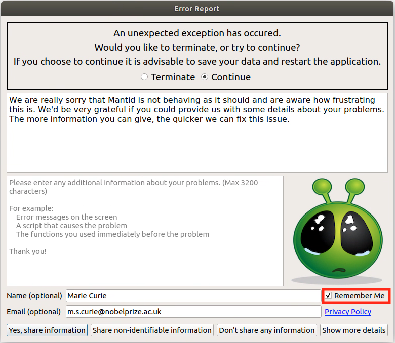
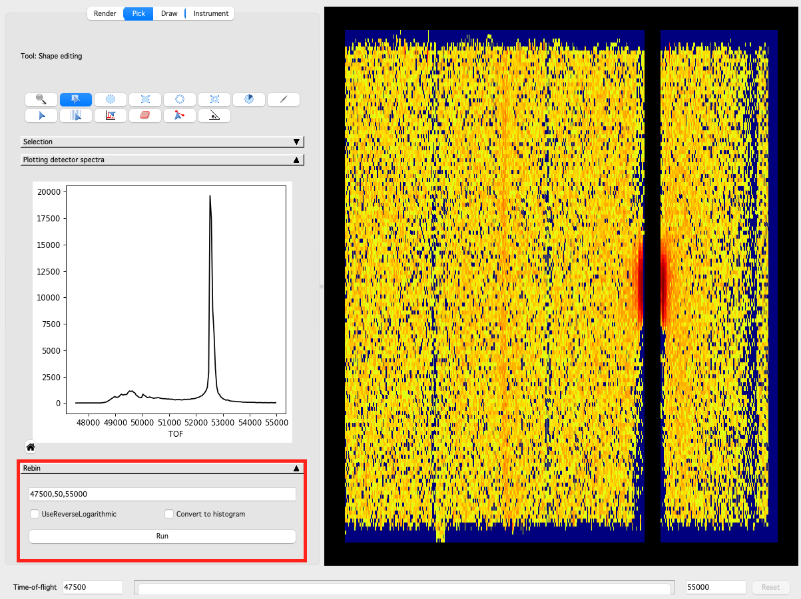

========================
Mantid Workbench Changes
========================

.. contents:: Table of Contents
   :local:

New features
------------
- Table workspaces can now have read-only columns added to them (``ws.addReadOnlyColumn(<TYPE>, <NAME>)``). Existing columns can also be set to be read-only (``ws.setColumnReadOnly(<INDEX>, <TRUE/FALSE>)``).
- **The Error Reporter can now remember and prefill the user's name and email.**

Improvements
------------
- The algorithm browser has been tidied to reduce the number of single algorithm categories.
- Cells containing vector data in a table workspace can now be viewed in the table workspace display.
- The browse dialog in the file finder widget now opens at the path specified in the widget's edit box (if the edit box contains a full path).
- The font in python editor and IPython console are ensured to be monospace. It also ensures monospace on KDE Neon distributions too.
- There is now a warning in the settings to say that changes to :ref:`Project Recovery<Project Recovery>` settings are only applied after restarting Workbench.

Bugfixes
--------
* Fixed an issue when ``save_as`` of a running script leads to crash upon script completion.
* Fixed arbitrary values not being accepted as the ``Start Time`` in ``StartLiveDataDialog``.
* Fixed a bug where the option ``SignedInPlaneTwoTheta`` in :ref:`ConvertSpectrumAxis <algm-ConvertSpectrumAxis-v2>` would not give signed results.
* A number of plotting bugfixes have been made.

  * Fixed a bug where the toggle state of the ``Grids on/off`` toolbar button was incorrect when opening a 3D surface plot.
  * Fixed plot bins not working on data with numeric X-axis.
  * Fixed a bug where the z-axis editor dialog was being initialised from the y-axis for a 3D plot.
  * Fixed a bug with autoscaling of colorfill plots from within the figure options.
  * Calls to :ref:`EvaluateFunction <algm-EvaluateFunction>`, when plotting a guess or fit result in the fit browser of a figure, correctly ignores invalid data when requested.
  * The axes limits of Waterfall plots will now scale correctly upon initial plotting and overplotting.
  * The Z-axis limits of 3D plots can now be set on linux machines.
  * The colour of the canvas is now preserved when generating a script from a plot.

* Fixed issue in :ref:`DrILL <DrILL-ref>` when ``ASCII`` output was requested but the logs to save were not defined for that instrument.
* The ``About Mantid`` page now appears on a new full release, even if a recent nightly was previously launched.
* The instrument and facility combo-boxes are now always appropriately sized on the ``About Mantid`` page on macOS.
* Fixed a bug where copying data from a table displaying a matrix workspace was not working.
* Workbench will no longer hang if an algorithm was running when Workbench was closed.
* Fixed a bug in the editor where uncommenting using ``ctrl+/`` wasn't working correctly for lines of the form ``<optional whitespace>#code_here # inline comment``.
* Commenting code in the editor using ``ctrl+/`` will preserve indenting (i.e. ``#`` will be inserted at the position of the first non-whitespace character in the line).
* Empty group workspaces can now be deleted rather than needing to be ungrouped.
* Fixed a bug in :ref:`Project Recovery<Project Recovery>` when attempting to remove non-empty directories and raising the error reporter.
* Users are no longer able to add a peak to the Fit Property Browser by clicking with the interactive tool outside of the axes (which would cause an error).
* An unhandled exeception no longer occurs when attempting to open the Fit Property Browser on a bin plot.

InstrumentViewer
----------------
New features
############
- **In the** :ref:`Pick Tab<instrumentviewer_pick_tab>` **, a new panel allowing users to directly rebin their workspace now exists.**

- The ability to rotate Ellipse and Rectangle shapes has been added.
- The integration slider now supports discrete steps when the axis has discrete values.
- A new button has been added to the :ref:`Pick Tab<instrumentviewer_pick_tab>` to allow all of the detectors in the instrument to be summed in the miniplot without having to draw a shape.

Improvements
############
- In the :ref:`Pick Tab<instrumentviewer_pick_tab>` integration is now by default over the entire detector unless some other curve is requested (such as by drawing a shape or picking a detector).
- The Y-position of the HKL labels on the miniplot is now fixed in Axes coordinates so that the label remains visible as the zoom level changes.

Bugfixes
########
- Fixed a memory leak when closing the :ref:`InstrumentViewer` window.
- Fixed a bug where folding the :ref:`Pick Tab<instrumentviewer_pick_tab>` crashed Mantid.
- Fixed a crash on the :ref:`Draw Tab <instrumentviewer_draw_tab>` when trying to sum detectors on a workspace which doesn't have common bin edges across all spectra.
- Getter for the :ref:`InstrumentViewer` will return a fully constructed instance to avoid a segmentation fault.
- Opening the :ref:`InstrumentViewer` while a workspace is being reloaded will no longer cause a crash.

SliceViewer
-----------
Bugfixes
########
- Fixed the ``out-of-range`` error when trying to access the projection matrix for a workspace with a non-Q axis before other Q axes.
- Fixed an issue to plot negative values with logarithm scaling.
- Fixed a bug in :ref:`Run <Run>` goniometer when using :ref:`algm-Plus`.
- Fixed the issue in ``SNSLiveEventDataListener`` when the instrument doesn't have monitors.
- When entering a specific value for the center of the slicepoint of an integrated dimension/axis it will no longer jump to the nearest bin-center (this fix also affects ``MDEvent`` workspaces as it was assumed each dimension had 100 bins for the purpose of updating the slider for a integrated dimension/axis).
- For ``MDHisto`` workspaces the projection matrix will be derived from the basis vectors on the workspace rather than searching for the ``W_MATRIX`` log.
- Slicepoint center is now set to the correct initial value (consistent with position of slider) for ``MDHisto`` workspaces.
- :ref:`SliceViewer` now closes when the underlying workspace is deleted.
- Removed the peak table from peak viewer when the table is deleted in ADS (and now closes peak viewer if there are no more peak tables overlaid).
- The peak actions combobox is updated when an overlain peak table is deleted.
- Users are now able to export x/y cuts and 2D slices from the region of interest tool for ``MDHisto`` workspaces.
- Transposing data (i.e. swapping x and y axes) of ``2D MD`` workspace, now works without error.
- Fixed issues with the colorbar autoscale not updating correctly on zoom.
- Stopped the ROI rectangle selection extents jumping discontinuously when the user tries to resize beyond the extent of the colorfill axes towards the line plot axes.
- :ref:`SliceViewer` will no longer dynamically rebin when viewing an ``MDHisto`` workspace that has been modified by a binary operation (e.g. :ref:`MinusMD<algm-MinusMD>`).

:ref:`Release 6.3.0 <v6.3.0>`
