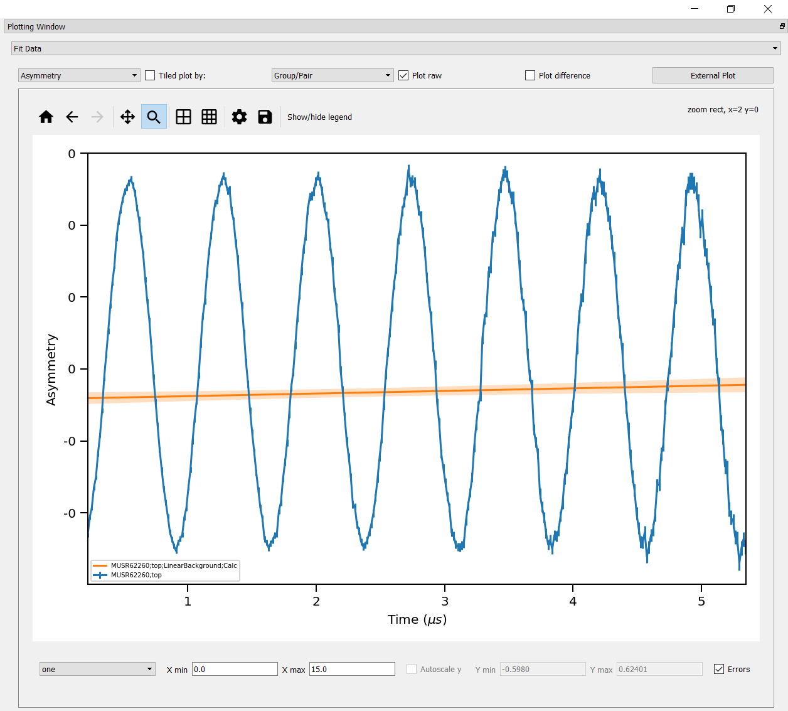

============
Muon Changes
============

.. contents:: Table of Contents
   :local:

Frequency Domain Analysis
-------------------------

New Features
############
- Users can now select the unit for the frequency spectra (MHz or Gauss) in plotting, by picking either ``Frequency`` or ``Field`` respectively after a transform has been calculated.

Bugfixes
########
- Fixed a bug that prevented the frequency spectra from being plotted when data was binned.
- When plotting transformations, FFTs now have y-units of ``intensity`` and Maxents now have y-units of ``probability``.

Muon Analysis and Frequency Domain Analysis
-------------------------------------------

New Features
############
- **Instead of plotting the confidence interval of a fit as an error bar, it is now represented by a shaded region.**

Improvements
############
- Changes have been made to improve the speed of Muon Analysis and Frequency Domain Analysis.
- The :ref:`Results Tab <muon_results_tab-ref>` will now display a warning (red text and a tooltip) if the results table already exists.
- The results table now produces errors for log values (when they are available).
- The plots no longer use scientific notation for the axis values.
- On resizing the GUI, priority is given to plotting.
- The plot guess option in Fitting can now have its range interpolated or extrapolated.
- The ``alpha`` values on :ref:`Grouping Tab <muon_grouping_tab-ref>` are now to six decimal places.
- The numerical values in the ``run info`` box on the :ref:`Home Tab <muon_home_tab-ref>` are now rounded to either 4 significant figures or a whole number, whichever is more precise.
- The Sequentially Fit all button is now visible for 4K displays.
- The :ref:`Results Tab <muon_results_tab-ref>` will now preserve the workspace selection after a fit. However, it will reselect a fit that has been recalculated.
- When using ``Browse`` to load data from a different instrument, a warning is now shown saying that the data has not been loaded.

Bugfixes
########
- Detaching tabs in Muon Analysis or Frequency Domain Analysis GUIs and then closing Mantid no longer causes a crash.
- Dragging tabs in Muon Analysis or Frequency Domain Analysis GUIs no longer shows a translucent preview that does nothing.
- Mantid no longer crashes when changing tabs in either Muon Analysis or Frequency Domain Analysis on MacOS.
- Fixed a bug that prevented the GUI working with workspace history and project recovery.
- Undo fit now resets when the function structure changes. This prevents a bug caused by trying to revert the current function to the state of a previous one.
- When a new fit is performed in Muon Analysis or Frequency Domain Analysis it no longer reselects all parameter workspaces in the results tab.

ALC
---

New Features
############
- Can now read ``nxs_v2`` files.

Bugfixes
########
- Fixed a bug that allowed decimal values for custom groupings.

Algorithms
----------

Improvements
############
- :ref:`LoadPSIMuonBin <algm-LoadPSIMuonBin>` can now load a subset of the spectra.

Fitting Functions
-----------------
New Features
############
* Added two Activation fitting functions to ``MuonModelling`` Fit Functions.

  * :ref:`ActivationK <func-ActivationK>` can be used for data in Kelvins.
  * :ref:`ActivationmeV <func-ActivationmeV>` can be used for data in meV.

* Added a :ref:`Critical peak of relaxation rate <func-CriticalPeakRelaxationRate>` for fitting to ``MuonModelling\Magnetism`` Fit Functions.
* Added two fitting functions for the decoupling of asymmetry in the ordered state of a powedered magnet for fitting.

  * :ref:`DecoupAsymPowderMagLong <func-DecoupAsymPowderMagLong>` can be used for longitudinal polarization.
  * :ref:`DecoupAsymPowderMagRot <func-DecoupAsymPowderMagRot>` can be used for rotational asymmetry.

* Added a :ref:`Magentic Order Parameter<func-MagneticOrderParameter>` function to ``MuonModelling\Magentism`` Fit Functions.
* Added a :ref:`Muonium-style Decoupling Curve <func-MuoniumDecouplingCurve>` function to ``MuonModelling`` Fit Functions.
* Added a :ref:`Power Law <func-PowerLaw>` fitting function to ``MuonModelling`` Fit Functions.
* Added a :ref:`Smooth Transition <func-SmoothTransition>` function to ``MuonModelling`` Fit Functions.

Improvements
############
- created a new category, ``Magnetism``, in the ``MuonModelling`` Fit Functions list.
- :ref:`Gaussian <func-Gaussian>`, :ref:`Lorentzian <func-Lorentzian>` and :ref:`Polynomial fitting <func-Polynomial>` functions can now also be found under ``MuonModelling`` in the Fitting Functions Tree.

:ref:`Release 6.3.0 <v6.3.0>`
