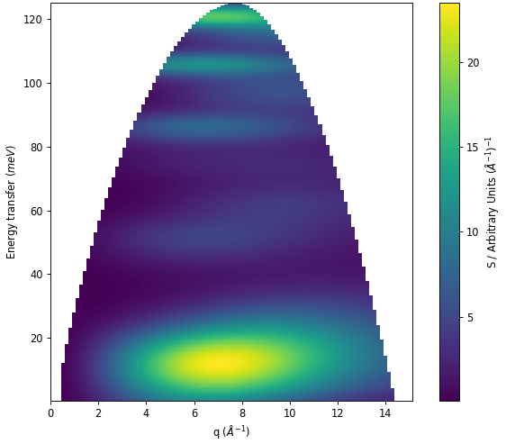

=======================
Direct Geometry Changes
=======================

.. contents:: Table of Contents
   :local:

General
-------

New Features
############

- :ref:`CorrectTOFAxis <algm-CorrectTOFAxis>` can now accept fractional bin indices for more precise calculation of the elastic peak position calibration.
- :ref:`DirectILLCollectData <algm-DirectILLCollectData>` will now accept fractional elastic peak reference bins as well as forward fractional elastic
  peak indexes in the :ref:`CorrectTOFAxis <algm-CorrectTOFAxis>` algorithm.
- :ref:`DirectILLApplySelfShielding <algm-DirectILLApplySelfShielding>` now ensures that the subtracted container and self-attenuation correction workspaces
  have consistent binning by rebinning to the sample that will be corrected.
- :ref:`LoadPLN <algm-LoadPLN>` now supports the loading of ANSTO PELICAN data during event capture mid-experiment, as a cross check for long experiments.

Bugfixes
########

- The sign of the half-channel width in the :ref:`LoadILLTOF <algm-LoadILLTOF>` algorithm has been changed from negative to positive to ensure the TOF axis is always positive.
- The :ref:`PyChop <PyChop>` interface has been adjusted to ensure that the command-line version functions as described in the documentation.
- :ref:`DirectILLCollectData <algm-DirectILLCollectData>` will now be able to load data with whitespaces in paths or file names.

Algorithms
----------

New Features
############

* A new :ref:`Abins2D <algm-Abins2D>` algorithm has been added for simulation of inelastic neutron scattering in direct-geometry

  * This employs the same almost-isotropic analytic powder-averaging incoherent approximation as :ref:`Abins <algm-Abins>`.
  * The ISIS MARI, MAPS, and MERLIN instruments are supported, alongside ILL-PANTHER and a ``TwoDMap`` ideal simulation. Please direct requests/specifications for additional instruments to Sanghamitra Mukhopadhyay and Adam Jackson.
  * The algorithm produces workspaces in :math:`(Q,\omega)` space, best viewed interactively in :ref:`Sliceviewer <sliceviewer>`, or rendered as :ref:`colorfill plots <Colorfill_Plots>`.

* :ref:`DirectILLAutoProcess <algm-DirectILLAutoProcess>` now performs the full data reduction treatment for ILL direct geometry instruments for an empty container, vanadium, and sample, both for single crystal and powder.
* :ref:`DirectILLCollectData <algm-DirectILLCollectData>` has two new properties: ``GroupDetHorizontallyBy`` and ``GroupDetVerticallyBy`` which allow for averaging pixel counts between the tubes and inside them, respectively, or for flat background calculations.
* Autoscaling has been added to the :ref:`PelicanReduction <algm-PelicanReduction>` algorithm to ensure that the Q range matches the energy transfer, as is default in the UI.

CrystalField
------------

New Features
############

- The :ref:`Crystal Field Python interface <Crystal Field Python Interface>` has been extended to include functions to calculate the x, y, and z components of
  the dipole transition matrix: ``getXDipoleMatrixComponent()``, ``getYDipoleMatrixComponent()`` and ``getZDipoleMatrixComponent()``.

MSlice
------

New Features
############

- The documentation has been improved to include more up-to-date screenshots and more information about cutting methods.
- The programme is now available as a noarch conda package.
- MSlice is now compatible with ``matplotlib 3.5.0``.
- Slice plot font sizes can now be changed using the quick options.
- Improved the error message for empty cut plot axes.
- Modified the default Bragg peak size for interactive cut plots.
- Improved zooming speed for slice plots with recoil lines.
- Improved handling of default line widths.

Bugfixes
########

- The Default Energy Unit menu is no longer empty.
- The ``Show Legend`` check boxes now appear with the correct state.
- Fixed colorbar crash when changing scale to logarithmic with negative ``vmax`` value and/or negative/0 ``vmin`` value.
- Fixed a bug that prevented ``vmin`` from updating when unticking logarithmic scale.
- Fixed a problem with ignored Bragg peaks on interactive cut plots when flipping axes.
- Fixed a bug that caused a runtime error when changing between workspaces from same dataset.
- Fixed an issue with re-opening line dialog for cut plots.
- Fixed bug that caused an error when changing the scale to logarithmic for cut plots with Bragg peaks.
- Max and min axes values will no longer take strings or empty strings instead of doubles.
- Dialogue boxes for quick options and plot options now stay on top of the plot window.
- Fixed a bug causing error messages when loading OSIRIS data.
- Fixed problem with the deletion of overplotted lines.
- Included a fix for to prevent Bragg peaks being duplicated when overplotting cut plots.
- Fixed the scaling of Bragg peaks on plots with logarithmic scales.

:ref:`Release 6.4.0 <v6.4.0>`
