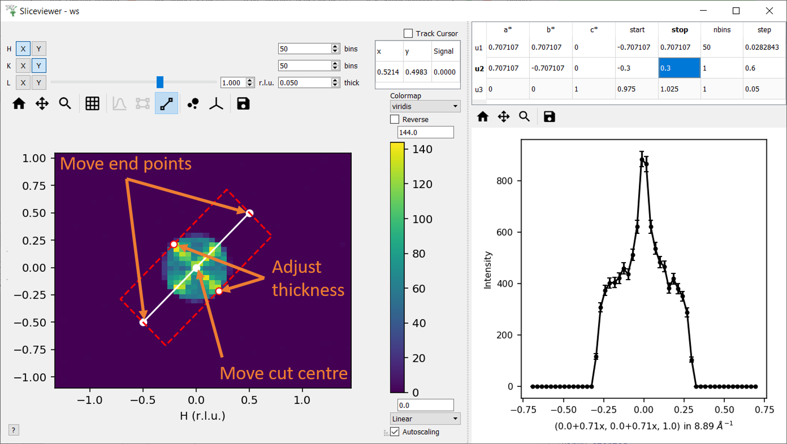

.. _v6.4.0:

===========================
Mantid 6.4.0 Release Notes
===========================

.. contents:: Table of Contents
   :local:

We are proud to announce version 6.4.0 of Mantid.

Many of the updates in this version have focused on improvements for users, building on existing algorithms and interfaces.
Our method of packaging has also changed. Windows and macOS users should not notice any difference,
but this will be the last release where we provide ``.rpm`` and ``.deb`` packages for Linux (more details :ref:`here <6.4_packaging>`).

In addition to many improvements we are delighted to announce some new features including:

- A new :ref:`cut viewer tool <sliceviewer_nonaxiscuts>` for non-axis aligned cuts has been added to the :ref:`SliceViewer`.
- Workbench and MSlice are now compatible with matplotlib v3.5.
- In the :ref:`ISIS Reflectometry <interface-isis-refl>` interface, :ref:`Experiment Settings <refl_exp_instrument_settings>`
  defaults can now be set according to both the angle and the sample title.
- Fit functions have been extended to allow for the addition of :ref:`Function Attribute Validators <attribute_validators>`.
- The :ref:`ISIS SANS TOML <sans_toml_v1-ref>` format has been upgraded to V1. All V1 files will continue to be supported in future versions without changes.
- An inelastic version of the :ref:`DiscusMultipleScatteringCorrection <algm-DiscusMultipleScatteringCorrection>` algorithm has been implemented. This allows the multiple scattering effect to be simulated using a Monte Carlo integration for an arbitrary sample shape given an S(Q,w). The calculation can be run for a direct or indirect geometry instrument. The following figure shows the simulated first and second order scattering intensity as a function of energy for a direct geometry experiment on a water sample:

.. figure:: /images/MultipleScatterIntensityDiscusDirect.png
   :align: center

.. _6.4_packaging:

Packaging & Installation
------------------------

As advertised in :ref:`v6.3.0 <v6.3.0>` we have reworked our installer packages for this release. Changes include:

- Windows and macOS packages are now named ``MantidWorkbench-6.4.0`` with the appropriate extension. Other than this they are used in the same manner.
- A new linux package, ``mantidworkbench-6.4.0.tar.xz``, now supports many Linux distributions and should work on any 2010+ distribution with ``glibc >= 2.17``.
  It is a simple, flat tarball that can be unpacked anywhere and no longer has to reside in ``/opt``.

These packages are built using our conda libraries to make future maintenance easier.

Last Release of .rpm and .deb
#############################

This release will be the last time we provide an ``.rpm`` for Red Hat and a ``.deb`` for Ubuntu.
The new Linux tarball provided above will work on both of these systems and has the advantage of not being tied to ancient system libraries that have held up internal updates.
The new tarball can also be extracted and run anywhere, so does not require root permissions to install.

Further Information
-------------------

These are just some of the many improvements in this release, so please take a
look at the release notes, which are filled with details of the
important changes and improvements in many areas. The development team
has put a great effort into making all of these improvements within
Mantid, and we would like to thank all of our beta testers for their
time and effort helping us to make this another reliable version of Mantid.

Throughout the Mantid project we put a lot of effort into ensuring
Mantid is a robust and reliable product. Thank you to everyone that has
reported any issues to us. Please keep on reporting any problems you
have, or crashes that occur on our `forum`_.

Installation packages can be found on our `download page`_
which now links to sourceforge to mirror our download files around the world. You can also
access the source code on `GitHub release page`_.

Citation
--------

Please cite any usage of Mantid as follows:

- *Mantid 6.4.0: Manipulation and Analysis Toolkit for Instrument Data.; Mantid Project*. `doi: 10.5286/SOFTWARE/MANTID6.4 <https://dx.doi.org/10.5286/SOFTWARE/MANTID6.4>`_

- Arnold, O. et al. *Mantid-Data Analysis and Visualization Package for Neutron Scattering and mu-SR Experiments.* Nuclear Instruments
  and Methods in Physics Research Section A: Accelerators, Spectrometers, Detectors and Associated Equipment 764 (2014): 156-166
  `doi: 10.1016/j.nima.2014.07.029 <https://doi.org/10.1016/j.nima.2014.07.029>`_
  (`download bibtex <https://raw.githubusercontent.com/mantidproject/mantid/master/docs/source/mantid.bib>`_)

Changes
-------

.. toctree::
   :hidden:
   :glob:

   *

- :doc:`Framework <framework>`
- :doc:`Mantid Workbench <mantidworkbench>`
- :doc:`Diffraction <diffraction>`
- :doc:`Muon Analysis <muon>`
- Low Q

  - :doc:`Reflectometry <reflectometry>`

  - :doc:`SANS <sans>`
- Spectroscopy

  - :doc:`Direct Geometry <direct_geometry>`

  - :doc:`Indirect Geometry <indirect_geometry>`

Full Change Listings
--------------------

For a full list of all issues addressed during this release please see the `GitHub milestone`_.

.. _download page: https://download.mantidproject.org

.. _forum: https://forum.mantidproject.org

.. _GitHub milestone: https://github.com/mantidproject/mantid/pulls?utf8=%E2%9C%93&q=is%3Apr+milestone%3A%22Release+6.4%22+is%3Amerged

.. _GitHub release page: https://github.com/mantidproject/mantid/releases/tag/v6.4.0
