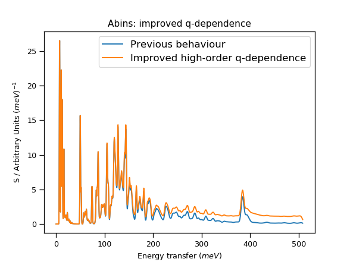

=========================
Indirect Geometry Changes
=========================

.. contents:: Table of Contents
   :local:

New Features
------------

- In the Fitting tabs in :ref:`Inelastic Data analysis <interface-inelastic-qens-fitting>` the button for fitting the currently plotted spectra has been renamed and rescaled to fit the interface.
- An option has been added to :ref:`ISIS Energy Transfer <ISISEnergyTransfer>` that will group outputs by the position of the sample changer using :ref:`GroupBySampleChangerPosition<algm-GroupBySampleChangerPosition>` .

Bugfixes
--------

- A bug has been fixed in the ``CASTEP .phonon`` file import for the :ref:`Density Of States interface<DensityOfStates_Interface>` and :ref:`SimulatedDensityOfStates <algm-SimulatedDensityOfStates>` algorithm. The bug was causing some q-points to be misidentified as duplicate Gamma-points and removed.
- A bug has been fixed in :ref:`Inelastic Data analysis <interface-inelastic-qens-fitting>` where the first value would be ignored when a fit was performed.
- Two bugs have been fixed in ``ISISCalibration`` in the :ref:`Indirect Data Reduction<interface-indirect-data-reduction>` interface. The first bug caused the resolution data to not be updated when the reflection was changed. The second bug sometimes caused a bad energy range selection for the resolution data.

Algorithms
----------

New Features
############

- :ref:`IndirectILLReductionQENS <algm-IndirectILLReductionQENS>` and :ref:`IndirectILLReductionFWS <algm-IndirectILLReductionFWS>` now offer the ability to switch off the detector grouping.
- Added new workflow algorithm called :ref:`SimpleShapeDiscusInelastic <algm-SimpleShapeDiscusInelastic>` that calls :ref:`DiscusMultipleScatteringCorrection <algm-DiscusMultipleScatteringCorrection>` with options for some simple shape types.

Bugfixes
########

- **The** :ref:`Abins <algm-Abins>` **algorithm has been reworked to account for q-dependence correctly when forming 3+
  phonon events by self-convolution. This changes the results obtained when using the** ``Autoconvolution``
  **option, which now results in the expected high-frequency** ``wing``.

- An error is fixed in :ref:`Abins <algm-Abins>`. This relates to the assignment of ``Forward`` and ``Backward`` detector settings for TOSCA, which were reversed from their conventional definition. The default behaviour has not changed: results will only be affected for calculations which explicitly selected the ``Forward (TOSCA)`` or ``Backward (TOSCA)`` options.
- A bug has been fixes in :ref:`SofQWMoments <algm-SofQWMoments>` that prevented it from working with OSIRIS data.

:ref:`Release 6.4.0 <v6.4.0>`
