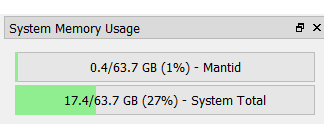

========================
Mantid Workbench Changes
========================

.. contents:: Table of Contents
   :local:

New Features
------------

- Added the :ref:`Fit Script Generator <Fit_Script_Generator-ref>` interface to the ``General`` category of the interface menu.
- Added a new general setting: ``Provide auto-completion suggestions in the script editor`` for making auto-completion optional in the script editor.
- **An additional memory bar has been added to the memory widget to enable users to see how much memory Mantid is using.**

\

- The ``FitPropertyBrowser`` has been extended to allow for Function Attribute Validators. This allows the value of attributes to be restricted in numerous ways such as being bounded by a numeric min/max value or to be selected from a list of values using a drop down menu.
- Add support for the new :ref:`SANSILLReduction <algm-SANSILLReduction>` algorithm in DrILL.
- When loading and saving a project or a script, the working directory of the dialogs is now set to the current default save directory.
- MantidWorkbench is now compatible with ``matplotlib v3.5.0``.

Bugfixes
--------

- Suppressed a spurious warning where ``matplotlib`` warns about creating a figure outside of the main thread when using the script window.
- In the DrILL interface, scrolling down in the settings dialog no longer affects the combo boxes.
- Cleaned up the appearance of the main window and the Indirect, Reflectometry, and Engineering GUIs on macOS.
- Fixed a bug with the plotting status bar in conda builds. The status bar no longer flickers when users move over the plot image or the z axis image.
- Fixed a memory leak whereby copies of workspaces were being retained even though the workspace had been deleted.
- Removed the Load ILL tab from the interface in ``Indirect -> Tools``. Users should use the :ref:`LoadILLIndirect<algm-LoadILLIndirect>` algorithm or the ``Load`` button instead.
- ``RebinnedOutput`` workspaces are now supported in the :ref:`Superplot <WorkbenchSuperplot>`.
- Copying a spectrum in a ``MatrixWorkspace`` is now supported for ragged workspaces.
- Opening the plot options for a figure containing an ``inset`` axes will no longer cause an error.
- Workbench will no longer throw an error on plots with error bar caps when the offset of a waterfall plot is adjusted.
- Fixed a crash that occurred when adding a user function to a plot that already has a guess plotted.
- Fixed a bug where trying to save a large project would cause Mantid to crash.
- Workbench no longer generates an error when you save the ``Figure Options`` on a colour fill plot containing two images of different types (e.g. QuadMesh and Image).
- Users are now prevented from overwriting previous versions of Mantid if the uninstaller is not present. Some antivirus software deletes the uninstaller. Installing over older versions without the uninstaller can cause Mantid not to function properly and for users to lose data.
- Removed Line Colour option from the toolbar in Contour Plots as it no longer works.

Instrument Viewer
-----------------

New Features
############

- A new option is available to see basic detector data in a tooltip when hovering.
- It is now possible to replace the workspace and save the image of the Instrument Viewer using its python API.

Bugfixes
########

- The ``?`` button now opens the help documentation for Workbench, rather than a web-page containing the documentation for the interface in MantidPlot.

Sliceviewer
-----------

New Features
############

- **A new cut viewer tool for non-axis aligned cuts. Please Note: This currently only supports 3D MD workspaces where all dimensions are Q.**

.. image::  ../../images/SliceViewer_CutViewer.png
            :align: center

Bugfixes
########

- Color limit autoscaling now works for ``MDHisto`` workspaces in non-orthogonal view in Sliceviewer.
- Using the ``Region of Interest`` tool when the colorscale is set to Power will no longer cause a position related error.
- Using the ``Log`` or ``SymmetricLog10`` colorbar normalisation options on masked data is now disabled to prevent an error.
- Fixed a bug with peak selection causing a crash for 4D MD workspaces.
- Peak addition now correctly assigns new peak ``HKL`` in nonorthogonal view.
- The peak overlay is now disabled when a non-Q axis is viewed. The peak object does not have a position defined for a non-Q dimension.
- Automatic refresh now works when a binary operation is applied to the underlying workspace.

:ref:`Release 6.4.0 <v6.4.0>`
