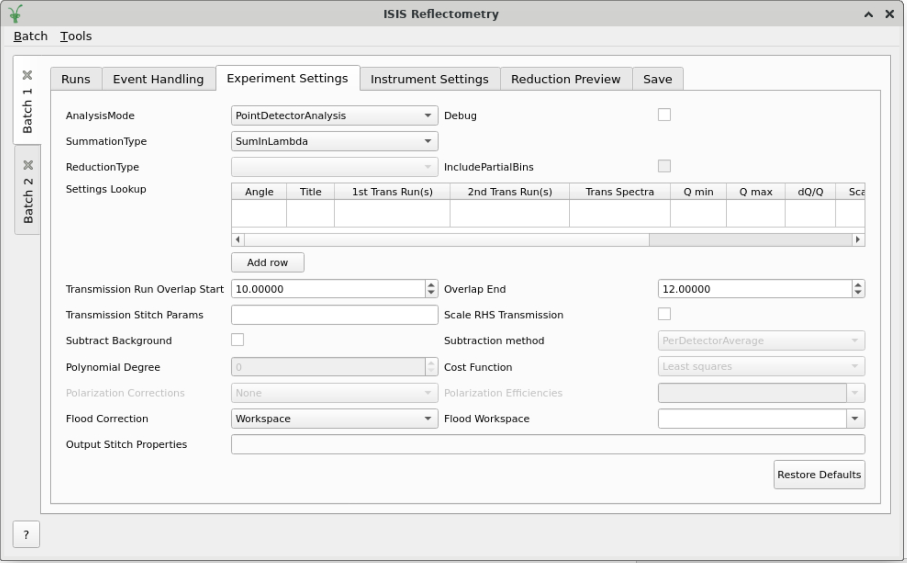

=====================
Reflectometry Changes
=====================

.. contents:: Table of Contents
   :local:

New features
------------

- **On the ISIS Reflectometry interface, you can now specify default experiment settings on a per-sample basis as well as a per-angle basis. The new** ``Title`` **field in the lookup table allows you to specify a regular expression. Any runs with a title that matches this expression will use those settings by default.**

- The ``per-angle defaults`` table has been renamed to the ``Settings Lookup`` table to better represent that lookups can now be performed using both the angle and the sample title.
- The :ref:`Runs tab <refl_runs>` of the ISIS Reflectometry Interface now contains a ``Lookup Index`` column to indicate which row from the ``Settings Lookup`` table was used.
- Processing is now disabled if there are any errors on the :ref:`Experiment Settings <refl_exp_instrument_settings>` table.
- Groups on the :ref:`Runs tab <refl_runs>` are now highlighted with a paler green when all runs within them have been processed, but the group has not yet been post-processed.
- The automated template generation from the :ref:`LRAutoReduction <algm-LRAutoReduction>` algorithm has been removed, as it was never used.
- Removed the ``PrimaryFractionRange`` property from the :ref:`LRAutoReduction <algm-LRAutoReduction>` algorithm, as the primary fraction correction is no longer in use.
- The ISIS Reflectometry interface now logs a warning if starting live data will use potentially unexpected settings.
- The Instrument Selector tooltips have been updated to clarify that any changes made using these combo-boxes will apply across all of Mantid.

Bugfixes
--------

- Loading a batch now correctly re-populates the :ref:`Experiment Settings tab's <refl_exp_instrument_settings>` ``Settings Lookup`` table.
- Fixed a potential crash when running a live data reduction if the :ref:`SliceViewer <sliceviewer>` is open on the live data workspace.
- Workbench will no longer crash if :ref:`ReflectometryBackgroundSubtraction <algm-ReflectometryBackgroundSubtraction>` is run from the Algorithm Dialog with a :ref:`WorkspaceGroup <WorkspaceGroup>` as the input.
- The default processing instructions for :ref:`ReflectometryReductionOneAuto <algm-ReflectometryReductionOneAuto>` can no longer be incorrect.
  Sensible default values are now used for the INTER linear detector if not specified by the user.
  Previously, an incorrect pattern was being specified. This resulted in confusing errors such as a reduced workspace with multiple histograms, or error messages about invalid detector IDs or angle correction not being possible.
- Mantid will no longer hang when running multiple python algorithms simultaneously, e.g. when running live data and processing a batch at the same time.

:ref:`Release 6.4.0 <v6.4.0>`
