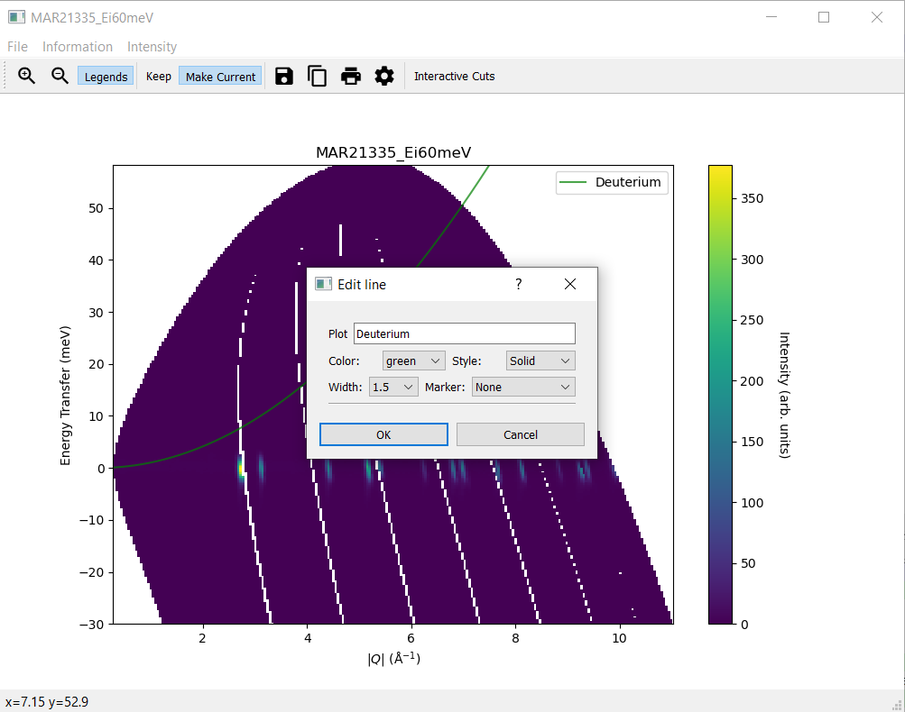

=======================
Direct Geometry Changes
=======================

.. contents:: Table of Contents
   :local:

CrystalField
-------------

New features
############
- It is now possible to use the algorithms from the :ref:`GOFit optimization package <gofit-fitting>` directly with the :ref:`Crystal Field API <Crystal Field Python Interface>`.
- :ref:`PelicanCrystalProcessing <algm-PelicanCrystalProcessing>` generates a collection of nxspe files from a run sequence that can be used by programs such as Horace.

Bugfixes
############
- Fix for bug that caused runtime errors when trying to fix a tied parameter in the two step fitting process.
- Fix for ``sortTies`` to prevent a crash when fitting CrystalField multisite objects with Gaussian peaks.

MSlice
------

New features
############
- Added ability to correct intensity of cuts.
- Updated documentation.
- Updated quick options for lines to consider new colour mapping and line width changes.

Bugfixes
############
- Fixed bug that caused opening of a second slice plot when changing the intensity while an interactive cut plot is open.
- Fixed error occurring when closing interactive cut plot.
- The temperature is now cached for access from derived cuts to prevent MSlice from crashing.
- Improved logic behind intensity type changes to fix a bug impacting both cut and slice plots.
- Font size changes are now propagated in scripts generated from plots.
- Fixed a bug that caused the duplication of suffixes when renaming workspaces.

:ref:`Release 6.5.0 <v6.5.0>`
