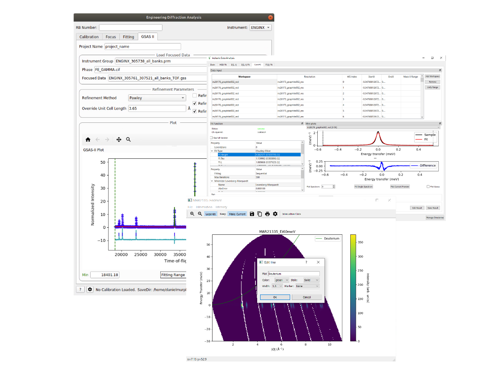

.. _v6.5.0:

===========================
Mantid 6.5.0 Release Notes
===========================

.. contents:: Table of Contents
   :local:

We are proud to announce version 6.5.0 of Mantid.

This release includes a wide array of updates, bugfixes, and new features, which build on the functionality of Mantid.
Users are reminded that this release has now dropped support for ``.rpm`` & ``.deb`` files on Linux in favour of Conda installations or a standalone tarball. Please see the :ref:`6.4.0 release notes <v6.4.0>` for more information.

In addition to many improvements we are delighted to announce some new features including:

- A new tab has been added to the :ref:`ISIS Engineering Diffraction UI<Engineering_Diffraction-ref>` to support running refinements in GSAS-II.
- The ISIS powder diffraction scripts support the PaalmanPings correction method.
- It is now possible to use the algorithms from the :ref:`GOFit optimization package <gofit-fitting>` directly with the :ref:`Crystal Field API <Crystal Field Python Interface>`.
- The algorithm :ref:`DiscusMultipleScatteringCorrection <algm-DiscusMultipleScatteringCorrection>` now simulates scattering in a container (and more generally in any sample environment components) if a user sets up the shapes and materials in the input workspace prior to running the algorithm.
- A new set of scripts has been produced to provide a method for processing OSIRIS data. :ref:`ISIS Powder Diffraction Scripts - OSIRIS <isis-powder-diffraction-osiris-ref>`.
- Three new fitting functions: :ref:`FickDiffusionSQE <func-FickDiffusionSQE>`, :ref:`ChudleyElliotSQE <func-Chudley-ElliotSQE>`, and :ref:`HallRossSQE <func-Hall-RossSQE>` have been made and added to :ref:`ConvFit <convfit>`.
- Support loading and reducing data for the new detector for D16 at ILL.

Further Information
-------------------

These are just some of the many improvements in this release, so please take a
look at the release notes, which are filled with details of the
important changes and improvements in many areas. The development team
has put a great effort into making all of these improvements within
Mantid, and we would like to thank all of our beta testers for their
time and effort helping us to make this another reliable version of Mantid.

Throughout the Mantid project we put a lot of effort into ensuring
Mantid is a robust and reliable product. Thank you to everyone that has
reported any issues to us. Please keep on reporting any problems you
have, or crashes that occur on our `forum`_.

Installation packages can be found on our `download page`_
which now links to sourceforge to mirror our download files around the world. You can also
access the source code on `GitHub release page`_.

Citation
--------

Please cite any usage of Mantid as follows:

- *Mantid 6.5.0: Manipulation and Analysis Toolkit for Instrument Data.; Mantid Project*. `doi: 10.5286/SOFTWARE/MANTID6.5 <https://dx.doi.org/10.5286/SOFTWARE/MANTID6.5>`_

- Arnold, O. et al. *Mantid-Data Analysis and Visualization Package for Neutron Scattering and mu-SR Experiments.* Nuclear Instruments
  and Methods in Physics Research Section A: Accelerators, Spectrometers, Detectors and Associated Equipment 764 (2014): 156-166
  `doi: 10.1016/j.nima.2014.07.029 <https://doi.org/10.1016/j.nima.2014.07.029>`_
  (`download bibtex <https://raw.githubusercontent.com/mantidproject/mantid/master/docs/source/mantid.bib>`_)

Changes
-------

.. toctree::
   :hidden:
   :glob:

   *

- :doc:`Framework <framework>`
- :doc:`Mantid Workbench <mantidworkbench>`
- :doc:`Diffraction <diffraction>`
- :doc:`Muon Analysis <muon>`
- Low Q

  - :doc:`Reflectometry <reflectometry>`

  - :doc:`SANS <sans>`
- Spectroscopy

  - :doc:`Direct Geometry <direct_geometry>`

  - :doc:`Indirect Geometry <indirect_geometry>`

Full Change Listings
--------------------

For a full list of all issues addressed during this release please see the `GitHub milestone`_.

.. _download page: https://download.mantidproject.org

.. _forum: https://forum.mantidproject.org

.. _GitHub milestone: https://github.com/mantidproject/mantid/pulls?utf8=%E2%9C%93&q=is%3Apr+milestone%3A%22Release+6.5%22+is%3Amerged

.. _GitHub release page: https://github.com/mantidproject/mantid/releases/tag/v6.5.0
