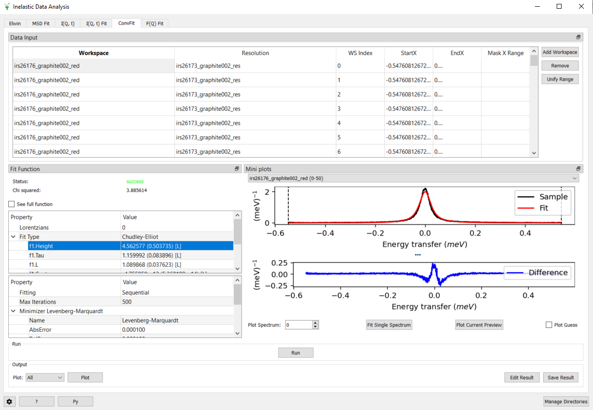

=========================
Indirect Geometry Changes
=========================

.. contents:: Table of Contents
   :local:

New Features
------------
- A new set of scripts has been produced to provide a method for processing OSIRIS data. :ref:`ISIS Powder Diffraction Scripts - OSIRIS <isis-powder-diffraction-osiris-ref>`.
- Three new fitting functions: :ref:`FickDiffusionSQE <func-FickDiffusionSQE>`, :ref:`ChudleyElliotSQE <func-Chudley-ElliotSQE>`, and :ref:`HallRossSQE <func-Hall-RossSQE>` have been made and added to ConvFit.

- The :ref:`I(q,t) <iqt>` tab in Indirect Data Analysis can now be ran with direct data.
- Updated :ref:`SimpleShapeDiscusInelastic <algm-SimpleShapeDiscusInelastic>` workflow algorithm to add support for containers in line with the enhancements made to :ref:`DiscusMultipleScatteringCorrection <algm-DiscusMultipleScatteringCorrection>`.

Bugfixes
--------
- Fixed a bug where clicking 'Run' on the :ref:`Apply Absorption Corrections<apply_absorp_correct>` Tab in the :ref:`Corrections<interface-inelastic-corrections>` GUI with no Sample or Corrections would close mantid.
- Fixed a bug where if the Corrections Workspace name entered on the :ref:`Apply Absorption Corrections<apply_absorp_correct>` Tab does not match an existing workspace, Mantid would close.
- Fixed a bug in :ref:`Indirect Data Reduction <interface-indirect-data-reduction>` where the spectra in the detector table started at 0. The spectra now start at 1.
- Fixed a bug in the Indirect Data Analysis :ref:`F(Q) fit <fqfit>` tab where, when loading a file in the workspace selector, if the parameter type was changed before the workspace was finished loading it would crash Mantid.
- Fixed a bug in the Indirect Data Analysis :ref:`F(Q) fit <fqfit>` tab where, when adding data to the interface, if the parameter type was changed when no data was selected it would crash Mantid.
- Prevent a crash when loading a file in the S(Q,w) tab without first selecting an instrument.

Algorithms
----------

Bugfixes
########
- :ref:`Abins<algm-Abins>`/:ref:`Abins2D<algm-Abins2D>` DMOL3 parser has been heavily re-written to fix incorrect assignment of eigenvector values. Intensities of any :ref:`Abins<algm-Abins>`/:ref:`Abins2D<algm-Abins2D>`-calculated spectra from DMOL3 data are likely to have changed, and should now agree better with other codes.

:ref:`Release 6.5.0 <v6.5.0>`