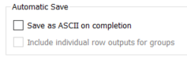

=====================
Reflectometry Changes
=====================

.. contents:: Table of Contents
   :local:

New Features
------------
- When running the :ref:`live data monitor<refl_live_data>` from the :ref:`ISIS Reflectometry interface<interface-isis-refl>`, it will now be automatically restarted if it stops unexpectedly.
- The :ref:`Save ASCII tab<refl_save_ascii>` now has a checkbox to allow individual row outputs to be included as well as group outputs, when autosave is selected.

- If both transmission runs are set on the :ref:`Experiment Settings tab<refl_exp_instrument_settings>`, there was previously no way to override this to use only a single transmission run. This has been changed so that if you specify only the first transmission run on the runs table, and leave the second blank, then only the first will be used.

Bugfixes
--------
- The lookup index is now set correctly on the runs table when transferring from the search results.
- The settings from the :ref:`Event Handling tab<refl_event_handling>` are now correctly applied after loading a batch.
- Fixed a bug with starting the :ref:`live data monitor<refl_live_data>` from the :ref:`ISIS Reflectometry interface<interface-isis-refl>` where there was a delay in updating the processed (IvsQ) workspace.
- The reduction type from the :ref:`Experiment Settings tab<refl_exp_instrument_settings>` is now ignored when SumInLambda is selected.
- Fixed a potential crash when performing time slicing if the workspace contains zero counts; you should now get a sensible error message instead.

:ref:`Release 6.5.0 <v6.5.0>`
