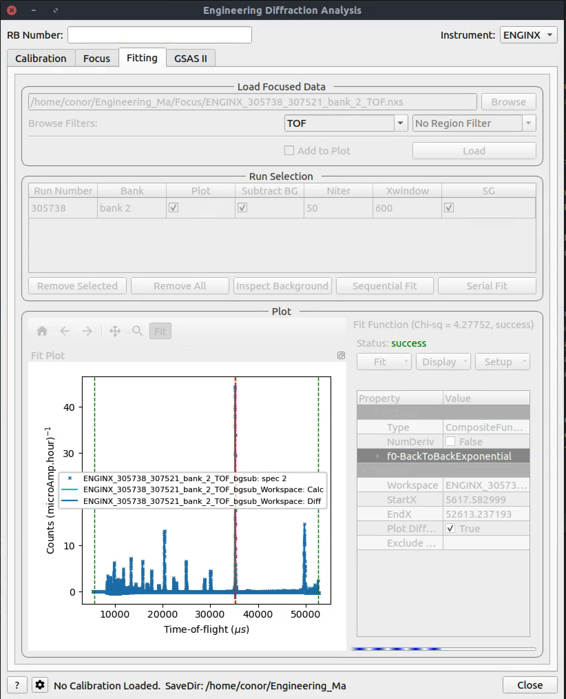

===================
Diffraction Changes
===================

.. contents:: Table of Contents
   :local:

Powder Diffraction
------------------

New features
############
- Introduced an input parameter in :ref:`WANDPowderReduction <algm-WANDPowderReduction>` to specify that the input workspaces are from event filtering. In such a situation, the overall reduction time may be significantly reduced.
- Added support for ILL D4C instrument, a liquid diffractometer. This adds a new algorithm responsible for the reduction stage: :ref:`D4ILLReduction <algm-D4ILLReduction>`, which handles calling the loader, correcting for dead time, bank position offsets, relative efficiency, and normalisation to monitor or time.
- Increased the speed of the Fourier filter in the POLARIS total scattering reduction by reducing the ``Rmax`` parameter used in the pair of (forward and backward) ``PDFFourierTransform`` calls and optimising the integration code inside :ref:`PDFFourierTransform v2 <algm-PDFFourierTransform-v2>`.

Bugfixes
########
- :ref:`PDDetermineCharacterizations <algm-PDDetermineCharacterizations>` now uses the time average mean value of logs.
- Calling focus twice in a reduction using the :ref:`ISIS Powder Diffraction scripts<isis-powder-diffraction-ref>` no longer runs the normalisation and absorption correction steps twice. The second run of focus was using a partially processed input file from the first focus.
- Fixed an issue with :ref:`HB2AReduce <algm-HB2AReduce>` when ``colltrans`` column is not available in the data file. This corresponds to the situation when the ``colltrans`` motor is not connected.

Engineering Diffraction
-----------------------

New features
############
- On the ``GSASII`` tab of the :ref:`Engineering Diffraction interface<Engineering_Diffraction-ref>`, when a successful refinement is run, the output table workspace for the lattice parameters now includes the ``Microstrain`` value and the column title is marked when this parameter has been refined. A similar instrument parameter table workspace is now also generated which includes ``Sigma-1`` and ``Gamma(Y)``, with a refined flag, and the fitting range. The Pawley reflections are output to a separate table workspace if they are available.
- An indicator has been added below the ``FitPropertyBrowser`` on the :ref:`Engineering Diffraction interface<Engineering_Diffraction-ref>` ``Fitting`` tab. This will display when the fit is in progress and whether the most recent fit was successful or a failure.

Bugfixes
########
- Corrected the tabbing order between widgets on the :ref:`Engineering Diffraction interface<Engineering_Diffraction-ref>`.
- Add a scrollbar to the ``GSASII`` tab, on the :ref:`Engineering Diffraction interface<Engineering_Diffraction-ref>`, to allow a smaller interface height, similar to the ``Fitting`` tab.
- A check has been added to ensure there are enough data points before attempting to fit a diffraction peak in :ref:`FitPeaks <algm-FitPeaks>`.
- The :ref:`SaveVulcanGSS <algm-SaveVulcanGSS>` algorithm has been marked as deprecated as of 2022-11-30.

Single Crystal Diffraction
--------------------------

New features
############
- Added a new option to :ref:`IntegratePeaksSkew <algm-IntegratePeaksSkew>`: to get the initial TOF window from back-to-back exponential coefficients if specified in the instrument's ``parameters.xml`` file.
- Back-to-back exponential coefficients have been added to the SXD ``parameters.xml`` file
- Input arguments to :ref:`IntegratePeaksSkew <algm-IntegratePeaksSkew>` have been simplified. The parameter ``FractionalTOFWindow`` has been removed, if a user wants to integrate with an initial window ``dTOF/TOF = constant`` for all peaks then this can be achieved by setting ``ThetaWidth = 0``. This is a breaking change!
- A new algorithm, :ref:`SaveINS <algm-SaveINS>`, allows for writing of ``.ins`` input file for SHELX
- Added two options to :ref:`IntegratePeaksSkew <algm-IntegratePeaksSkew>`: to scale angular resolution parameter (``ThetaWidth``) by wavelength, and to specify minimum number of TOF bins in a valid peak (``NTOFBinsMin``).
- Improve estimation of resolution parameters in :ref:`IntegratePeaksSkew <algm-IntegratePeaksSkew>` to make it more robust to outliers.
- Made Lorentz correction in :ref:`IntegratePeaksSkew <algm-IntegratePeaksSkew>` optional.
- Added back bank 14 to TOPAZ, for a total of 20 banks.
- Exposed indexing tolerance for :ref:`SCDCalibratePanels  <algm-SCDCalibratePanels>` when using ``RecalculateUB`` option.
- Sped up ellipsoid integration in :ref:`algm-IntegratePeaksMD` by introducing parallelization.

Bugfixes
############
- The :ref:`algm-IntegratePeaksProfileFitting` library ``ICCFitTools`` module has been updated to support more recent versions of SciPy where the factorial function moved from ``scipy.misc.factorial`` to ``scipy.special.factorial``. On newer versions of SciPy, the algorithm previously failed.
- Replaced deprecated NumPy ``np.int`` type in :ref:`ConvertWANDSCDtoQ <algm-ConvertWANDSCDtoQ>`.
- :ref:`algm-SaveReflections` now warns if an empty peak table is saved and doesn't fail with an error.
- The deprecated Matplotlib ``bivariate_normal`` function has been replaced in ``BVGFitTools.py``.
- :ref:`LoadIsawPeaks <algm-LoadIsawPeaks>` no longer fails when loading peaks with modulation vectors that cannot recover the modulated UB matrix.
- Checks to ensure that colourscale max > min have been added to :ref:`IntegratePeaksSkew <algm-IntegratePeaksSkew>`.
- :ref:`IntegratePeaksSkew <algm-IntegratePeaksSkew>` will now close a generated figure if an error occurred while trying to write to a file (e.g. a file of same name was already open).
- HKL of peak if ``UpdatePeakPosition = True`` in :ref:`IntegratePeaksSkew <algm-IntegratePeaksSkew>` is now set properly.
- :ref:`SelectCellWithForm <algm-SelectCellWithForm>` and :ref:`SelectCellOfType <algm-SelectCellOfType>` now correctly transform modulation vectors.
- Modulation vectors are now correctly transformed in :ref:`TransformHKL <algm-TransformHKL>`.

:ref:`Release 6.6.0 <v6.6.0>`
