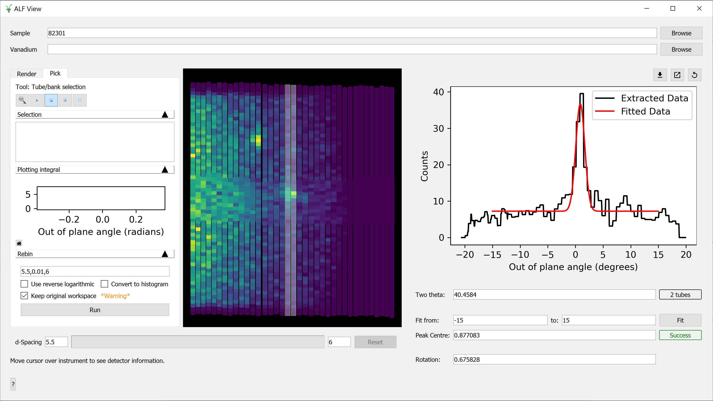

=======================
Direct Geometry Changes
=======================

.. contents:: Table of Contents
   :local:

General
-------

New features
############

   The new ALFView Interface

- The FunctionBrowser widget in :ref:`ALFView <ALFView-ref>` has been replaced with a box to specify the PeakCentre of a Flat Background + Gaussian.
- By default, the mini plot on the :ref:`ALFView <ALFView-ref>` Pick tab will now select the 'Out of plane angle' axis and 'Integrate' when the ``Select whole tube`` button is pressed.
- Added :ref:`LagrangeILLReduction <algm-LagrangeILLReduction>`, which handles loading and data reduction from IN1 - Lagrange at ILL.
- The ability to load an optional vanadium run into :ref:`ALFView <ALFView-ref>` for normalisation is now possible. This vanadium run is saved between sessions.
- The tools in the :ref:`ALFView <ALFView-ref>` Pick tab which are not useful for the main workflow have been hidden.
- The ``Select whole tube`` tool on the :ref:`ALFView <ALFView-ref>` Pick tab can now be used to select individual tubes.
- The ``Draw a rectangle`` tool on the :ref:`ALFView <ALFView-ref>` Pick tab can now be used to select one or more neighbouring tubes.
- The ``Edit a shape`` tool on the :ref:`ALFView <ALFView-ref>` Pick tab can now be used to select, move, resize and delete highlighted tubes.
- The ``Update Estimate`` button has been removed in :ref:`ALFView <ALFView-ref>`. An estimate value for the peak centre is automatically re-calculated whenever the tube selection changes.
- An option to export the right hand side plot to a workspace has been added to :ref:`ALFView <ALFView-ref>`.
- An option to open the right hand side plot in a new window to allow more plotting customizations has been added to :ref:`ALFView <ALFView-ref>`.
- An option to reset the extracted data in the right hand side plot has been added to :ref:`ALFView <ALFView-ref>`.
- The average two theta value is now displayed in :ref:`ALFView <ALFView-ref>` when a tube is selected.
- The number of selected tubes is now displayed in :ref:`ALFView <ALFView-ref>` when the tube selection is changed.
- The ``Fit`` button will now trigger the calculation of the Rotation angle, if the Fit is successful.
- Updated the documentation for the :ref:`ALFView <ALFView-ref>` interface.
- :ref:`LagrangeILLReduction <algm-LagrangeILLReduction>` now allows the user to select normalisation approach and load time and temperature metadata from the ASCII files. Additionally, it now properly handles interpolation and energy range of the water correction, depending on the value of ``UseIncidentEnergy``.

Bugfixes
############
- Corrected a repeated call to the loader while merging runs in the :ref:`PelicanReduction <algm-PelicanReduction>` algorithm.
- A crash is now avoided when extracting a tube in :ref:`ALFView <ALFView-ref>` with an invalid axis selected.
- The plotting panel on the :ref:`ALFView <ALFView-ref>` pick tab is now expanded by default when first opening the interface.
- It is now possible to delete the workspace loaded into :ref:`ALFView <ALFView-ref>` and then load in a new dataset without issue.

CrystalField
-------------

Bugfixes
############
- Fixed transcription error in Table 3 of :ref:`Crystal Field Theory` documentation.

MSlice
------

Bugfixes
############
- Fixed bug that prevented cuts along 2Theta.

:ref:`Release 6.6.0 <v6.6.0>`
