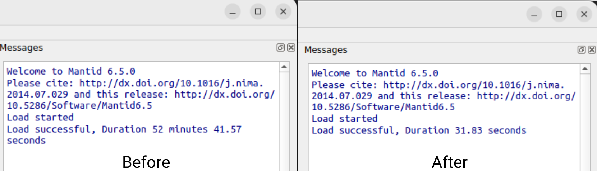

=================
Framework Changes
=================

.. contents:: Table of Contents
   :local:

New Features
------------
- The approach for inverting large tridiagonal matrices has been improved so that the analytical method can still be used even for large matrices, resulting in a performance improvement. This type of matrix inversion is used when calculating the interpolation errors while performing spline interpolation.
- HDF5 has been upgraded to v1.12 along with h5py to version 3.

Algorithms
----------

New features
############
- To allow files saved with :ref:`SaveAscii2 <algm-SaveAscii-v2>` to be reloaded into Mantid whilst preserving rebinning behaviour, a ``Distribution=true`` flag is now written in the file header if the workspace is a Distribution. In this case, a column header is always written, even if the Save property ``ColumnHeader`` is set to ``false``.
- To load an Ascii file, that was saved without a Distribution header flag, and set it as a Distribution, execute :ref:`LoadAscii2 <algm-LoadAscii-v2>` with property ``ForceDistributionTrue=true``.
- Added error calculation to :ref:`DiscusMultipleScatteringCorrection <algm-DiscusMultipleScatteringCorrection>` following a similar approach to :ref:`MonteCarloAbsorption <algm-MonteCarloAbsorption-v1>`.
- The :ref:`LoadSANS1MLZ <algm-LoadSANS1MLZ-v1>` algorithm now can be used to load raw files with extension ``.001`` generated by the SANS-1 instrument at MLZ, as well as to load reduced files with extension ``.002``.
- Added support for removal of instrument information from workspace - see :ref:`RemoveInstrumentGeometry <algm-RemoveInstrumentGeometry>`. This will allow saving smaller nexus files.
- Removed the MuscatData, MuscatFunc and MuscatSofQW algorithms. The functionality provided by these algorithms is now provided by the :ref:`DiscusMultipleScatteringCorrection <algm-DiscusMultipleScatteringCorrection>` algorithm.
- Added support for a beam profile (specified in :ref:`SetBeam <algm-SetBeam>`) to :ref:`DiscusMultipleScatteringCorrection <algm-DiscusMultipleScatteringCorrection>`.

Bugfixes
############
- The algorithm GUI for :ref:`UpdateInstrumentFromFile <algm-UpdateInstrumentFromFile>` now accepts ``.DAT`` files for the Filename property.
- Fixed an issue where MDE workspaces were taking a long time to load.

- Fixed a problem with the :ref:`ConvolveWorkspaces <algm-ConvolveWorkspaces>` algorithm when run on input workspaces with different x ranges. The x range of the output workspace was being taken from the resolution workspace instead of the data workspace.
- Fixed a problem in :ref:`CreateSampleWorkspace <algm-CreateSampleWorkspace>` where functions were evaluated at the left hand bin edge instead of the bin centre. The algorithm :ref:`FindEPP <algm-FindEPP>` has also been updated with a similar change.

Data Objects
------------

Bugfixes
############
- Fixed a minor bug in :ref:`LoadNXSPE <algm-LoadNXSPE>` that caused an invalid value for PSI when the corresponding entry in the NXSPE file is empty.

Python
------

New features
############
- MantidPython and MantidNotebook have been removed. For help accessing the mantid algorithms and methods
  in python and jupyter notebooks, check out the instructions in :ref:`PythonNotebook`.

MantidWorkbench
---------------

See :doc:`mantidworkbench`.

:ref:`Release 6.6.0 <v6.6.0>`
