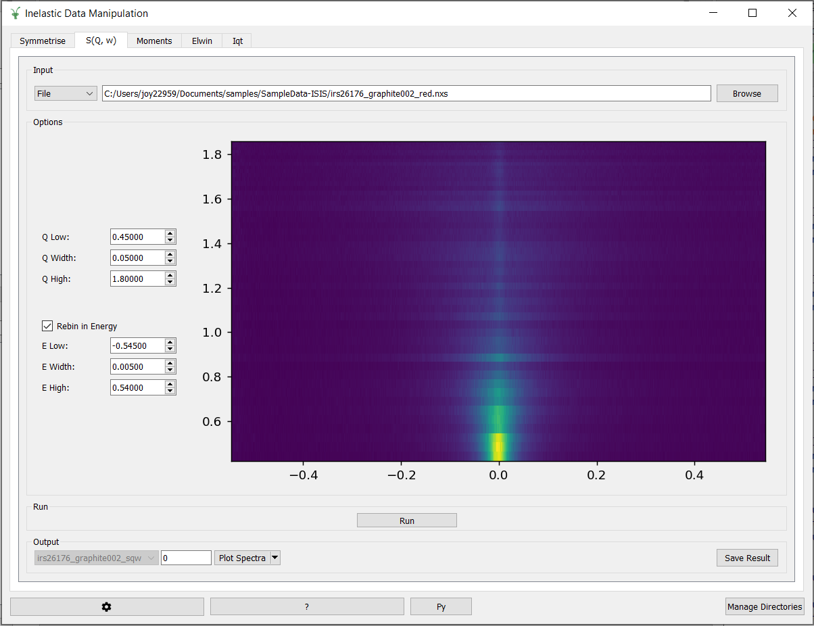

=========================
Indirect Geometry Changes
=========================

.. contents:: Table of Contents
   :local:

New Features
------------

   The new Inelastic Data Manipulation Interface

- A new interface has been created: the :ref:`Inelastic Data Manipulation Interface <interface-inelastic-data-processor>`. The :ref:`Sqw <inelastic-sqw>`, :ref:`Moments <inelastic-moments>`, and :ref:`Symmetrise <inelastic-symmetrise>` tabs have been moved from the Indirect Data Reduction interface into the new interface along with :ref:`Elwin <elwin>` and :ref:`Iqt <iqt>` from the Indirect Data Analysis interface.
- :ref:`LoadEMU <algm-LoadEMU>` now loads data from the beam monitor and adds missing environment parameters, reactor power, and scan period to the log when loading EMU event files.
- Added support for sparse workspace features in the :ref:`Indirect Correction Interface <interface-inelastic-corrections>`.
- Changed the ``Group by sample`` option to ``Sample changer grouped`` in the :ref:`ISIS Energy Transfer interface <ISISEnergyTransfer>`. It is only shown when an IRIS instrument is selected.

Algorithms
----------

Bugfixes
############
- A problem when running :ref:`MonteCarloAbsorption <algm-MonteCarloAbsorption-v1>` on an indirect instrument using the Sparse Instrument feature has been fixed. Detectors that are associated with an inactive analyser in the instrument definition no longer cause an error about retrieving the efixed value.

:ref:`Release 6.6.0 <v6.6.0>`
