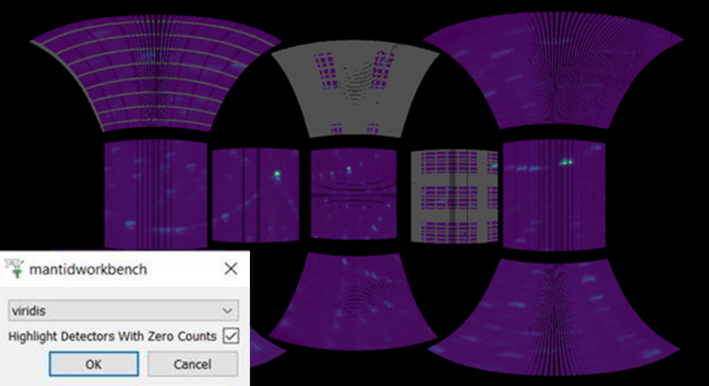

========================
Mantid Workbench Changes
========================

.. contents:: Table of Contents
   :local:

New Features
------------
- Added button to the figure tool bar which hides the figure (unhidden using the plots tab).

.. image:: ../../images/6_6_release/Mantidworkbench/hide_plot_button.png
    :align: center
    :width: 650

- Subsampling of data on surface plots is now only performed if the number of rows or columns is greater than 100 (instead of 50).
- Mantid Workbench is now compatible with matplotlib v3.6.
- Sample shapes can now be plotted by right-clicking the workspace and selecting ``Show Sample Shape``. This will plot all Sample, Container and Component shapes attached to the workspace, add a black arrow for the beam direction and coloured arrows for the lattice vectors. For more details see :ref:`Mesh_Plots`.

.. image:: ../../images/6_6_release/Mantidworkbench/6.6DiffractionUpdateSample.png
    :align: center
    :width: 700

- Scripts generated by the Algorithm History Interface now include an import of ``mantid.simpleapi``.
- Qt has been upgraded to version 5.15.
- Normalisation (by maximum value) is now available in :ref:`Superplot <WorkbenchSuperplot>`.
- Drop support for ICAT v3.
- Mouse cursor now changes to a horizontal double arrow when hovering over peak and range markers in the :ref:`Fit Browser <WorkbenchPlotWindow_Fitting>`, indicating they can be dragged left and right.
- A label showing the maximum character limit of the additional context text has been added to the Error Reporter.

Bugfixes
--------
- Fixed a bug that prevented arrays from displaying properly in sample logs.
- Fixed a bug where the user couldn't reselect a peak in the :ref:`Fit Browser <WorkbenchPlotWindow_Fitting>` after adding another.
- In the :ref:`Fit Browser <WorkbenchPlotWindow_Fitting>`, if a tie is edited to an invalid value, Workbench will now display an error and revert the tie to its previous value.
- Fixed a bug where the :ref:`Superplot <WorkbenchSuperplot>` plot area shrunk on some data.
- Fixed a bug where data from workspaces accessed from the :ref:`Fit Browser <WorkbenchPlotWindow_Fitting>` (i.e the fit parameters) could not be copied.
- Saving script from history dialog in Linux will now be saved with :code:`.py` extension.
- When a file with mantid algorithms is loaded, and the user accepts workbench adding the mantid API import line, the new import is now always added to the top of the file.
- Fixed a bug where :ref:`waterfall plots <Waterfall_Plots>` were updated unconditionally during ADS updates.
- The sensitivity of vertical and horizontal lines on plots, including the peak picker and range selector tools, has been increased.
- Fixed bug where :ref:`Load <algm-Load>` and :ref:`Rebin <algm-Rebin>` showed up twice (upper and lower case) in the algorithms tab search.
- Fixed a bug where property values were shortened in history.
- Fixed a bug in the :ref:`Mean <algm-Mean>` algorithm where an invalid input workspace name would cause Mantid to crash.
- Fixed a bug where the user could drag the width markers of an unselected peak in the :ref:`Fit Browser <WorkbenchPlotWindow_Fitting>`.
- Fixed inconsistent text sizes when opening multiple script editor tabs on macOS.
- Fixed a bug with :ref:`AddSampleLogMultiple <algm-AddSampleLogMultiple>` where including log types and keeping the parser box ticked would crash Mantid.
- Fixed a bug where Delta and Elastic function peaks were not connected to the :ref:`Fit Browser <WorkbenchPlotWindow_Fitting>` GUI.
- Fixed a bug where collapsing plots using a splitter handle could result in a crash.
- Grid lines will now not turn on unexpectedly when changing axis format in a 3-D plot.
- Fixed bug where plot marker labels became unattached when zooming and panning.
- When plotting with an exported script, the ``Show Minor Gridlines`` checkbox in the Axes tab will be ticked.
- The ``toggle grid lines`` button affecting minor lines has been fixed.
- Fixed links to tutorials on the About widget which were broken.
- The tooltips of properties in an algorithm dialog will now provide the full description of a property.
- Fixed a bug where plots with error bars could not have normalisation turned off.

InstrumentViewer
----------------

New features
############
- Added an option to the :ref:`Instrument Viewer <InstrumentViewer>` display settings to highlight detectors with zero counts.

- Added the ``Keep original workspace`` rebin option on the :ref:`Pick tab <instrumentviewer_pick_tab>`. When ticked, this will ensure the originally loaded data is rebinned, and not the previously rebinned data.
- Control points on the shapes drawn using the :ref:`Pick <instrumentviewer_pick_tab>` or :ref:`Draw <instrumentviewer_draw_tab>` tab now give cursor feedback.

Bugfixes
############
- The sensitivity of resizing a masked shape using its corners has been increased for screens with larger resolutions.
- Fixed a bug where Y histogram data was not being summed correctly when plotting ALF data on the :ref:`Pick tab <instrumentviewer_pick_tab>` in units of 'Out of Plane angle'.

SliceViewer
-----------

New features
############
- Added HKL values to the image info table in the slice viewer when viewing a workspace with HKL coordinates.
- Users can now double click on the :ref:`SliceViewer <sliceviewer>` plot axes to edit their limits more accurately.
- Added ``Concise View`` check box to the :ref:`SliceViewer Peak View <sliceviewer_peaks_overlay>` to show a reduced number of columns in the peak table view.

.. image:: ../../images/6_6_release/Mantidworkbench/slice_viewer_peak_concise_view_box.png
    :align: center
    :width: 800

- Enabled the cut viewer tool in non-orthogonal view.

Bugfixes
############
- Fixed a bug in :ref:`SliceViewer <sliceviewer>` where the line plots produced by the ROI tool were not updated if the cursor was released outside the axes.
- Slice viewer now displays ``-`` instead of ``-DBL_MAX`` in some energy transfer readings.
- Fixed a bug causing cut representation to be re-drawn on the sliceviewer colorfill plot on changing viewing axes when non-axis aligned cutting tool was not enabled.
- Fixed a bug in the :ref:`SliceViewer <sliceviewer>` where a matplotlib deprecation warning appears when toggling on the nonorthogonal axes.
- Fixed a bug where the :ref:`SliceViewer <sliceviewer>` plot would resize by small amounts as the cursor info changed.

:ref:`Release 6.6.0 <v6.6.0>`
