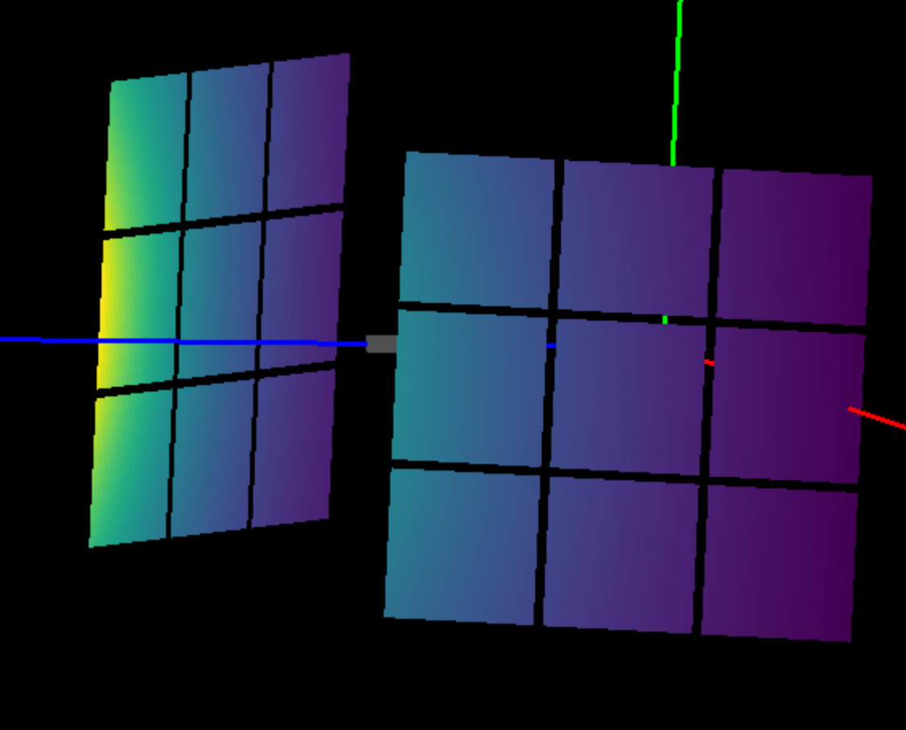
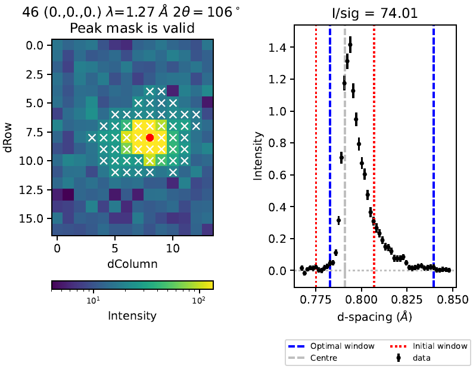

===================
Diffraction Changes
===================

.. contents:: Table of Contents
   :local:

Powder Diffraction
------------------

New features
############
- For the ILL/D2B instrument, only calibrated data are loaded from the nexus file.
- The ISIS powder diffraction scripts now support per detector Vanadium normalisation. So far this has only been enabled on the POLARIS instrument.
- It is now possible to provide more than one detector height range in :ref:`PowderILLDetectorScan <algm-PowderILLDetectorScan>`.
- The ``InitialMask`` and ``FinalMask`` properties of :ref:`PowderILLDetectorScan <algm-PowderILLDetectorScan>` have been removed.
- Improvements to :ref:`PEARL powder <isis-powder-diffraction-pearl-ref>` reduction output file and directory naming; ``.gss`` files and TOF and d-spacing ``.xye`` files are now in separate directories.
- OSIRIS scripts now use a new :ref:`focus function <focus_osiris_isis-powder-diffraction-ref>` instead of the ``run_diffraction_focusing`` function to perform the focusing. Results should be the same.
- The :ref:`create_vanadium <create_vanadium_osiris_isis-powder-diffraction-ref>` function has been added to the OSIRIS object which should be called before the ``focus`` function to create the vanadium runs.
- It is now possible to mask out detectors in the absorption and multiple scattering calculations :ref:`AbsorptionCorrection <algm-AbsorptionCorrection>`, :ref:`PaalmanPingsAbsorptionCorrection <algm-PaalmanPingsAbsorptionCorrection>`, and :ref:`MultipleScatteringCorrection <algm-MultipleScatteringCorrection>`.
- New parameter ``MinimumSignalToNoiseRatio`` has been added to the :ref:`FitPeaks <algm-FitPeaks>` and :ref:`PDCalibration <algm-PDCalibration>` algorithms. This will exclude peaks from automated fitting below a threshold signal-to-noise ratio estimated from the data in the fitting window.
- Additional, optional, source terms added to the :ref:`EstimateResolutionDiffraction <algm-EstimateResolutionDiffraction>`. For instruments with small detector pixels (e.g. SNAP), the size of the source is the overwhelming contributor to the resolution calculation.
- :ref:`EstimateResolutionDiffraction <algm-EstimateResolutionDiffraction>` will average the resolution from summed pixels.

Bugfixes
############
- The :ref:`Osiris script <isis-powder-diffraction-osiris-ref>` and the :ref:`Indirect Diffraction UI <interface-indirect-diffraction>` now produces the same results.

Engineering Diffraction
-----------------------

New features
############
- The GSASII tab outputs the sample logs attached to the relevant focused data, as specified in the Engineering Diffraction settings. This behaves in the same way as before for the fitting tab.
- It is now possible to load and plot multiple phases in the GSASII tab.

Bugfixes
############
- Extra validation has been added to the ``Path to GSASII`` setting so that Workbench no longer crashes if a GSAS refinement is run with an invalid GSASII path in settings.
- Loading or creating a calibration now fills the GSASII tab with the currently loaded calibration's ``.prm`` file.
- Check GSASII reflection file output exists before loading results in GSASII tab (this can happen if no reflections are within the TOF limits specified).
- Prevent TOF limits having min > max in GSASII tab.

Single Crystal Diffraction
--------------------------

New features
############
- Added new methods to calculate the directions of the reverse incident and scattered beam within ``Peak``.
- Added new method to calculate the direction cosine from a provided direction within ``OrientedLattice``.
- :ref:`OptimizeLatticeForCellType <algm-OptimizeLatticeForCellType>` now properly supports mnp-modulation vectors.
- :ref:`SaveHKL <algm-SaveHKL>` supports 6-column ``hklmnp`` format.
- :ref:`LoadHKL <algm-LoadHKL>` supports 6-column ``hklmnp`` format.
- :ref:`FilterPeaks <algm-FilterPeaks>` can now filter out modulation vectors by :math:`m^2+n^2+p^2`.
- :ref:`SortHKL <algm-SortHKL>` skips modulation vectors.
- :ref:`StatisticsOfPeaksWorkspace <algm-StatisticsOfPeaksWorkspace>` skips modulation vectors.
- :ref:`SaveNexus <algm-SaveNexus>` now supports modulation vectors.
- :ref:`LoadNexus <algm-LoadNexus>` now supports modulation vectors.
- :ref:`CompareWorkspaces <algm-CompareWorkspaces>` now supports modulation vectors.
- Peaks workspaces now display ``IntHKL`` and ``IntMNP`` columns.
- Add new instrument definition for SXD post bank 1 detector upgrade.
- Add option ``OptimiseXWindowSize`` to fix TOF (or d-spacing) window extent below a threshold :math:`intensity/sigma` (``ThresholdIoverSigma``) in :ref:`IntegratePeaksSkew <algm-IntegratePeaksSkew>`.
- Improved formatting of plots in pdf output of :ref:`IntegratePeaksSkew <algm-IntegratePeaksSkew>`.
- Parameter ``NTOFBinsMin`` in :ref:`IntegratePeaksSkew <algm-IntegratePeaksSkew>` now refers to the number of non-zero bins in the integration window with :math:`y/error > 1`.
- Support workspaces with d-spacing xunit in :ref:`IntegratePeaksSkew <algm-IntegratePeaksSkew>`.

Bugfixes
############
- Increased the number of nearest neighbor detector pixels to search for in :ref:`PredictPeaks <algm-PredictPeaks>` that caused some obvious peaks on detector to be missed.
- Fixed the calculation of direction cosines in :ref:`SaveHKL <algm-SaveHKL>` and :ref:`SaveHKLCW <algm-SaveHKLCW>`
- Added back in ``Peak`` method ``getDetectorID()`` that was removed in previous release associated with ``LeanElasticPeak``.
- Fixed a bug in estimating TOF window parameters in :ref:`IntegratePeaksSkew <algm-IntegratePeaksSkew>`.
- :ref:`IndexPeaks <algm-IndexPeaks>` now properly accounts for fractional offsets when ``RoundHKLs=True``.

:ref:`Release 6.7.0 <v6.7.0>`
