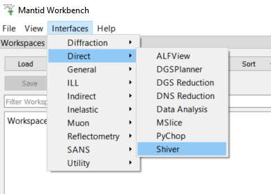

=======================
Direct Geometry Changes
=======================

.. contents:: Table of Contents
   :local:

General
-------

New features
############
- The :ref:`ALFView <ALFView-ref>` interface now executes all algorithms on a background thread to provide a smoother user experience.
- The :ref:`ALFView <ALFView-ref>` interface is now disabled when running an algorithm, and re-enabled when it has finished. The title of the ALFView window is changed to indicate why the interface is disabled.
- A new loader has been added to handle Lagrange NeXus files: LoadILLLagrange.
- :ref:`LagrangeILLReduction <algm-LagrangeILLReduction>` can now accept NeXus data as input for both sample and container runs.
- `Shiver <https://github.com/neutrons/Shiver>`_ has been added as a menu item for Direct interfaces.

Bugfixes
############
- The :ref:`ALFView <ALFView-ref>` peak picker tool is now offset on the y axis by the background amount.
- The :ref:`ALFView <ALFView-ref>` peak picker tool is now activated by default.
- The settings loaded into the :ref:`ALFView <ALFView-ref>` interface are now separate from those loaded into the InstrumentView.
- Removing the sample on the :ref:`ALFView <ALFView-ref>` interface will now clear the InstrumentWidget plot.
- The ``Reset View`` button on the Render tab of :ref:`ALFView <ALFView-ref>` will no longer prevent the Pick tab tools from working.
- :ref:`LagrangeILLReduction <algm-LagrangeILLReduction>` can now process ASCII data even if they contain only one scan step.

CrystalField
-------------

New features
############
- ``getSpectrum``, from the :ref:`Crystal Field Python interface`, now allows specification of the range for x values.
- Added a function to print eigenvectors for a :ref:`CrystalField <Crystal Field Python Interface>` object in human readable form.

MSlice
------

Bugfixes
############
- Fixed GDOS intensity correction so that the correction is applied in the same way regardless of the rotation of the slice plot.
- Fixed the integration of GDOS cuts.
- Fix for an error when saving a slice plot as a matlab file.
- Warning is now omitted if a cut is taken with a higher resolution than the parent slice. This causes the appearance of missing lines between adjacent datapoints.
- When taking a cut, if an intensity range is provided it is now applied to the plot y limits.
- When changing the intensity of a slice plot the axis limits now get reset to their original values. This solves a bug where zooming out after an intensity change was not possible.
- Bragg peaks are now sized more appropriately on an interactive cut.
- MSlice now correctly preserves metadata when saving NXPSE files.
- Fixed a bug relating to intensity correction on some datasets where arrays used to transform data during correction had incorrect dimensions.
- Fixed a bug causing a crash when cancelling an intensity correction from the temperature input pop-up.
- When inputting waterfall limits an error is no longer caused by the invalid use of E to apply an exponent.
- You can now save slices and cuts in an ASCII format from the MSlice command line.

DNS_Reduction
-------------

New features
############
- Two separate ``Sample Data`` and ``Standard Data`` buttons are added to the Powder TOF mode. Standard data are now loaded by default.
- ``Read All`` button is removed.
- Functionality of the red asterisk next to the ``Data Directory`` edit box is improved.

:ref:`Release 6.7.0 <v6.7.0>`
