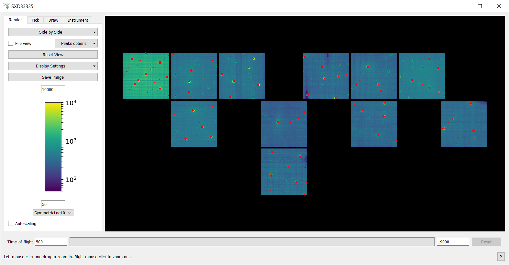

========================
Mantid Workbench Changes
========================

.. contents:: Table of Contents
   :local:

New Features
------------
- :ref:`SimpleScanViewer <SimpleScanViewer-ref>` now fits Gaussian peaks to data in each new ROI to estimate peak centre positions, instead of calculating a centre-of-mass.
- The Error Reporter will now prompt the user to upgrade to the latest version of Mantid if a new version is available.

Bugfixes
--------
- Removing a function from the :ref:`Fit Browser <WorkbenchPlotWindow_Fitting>` will now remove any ties involving that function and update ties, as function names may change. Before, this was happening behind the scenes but now the GUI updates to reflect that.
- Fixed a bug in the :ref:`Fit Browser <WorkbenchPlotWindow_Fitting>` where tied parameters would not update graphically. Additionally, the user can no longer add circular ties which would cause the fit to fail.
- The error reporter will now stay open if the report fails to send.
- Corrected plotting zoom box location on MacOS.
- Fixed a bug where copying a column with blank values from a ragged workspace data table could crash Workbench.
- Fixed a bug in :ref:`ExtractSpectra <algm-ExtractSpectra>` where X data would be needlessly copied, resulting in increased memory usage.
- Restore native file browser dialogs on Linux. This will fix problems with the file browser freezing and crashing on IDAaaS.
- It is now possible to generate a python script for fitting spectra from the same workspace using the :ref:`FitScriptGenerator <Fit_Script_Generator-ref>` interface.
- Fixed a bug where plot axes labels could be cut off by the window boundaries after resizing.
- Fixed a bug where the colour bar on surface plots could collide with the plot axes.
- A crash caused by closing the Load dialog while it is attempting to load a file has been fixed.
- Fixed a bug where Mantid would not open on Windows when a user has non-ascii characters in their username.
- Fixed an issue in :ref:`DrILL <DrILL-ref>` with loading rundexes related to an issue in processing the export algorithm name and the extension simultaneously.
- The performance of the ``Show Sample Shape`` window has been improved for workspaces with complex CSG shapes for either the sample or the container.
- Fixed a bug where opening the plot options for a script-created plot with error bars, would crash Workbench.
- Default to monospace font on non-ubuntu linuxes.

InstrumentViewer
----------------

New features
############
- The display position of detector banks in the :ref:`Instrument Viewer <InstrumentViewer>` side-by-side view can now be specified in the instrument definition file. Positions have been set up for the SXD instrument using the new feature.
- Prevent a yaw rotation being applied to a bank during side-by-side view generation. This applies to all instruments regardless of whether they use the new bank centre override feature in their instrument definition file. For instruments where this has an effect, it could also result in the bank positions in the side-by-side view changing. This is because the algorithm used to project the banks onto the XY plane cares about which is the largest bank. With the yaw rotation removed, the bounding rectangle (which is the measure used for the bank size) could be smaller for some banks.
- A new option has been added to the ``Display Settings`` drop-down on the Instrument Viewer :ref:`Render tab <instrumentviewer_render_tab>` to control whether the aspect ratios of detector banks are preserved in the 2D views (cylindrical, spherical, side by side), regardless of the dimensions of the plot area.
- The peak overlay feature in the :ref:`Instrument Viewer <InstrumentViewer>` now works in the side-by-side view.

Bugfixes
############
- Fixed bug with the :ref:`Instrument Viewer <InstrumentViewer>` on retina screens where the image would only fill a quarter of the available space.

SliceViewer
-----------

Bugfixes
############
- The :ref:`Slice Viewer <sliceviewer>` will now close if the original workspace of the workspace it is showing is deleted.
- Fixed a bug when calculating the projection matrix for 4D MDHisto workspaces with non-Q dimensions (e.g. energy transfer); now the non-orthogonal view and the HKL, in the cursor info table, will be correct for such workspaces.
- Fixed issue with projection matrix calculation when workspaces are loaded. This affected 4d workspaces.

:ref:`Release 6.7.0 <v6.7.0>`
