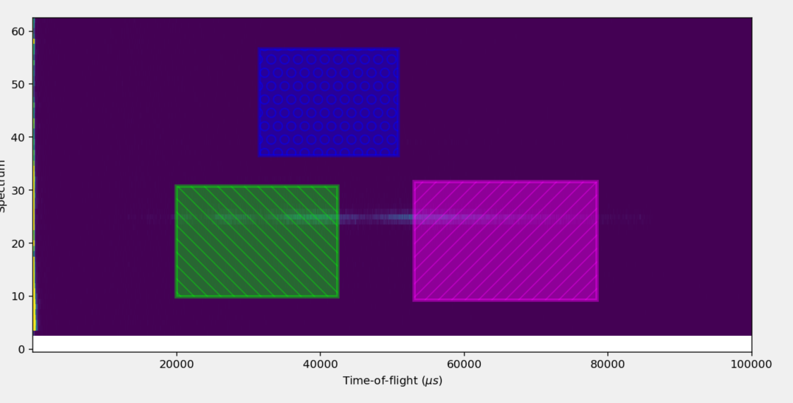

=====================
Reflectometry Changes
=====================

.. contents:: Table of Contents
   :local:

New Features
------------
- ``Polarization Efficiencies`` and ``Flood Workspaces`` can now be selected using a file path in the :ref:`Reflectometry GUI <interface-isis-refl>`.
- In the :ref:`Reflectometry GUI <interface-isis-refl>` experiments for POLREF will have the default parameters ``UseManualScaleFactors=True`` and ``ScaleFactorFromPeriod=1`` in the Output Stitch Properties field of the :ref:`Experiment tab<refl_exp_instrument_settings>`. These can be edited or removed as required.
- 1D Detectors can now be loaded into and cropped in the :ref:`Preview tab <refl_preview>`.
- It is now possible to overwrite or add a new sample log from either :ref:`algm-LoadILLReflectometry`,  :ref:`algm-ReflectometryILLPreProcess` or :ref:`algm-ReflectometryILLAutoProcess`.
- :ref:`algm-ReflectometryISISCalibration` now calculates and performs individual detector pixel corrections from an input file containing detector IDs and theta offsets.

Bugfixes
--------
- Changed the error message when the Polarization Corrections are set using a Parameter File without the necessary settings defined. The error now explains the required information is missing.
- The child workspaces of a stitched group now have shorter names with a simple suffix.
- It is now possible to use ``True`` and ``False`` in algorithm option inputs (such as the Options cells on the :ref:`Run tab <refl_runs>` or the Output Stitch Properties on the :ref:`Experiment Settings tab <refl_exp_instrument_settings>`) rather than needing to use ``1`` and ``0``.
- The :ref:`Preview tab <refl_preview>` now shows the binned output of the reduction on the 1D plot.
- The :ref:`Reduction Preview tab <refl_preview>` now correctly uses the values from the :ref:`Experiment Settings tab <refl_exp_instrument_settings>` tab in the final reduction.
- Fixed two minor issues in :ref:`algm-ReflectometryILLPreprocess` blocking normalisation to monitor for D17, and normalisation for both Figaro and D17.
- :ref:`algm-LoadILLReflectometry` can load cycle 231 Figaro data by updating the metadata location of the chopper pair to sample distance.
- Fixed the labelling of the workspaces output by :ref:`algm-PolarizationCorrectionWildes` which were being inverted, while ensuring the output workspace group order continues to match the documentation.
- Move the sum banks step from :ref:`algm-ReflectometryISISLoadAndProcess` to :ref:`algm-ReflectometryReductionOneAuto` so that it takes place after flood correction. Also only perform the summing step when a detector ID region has been set.
- The ``Signal``, ``Transmission``, and ``Background`` ROI selectors on the :ref:`Preview tab <refl_preview>` have been made more visible.

:ref:`Release 6.7.0 <v6.7.0>`
