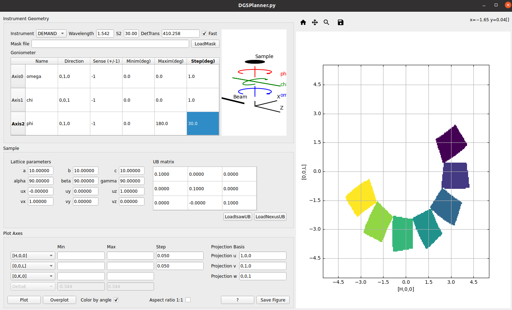

===================
Diffraction Changes
===================

.. contents:: Table of Contents
   :local:

Powder Diffraction
------------------

New features
############
- Add parameters, ``LogAllowList`` and ``LogBlockList``, to :ref:`AlignAndFocusPowderFromFiles <algm-AlignAndFocusPowderFromFiles>` and :ref:`SNSPowderReduction <algm-SNSPowderReduction>` so users can select which logs are actually needed. The default is to block chopper logs in SNSPowderReduction
- Expose the ``HighBackground`` option from :ref:`FitPeaks <algm-FitPeaks>` in :ref:`PDCalibration <algm-PDCalibration>`
- Update HRPD definition to reflect modifications to low-angle bank modules for runs from 01-MAR-23 onwards
- Add the ability for :ref:`CombineDiffCal <algm-CombineDiffCal>` to have a partial ``GroupedCalibration`` workspace.
  Detectors that do not appear in the ``GroupedCalibration`` have calibration constants copied directly from the ``PixelCalibration`` workspace without change.
- Expose the OffsetData parameter in the Powder Diffraction Reduction GUI
- :ref:`PDCalibration <algm-PDCalibration>` has two new parameters, ``StartWorkspaceIndex`` and ``StopWorkspaceIndex``, which limit which spectra are calibrated
- :ref:`PowderReduceP2D <algm-PowderReduceP2D>` has been adapted to work with SNAP measuring data.
- :ref:`AlignAndFocusPowderFromFiles <algm-AlignAndFocusPowderFromFiles>`, when it calls :ref:`LoadDiffCal <algm-LoadDiffCal>`, it will pass through the ``TMin`` parameter. In the case of non-zero ``TZERO`` values existing in the calibration constant, the warning message about minimum TOF value shift will now be suppressed.

Bugfixes
############
- Fixed bug in absolute unit normalisation in ISIS powder reduction where the vanadium workspace shape was used instead of the sample.
- When performing an ISIS powder reduction, errors are raised in absolute normalisation when sample/vanadium shape and material are not provided.
- Raise an error in POLARIS (ISIS) powder reduction script if user tries to create a vanadium workspace without correcting for absorption and multiple scattering.
- Exposed ``MSEvents`` parameter of :ref:`MayersSampleCorrection <algm-MayersSampleCorrection>` to users of ISIS powder reduction scripts (parameter ``mayers_mult_scat_events`` in the instrument settings).
- Fix type conversion bug producing an error in the cross-correlation functionality of the powder diffraction calibration scripts used in :ref:`powder diffraction calibration <Powder Diffraction Calibration>`.
- Fixed bug in ISIS powder reduction for workspaces being overwritten when focussing using individual batching mode (this affected POLARIS and GEM)
- Fixed bug in :ref:`PDCalibration <algm-PDCalibration>` which was not using the user-input peak windows unless they were pre-sorted, it is no longer necessary to pre-sort peak centers and windows.
- Fixed way :ref:`FitPeaks <algm-FitPeaks>` uses workspace indices in ``PeakCentersWorkspace`` and ``FitPeakWindowWorkspace``, to correspond to the same spectrum workspace indices in the input workspace, even when using ``StartWorkspaceIndex`` and ``StopWorkspaceIndex``.  This fixes the issue with :ref:`PDCalibration <algm-PDCalibration>`.
- Fixed bug in :ref:`FitPeaks <algm-FitPeaks>` which assumed the zeroeth workspace index defined the largest number of peaks to attempt to fit in all spectra.

Engineering Diffraction
-----------------------

New features
############
- Added new ``SNAPRed`` menu item for Diffraction interfaces
- :ref:`ISIS Engineering Diffraction UI<Engineering_Diffraction-ref>` fitting tab will perform an unweighted average of log values if the proton_charge log doesn't exist in workspace.

Single Crystal Diffraction
--------------------------

New features
############
- :ref:`LoadWANDSCD <algm-LoadWANDSCD>` has new keyword argument to apply or not apply goniometer tilts
- Update fitting coefficients for :ref:`BackToBackExponential <func-BackToBackExponential>` in SXD parameters xml file.
- Add parameter ``MinIntensOverSigma`` in :ref:`SaveReflections <algm-SaveReflections>` to filter peaks to export by Intensity/Sigma
- Support saving :ref:`LeanElasticPeaksWorkspace <LeanElasticPeaksWorkspace>` with GSAS format in :ref:`SaveReflections <algm-SaveReflections>` (calls :ref:`SaveHKLCW <algm-SaveHKLCW>`)
- New parameter in :ref:`SaveIsawUB <algm-SaveIsawUB>` to rotate the UB by the goniometer matrix.
- New algorithm :ref:`LoadGaussCube <algm-LoadGaussCube>` to load Gaussian cube files for volumetric data into a 3D :ref:`MDHistoWorkspace <MDHistoWorkspace>`
- :ref:`LoadWANDSCD <algm-LoadWANDSCD>` with grouping option has been sped up
- New algorithm :ref:`FindSXPeaksConvolve <algm-FindSXPeaksConvolve>` to find single-crystal Bragg peaks in instruments with :ref:`RectangularDetectors <RectangularDetector>` (such as SXD).
- ISIS single crystal reduction class for SXD now supports defining a file extension when loading data (previously available for WISH class - in both cases the argument to ``load_run`` has been renamed to ``file_ext``)
- Constant wavelength HFIR DEMAND instrument has been added to :ref:`dgsplanner-ref`

Bugfixes
############
- Fix bug saving empty peak tables in :ref:`SaveReflections <algm-SaveReflections>` using SHELX format
- Peaks with zero sigma will have Signal/Noise set to zero in :ref:`FilterPeaks <algm-FilterPeaks>`
- Now set ``modUB`` in :ref:`IndexPeaks <algm-IndexPeaks>` when ``SaveModulationInfo=True``
- ISIS single crystal reduction classes now set UB before attempting to transform data to HKL using ``convert_to_MD`` method
- Fixed bug in ISIS single crystal reduction classes where UB was not set on combined peak table when saving using ``save_all_peaks`` method.
- Fixed bug in ISIS single crystal reduction classes when defining goniometer angles in ``process_data`` method with a sequence (i.e. not using the motor name string)

:ref:`Release 6.8.0 <v6.8.0>`
