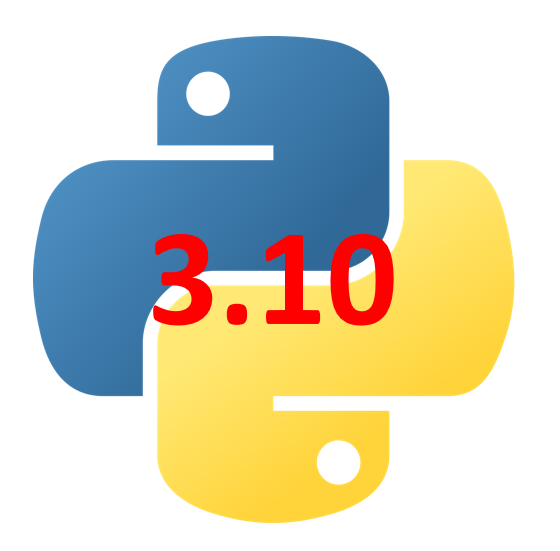

.. _v6.8.0:

===========================
Mantid 6.8.0 Release Notes
===========================

.. contents:: Table of Contents
   :local:

We are proud to announce version 6.8.0 of Mantid.

This release includes a wide array of updates, bugfixes, and new features.

Notably the version of python has been upgraded to 3.10 which produces better error messages and has new features such as ``match-case`` syntax with structural pattern matching.
See https://docs.python.org/3/whatsnew/3.10.html#summary-release-highlights for a summary and more details.

We would like to highlight the following improvements:

- Autoscaling options have been added to the :ref:`SliceViewer <sliceviewer>` to help quickly rescale color limits based on statistical variation in the data (e.g. mean +/- 3 sigma).
- New algorithms :ref:`BayesQuasi2 <algm-BayesQuasi2>` and :ref:`BayesStretch2 <algm-BayesStretch2>` based on the quickBayes package (these replace the now deprecated :ref:`BayesQuasi <algm-BayesQuasi>` and :ref:`BayesStretch <algm-BayesStretch>` algorithms).
- New algorithm :ref:`FindSXPeaksConvolve <algm-FindSXPeaksConvolve>` to find single-crystal Bragg peaks in instruments with :ref:`RectangularDetectors <RectangularDetector>` (such as SXD).
- Algorithms :ref:`algm-SANSTubeCalibration` and :ref:`algm-SANSTubeMerge` have been added for calibrating the Sans2d instrument at ISIS.

These are just some of the many improvements in this release, so please take a
look at the release notes, which are filled with details of the
important changes and improvements in many areas. The development team
has put a great effort into making all of these improvements within
Mantid, and we would like to thank all of our beta testers for their
time and effort helping us to make this another reliable version of Mantid.

Throughout the Mantid project we put a lot of effort into ensuring
Mantid is a robust and reliable product. Thank you to everyone that has
reported any issues to us. Please keep on reporting any problems you
have, or crashes that occur on our `forum`_.

Installation packages can be found on our `download page`_
which now links to the assets on our `GitHub release page`_, where you can also
access the source code for the release.

Citation
--------

Please cite any usage of Mantid as follows:

- *Mantid 6.8.0: Manipulation and Analysis Toolkit for Instrument Data.; Mantid Project*. `doi: 10.5286/SOFTWARE/MANTID6.8 <https://dx.doi.org/10.5286/SOFTWARE/MANTID6.8>`_

- Arnold, O. et al. *Mantid-Data Analysis and Visualization Package for Neutron Scattering and mu-SR Experiments.* Nuclear Instruments
  and Methods in Physics Research Section A: Accelerators, Spectrometers, Detectors and Associated Equipment 764 (2014): 156-166
  `doi: 10.1016/j.nima.2014.07.029 <https://doi.org/10.1016/j.nima.2014.07.029>`_
  (`download bibtex <https://raw.githubusercontent.com/mantidproject/mantid/master/docs/source/mantid.bib>`_)

Changes
-------

.. toctree::
   :hidden:
   :glob:

   *

- :doc:`Framework <framework>`
- :doc:`Mantid Workbench <mantidworkbench>`
- :doc:`Diffraction <diffraction>`
- :doc:`Muon Analysis <muon>`
- Low Q

  - :doc:`Reflectometry <reflectometry>`

  - :doc:`SANS <sans>`
- Spectroscopy

  - :doc:`Direct Geometry <direct_geometry>`

  - :doc:`Indirect Geometry <indirect_geometry>`

Full Change Listings
--------------------

For a full list of all issues addressed during this release please see the `GitHub milestone`_.

.. _download page: https://download.mantidproject.org

.. _forum: https://forum.mantidproject.org

.. _GitHub milestone: https://github.com/mantidproject/mantid/pulls?utf8=%E2%9C%93&q=is%3Apr+milestone%3A%22Release+6.8%22+is%3Amerged

.. _GitHub release page: https://github.com/mantidproject/mantid/releases/tag/v6.8.0
