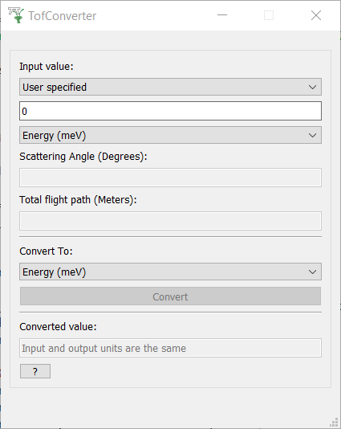
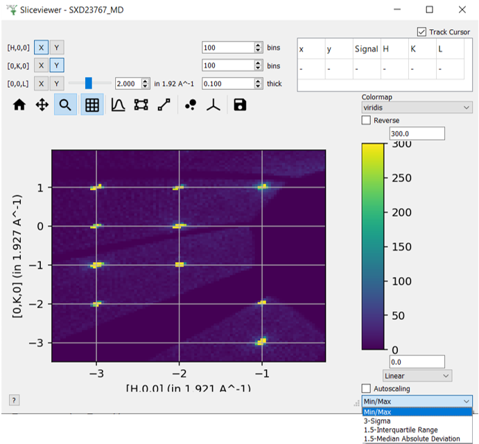

========================
Mantid Workbench Changes
========================

.. contents:: Table of Contents
   :local:

New Features
------------
- In an algorithm's Algorithm Dialogue, if an input workspace is named ``LHSWorkspace``, this workspace name will be used when auto-filling the ``OutputWorkspace`` property.

Bugfixes
--------
- Avoided a bug when attempting to drag and drop a single binned workspace onto an open plot. This action is now rejected and a warning logged.
- Fixed a bug which was causing the plot script generator button to not be shown on tiled plots with a non-square number of plots.
- Fix bug that left a tab open with the old file name in the script editor when using 'Save Script as'
- Catch unhandled exception when attempting to generate a plot script from an unsupported plot.
- Fix bug that would open a duplicate tab if a file was already open. Now it will select the existing tab with the file.
- Small bug fixes and usability improvements to the :ref:`sample_transmission_calculator`. Axes are now labelled and error feedback is improved.
- Improved right-click behaviour in the table view (e.g. "Show Data") when right-clicking on a row/column header.
- Fix bug in the Sample Logs Viewer that causes crash when the selected workspace is modified or deleted.
- An implicit conversion warning which sometimes appears when opening Sample logs has been fixed.
- Fix some minor usability bugs and improve the layout of the :ref:`tof_converter` window. It can now take an input value from any single valued workspace. It no longer requires a scattering angle to convert between momentum transfer and d-spacing.

InstrumentViewer
----------------

Bugfixes
############
- Fix bug in instrument viewer that caused a crash if you tried to delete a peak after having selected that peak and dragged the peak workspace onto the viewer.
- An exception caused when the colorbar on the "Render" tab is resized to a negative value has been fixed.

SliceViewer
-----------

New features
############
- Entering an invalid value into either colour bar limit text box will cause the outline to change to red.
- Integer ticks/grid lines are now used if possible for hkl-axes.
- Autoscaling types are now added to slice viewer to help quickly rescale color limits based on statistical variation in the data.

  1. Min/Max (minimum, maximum as before)
  2. 3-Sigma (mean ± 3 x standard deviation)
  3. 1.5-Interquartile Range (25th, 75th-quartile ± 1.5 x interquartile range)
  4. 1.5-Median Absolute Deviation (median ± 1.5 x median absolute deviation)

Bugfixes
############
- Entering particular values (i.e 0,111) into the colour bar limit text boxes, will no longer cause an error.
- Resolved issue with projection matrix calclulation using basis vectors with non-q dimensions.

:ref:`Release 6.8.0 <v6.8.0>`
