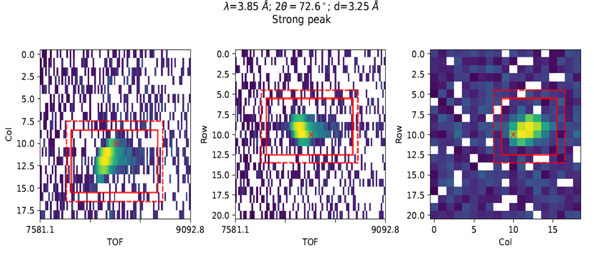
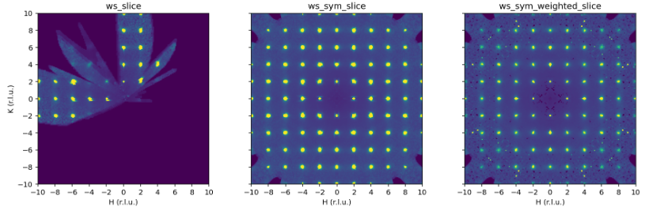

===================
Diffraction Changes
===================

.. contents:: Table of Contents
   :local:

Powder Diffraction
------------------

New features
############
- :ref:`AlignAndFocusPowder <algm-AlignAndFocusPowder>` will no longer sort events prior to doing :ref:`RebinRagged <algm-RebinRagged>` when ``PreserveEvents=False``. This enables it to utilize a performance improvement to :ref:`Rebin <algm-Rebin>`.
- Allow the passing of height information to the donor workspace ``mantid.utils.absorptioncorrutils`` so that the absorption calculation can be performed without the experimental data.
- Only crop in time-of-flight if a finite range is supplied in :ref:`AlignAndFocusPowder <algm-AlignAndFocusPowder>`. The time difference is minimal, but users will no longer see a log for a function that isn't being run.
- By utilizing new methods in EventList, :ref:`DiffractionFocussing <algm-DiffractionFocussing>` has an improved performance when using EventWorkspaces and ``PreserveEvents=False``.
- Added a new option to estimate background parameters, or manually set them in :ref:`PEARLTransfit <algm-PEARLTransfit>`
- Added the temperature sample log to the workspace title when using the :ref:`LoadWAND <algm-LoadWAND>` or :ref:`WANDPowderReduction <algm-WANDPowderReduction>` algorithm to process a group of datasets for HB2C (a.k.a. WAND^2) at HFIR.
- Make the ``CalibrationWorkspace`` property optional for the :ref:`SaveDiffCal <algm-SaveDiffCal>` algorithm. It can be used in this mode to save the grouping information.
- Add a new property ``MinimumPeakTotalCount`` to :ref:`PDCalibration <algm-PDCalibration>` and :ref:`FitPeaks <algm-FitPeaks>`. This relieves ``MinimumPeakHeight`` property from checking the total count and limits to just checking the peak height.
- Added nexus file support in :ref:`PEARLTransfit <algm-PEARLTransfit>`.

Bugfixes
############
- Fixed an issue with :ref:`SNSPowderReduction <algm-SNSPowderReduction>` where the background scale factor was applied multiple times when processing sliced workspaces.

Engineering Diffraction
-----------------------

New features
############
- The ``MaskWorkspace`` property of the Mantid algorithms :ref:`GetDetectorOffsets <algm-GetDetectorOffsets>` and :ref:`PDCalibration <algm-PDCalibration>` is now an optional output workspace.  This parameter will only be output when assigned a name in the keyword-arguments list.  In the case that a mask workspace of this name already exists, its incoming masked values (1.0 => dead pixel, 0.0 => live pixel) will be combined with those of any failing pixels identified during an algorithm's execution.  For :ref:`PDCalibration <algm-PDCalibration>`, the ``MaskWorkspace`` property also has a new position in the LHS output-workspace ordering, and now appears one-prior to the diagnostic workspaces in this list.
- Output the peak FWHM parameters from fitting in the :ref:`Fitting tab <ui engineering fitting>` as a function of best fit parameters.
- Added the ``UpdateInstrumentParameters`` property in :ref:`AddSampleLog <algm-AddSampleLog>` which updates the instrument parameters after adding the log. This allows for instruments with detectors on motors (e.g. SNAP) to update the geometry when adding logs.
- A new toolbar button named "Hide Legend" is introduced to toggle the visibility of the legend box of the :ref:`Fitting tab <ui engineering fitting>`. By Default the button is unchecked.

Bugfixes
############
- Prevented the plotting of data with different units on the same plot in the :ref:`Fitting tab <ui engineering fitting>`.
- Resolved the out of sync observation between the fit algorithm parameters returned by the :ref:`Fitting tab <ui engineering fitting>` and the Parameters table after completing a fit.
- Added validation of the characters entered in the RB Number box in the :ref:`Engineering Diffraction interface <Engineering_Diffraction-ref>` prior to creating a custom directory structure to write the artifacts in Calibration, Focus, and GSAS II tabs.
- Cropping the range of TOF data in the GSAS-II tab of the :ref:`Engineering Diffraction interface <Engineering_Diffraction-ref>` from its original TOF range is now avoided.
- Updated the dmax value used to generate ``Pawley Refinement`` from 3 :math:`\mathrm{\AA{}}` into 4.2 :math:`\mathrm{\AA{}}` since ENGIN-X has a wavelength range of up to 6 :math:`\mathrm{\AA{}}`.
- Avoid writing invalid background estimation parameters in the :ref:`Fitting tab <ui engineering fitting>`.
- When invalid parameters are entered for the background estimation in the :ref:`Fitting tab <ui engineering fitting>` they are overwritten with the last valid parameters used when the background is next calculated (immediately if ``Subtract BG`` is checked in the table).
- Prevented a crash when errors are raised from GSASIIscriptable module in the GSAS-II tab.

Single Crystal Diffraction
--------------------------

New features
############
- Added the :ref:`IntegratePeaksShoeboxTOF <algm-IntegratePeaksShoeboxTOF>` algorithm for single-crystal Bragg peaks.

- Added an option to clear instrument calibration from a peaks workspace in addition to a Workspace2D in ``SXD.undo_calibration``.
- Added documentation for :ref:`ISIS Single Crystal Diffraction Reduction Classes <isis-single-crystal-diffraction-ref>`.
- Added the :ref:`SymmetriseMDHisto <algm-SymmetriseMDHisto>` algorithm for symmetrising :ref:`MDHistoWorkspaces <MDHistoWorkspace>` by operations in the Laue class of the point group.

Bugfixes
############
- Fixed the slow creation of a ``CrystalStructure`` object when loading a CIF file with many atoms. A new method to add many scatterers at a time is added from ``CompositeBraggScatterer`` to ``CrystalStructure`` rather than one atom at a time.
- Fixed a typo in the argument name of the :ref:`WISH reduction class <isis-single-crystal-diffraction-wish-ref>` method ``WishSX.find_sx_peaks`` that was causing a method to fail.
- Renamed arguments of ``WishSX.remove_peaks_on_edge`` to be consistent with ``SXD.remove_peaks_on_edge`` (renamed ``nedge_pix`` to ``nedge`` and ``nedge_tube`` to ``ntubes``).
- Fixed a bug when a workspace object is passed to ``BaseSX.convert_ws_to_MD``. ``BaseSX`` is the base class for the :ref:`ISIS Single Crystal Diffraction Reduction Classes <isis-single-crystal-diffraction-ref>`.
- Set default number density units as formula units per cubic Angstrom in the ISIS single crystal reduction classes. The units can be changed by passing the ``NumberDensityUnit`` argument in the material dictionary in ``set_sample`` - see :ref:`SetSampleMaterial<algm-SetSampleMaterial>` for details.

:ref:`Release 6.9.0 <v6.9.0>`
