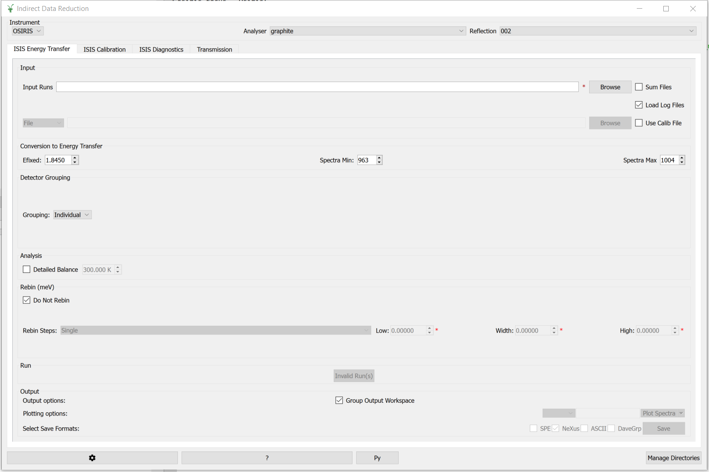

=========================
Indirect Geometry Changes
=========================

.. contents:: Table of Contents
   :local:

New Features
------------
- A few unused options such as ``Scale factor by`` have been removed from the :ref:`ISIS Energy Transfer tab <ISISEnergyTransfer>`.
- Based on the selected instrument, only relevant options are now shown on the :ref:`ISIS Energy Transfer tab <ISISEnergyTransfer>`.

- The ``Plot Contour`` option in the external plot options has been replaced with an option to ``Open Slice Viewer`` for the result workspace.

Bugfixes
--------
- The :ref:`Indirect Diffraction <interface-indirect-diffraction>` interface will only use the 'bank' component for manual grouping if it exists, otherwise it will use 'diffraction'.
- Fixed a crash in the :ref:`QECoverage <QE Coverage>` tool.
- Replaced multiple pop-up windows with logger warnings in the :ref:`QECoverage <QE Coverage>` tool when invalid input is passed to Ei and Emin (and S2 in the case of HYSPEC).
- Fixed a bug where the ``Run`` and ``Output Options`` appeared squished on Indirect interfaces.

Algorithms
----------

Bugfixes
############
- An intermediate wrapper algorithm called ``ISISIndirectEnergyTransferWrapper`` algorithm has been removed. The :ref:`Data Reduction <interface-indirect-data-reduction>` interface now calls the :ref:`ISISIndirectEnergyTransfer <algm-ISISIndirectEnergyTransfer>` algorithm directly.

:ref:`Release 6.9.0 <v6.9.0>`