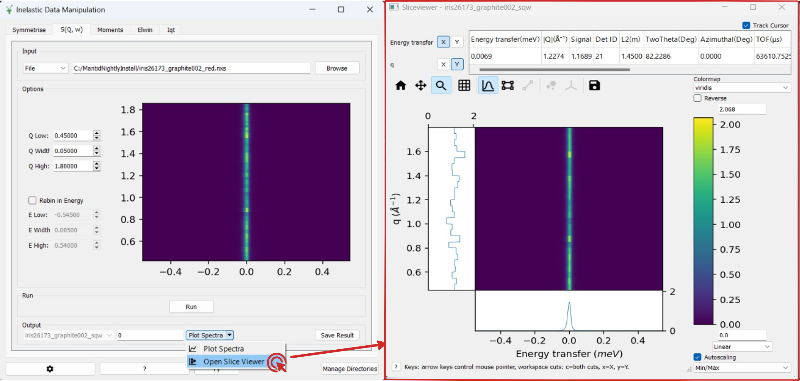

=================
Inelastic Changes
=================

.. contents:: Table of Contents
   :local:

New Features
------------
- The :ref:`Interface Settings <inelastic-interface-settings>` has a new advanced option called ``Developer Feature Flags``. When developing a large new feature, developers will create a flag that can be used by advanced software users for purposes of rapid prototyping and allowing a faster feedback loop.
- Moved the :ref:`Corrections <interface-inelastic-corrections>` interface from the Indirect interface category into the Inelastic interface category.
- Moved the :ref:`Bayes fitting <interface-inelastic-bayes-fitting>` interface from the Indirect interface category into the Inelastic interface category.
- Moved the :ref:`Data Analysis <interface-inelastic-qens-fitting>` interface from the Indirect and Direct interface categories into the Inelastic interface category.
- An estimate for the ``Amplitude`` and ``Height`` parameters is now calculated when a fit function is selected in the :ref:`Data Analysis interface <interface-inelastic-qens-fitting>` ``ConvFit`` tab. The estimate is taken to be the maximum value in the corresponding spectrum.
- An estimate for the ``FWHM`` parameter is now calculated when a fit function is selected in the :ref:`Data Analysis interface <interface-inelastic-qens-fitting>` ``ConvFit`` tab. The estimate is taken to be two times the difference between the peak centre and the x value at which the first half-maximum y value in a spectrum is located.
- The :ref:`Symmetrise tab <inelastic-symmetrise>` in the :ref:`Data Manipulation interface <interface-inelastic-data-processor>` has been modified with better input data validation. Selection markers can now be moved to the negative region upon changing the ``ReflectType`` property, and when the central marker is fixed.
- The ``Plot Contour`` option in the external plot options has been replaced with an option to ``Open Slice Viewer`` for the result workspace.

Bugfixes
--------
- Fixed an error when loading data into the ``IqtFit`` and ``ConvFit`` tabs after selecting a fit function and changing the plotted spectrum.
- Fixed a crash caused by clicking ``Run`` on the :ref:`Apply Absorption Corrections <apply_absorp_correct>` tab in the :ref:`Corrections interface <interface-inelastic-corrections>` when the corrections workspace is not a GroupWorkspace.
- Fixed a bug where the :ref:`Apply Absorption Corrections <apply_absorp_correct>` tab would not load a *_Corrections* file if it only contained a single correction component.
- The WorkspaceIndex attribute for a Q dependent function in the :ref:`Data Analysis interface <interface-inelastic-qens-fitting>` is now disabled when it is unused.
- The ``StartX`` and ``EndX`` columns of the :ref:`Data Analysis interface <interface-inelastic-qens-fitting>` tabs are now formatted to six decimal places, and validated.
- The sample shape is now used in the name of workspaces generated by the Calculate Monte Carlo Absorption tab in the :ref:`Corrections interface <interface-inelastic-corrections>`.
- Fixed a bug where the contour plot limits in the :ref:`S(Q,w) tab <inelastic-sqw>` in the :ref:`Data Manipulation Interface <interface-inelastic-data-processor>` did not update when loading consecutive files.
- The available fit functions in the :ref:`Data Analysis <interface-inelastic-qens-fitting>` ``FqFit`` tab changes depending on whether a WIDTH or EISF parameter is being analysed.
- The full fit function names are now used in the :ref:`Data Analysis <interface-inelastic-qens-fitting>` ``ConvFit`` tab to avoid confusion with similarly named functions.
- The ``Plot Current Preview`` and Sample Environment options in the :ref:`Data Manipulation <interface-inelastic-data-processor>` ``Elwin`` tab have been moved above the ``Run`` button.
- Added a missing import line in the :ref:`BayesStretch <algm-BayesStretch>` algorithm for checking installed packages on pip.
- Fixed an issue in the :ref:`Quasi <algm-BayesQuasi2>` algorithm where the algorithm wouldn't accept *_red* files as resolution files when using the QSE option.
- Fixed a bug in the :ref:`Elwin Tab <elwin>` where the integration and background limits would not updated correctly using the Instrument Parameter File.
- Fixed a bug where the ``Run`` and ``Output Options`` appeared squished on Indirect interfaces.

Algorithms
----------

Bugfixes
############
- Fixed a bug in the :ref:`VesuvioCalculateGammaBackground <algm-VesuvioCalculateGammaBackground>` algorithm that meant the order of the output spectra was not guaranteed. This largely affected instances of Mantid on linux machines.

:ref:`Release 6.9.0 <v6.9.0>`
