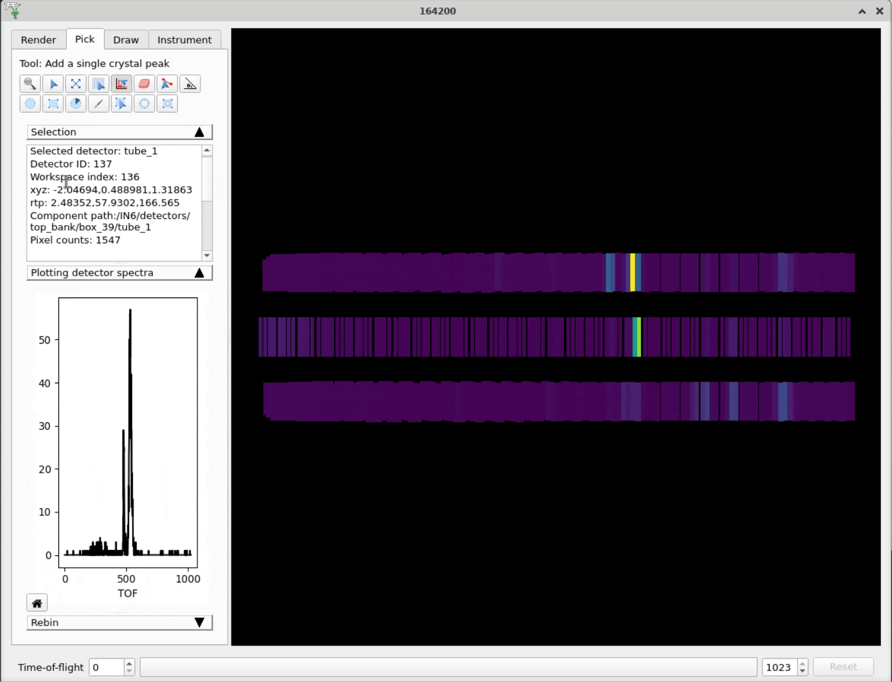

========================
Mantid Workbench Changes
========================

.. contents:: Table of Contents
   :local:

New Features
------------
- Added extra tooltip for ISIS Linux users to help out anybody on IDAaaS who has not mounted the archive. This is due to a change in early 2024 that will require users to mount the archive on IDAaaS themselves using their federal ID.
- Added new options in the plot settings which let users set default X and Y ranges for spectra plots, effectively zooming in on open.
- Editing a plot's title will now automatically update its name in the plot selector (and vice versa).
- Monitor for external changes to script files that are open in Mantid to prevent loss of work.
- An email is now required to submit an error report.
- Project recovery performance has been improved by saving one python file for all workspaces, rather than one python file per workspace.

Bugfixes
--------
- Fixed a bug that caused surface plots to hang and/or crash after changing properties such as axis labels or colour bar limits.
- Home button on a 3D plot will now reset the view to the default view.
- Fixed a bug where Workbench can hang if you close a plot while an algorithm is processing.
- Fixed a bug where the y axis in the superplot window did not scale immediately when selecting the "Normalise by max" option.
- Improved the behaviour of the load dialog with event workspaces so that it doesn't expand off the bottom of the screen.
- Fixed a bug where overplotting group workspaces would cause an unhandled exception.
- Fixed a bug where dragging a plot's legend could cause the plot to resize.
- Fixed a bug where double clicking a 3D plot to edit an axis label would grab hold of the plot for rotation and not release when the dialog was closed.
- Line Colour selection button is re-enabled in the toolbar of contour plots.
- Fixed a crash which could happen if workspaces are deleted while the project saves. Save now fails in a controlled way.
- Fixed an unhandled exception thrown when attempting to remove a curve from a plot that has a badly formatted label.
- Fixed a bug where it was not possible to remove the grid lines on a plot once they had been added.
- The splash screen will no longer stay on top of every window.
- Fixed a bug that made the Settings window disappear behind the Workbench window on Linux when opening the font selection menu.
- Fixed a bug where a 3D plot would shrink every time you changed a property of the colorbar.
- Fixed an issue when displaying large array properties in the sample logs viewer.
- Fixed a bug where fixed properties in the fitting view could not be un-fixed.
- Fixed an error in the plot script generated for 1D MDHisto workspace plots.
- Fixed a bug with ``plotSpectrum`` where quickly over-plotting could cause Workbench to hang.
- Mantid's package size has been reduced by removing the algorithm dialog screenshots from the documentation.
- Fixed a crash which could occur when opening a file with unicode characters.
- Fixed a bug where changing waterfall x and y offsets would not update the plot axes limits.
- Fixed a bug where double clicking a plot to open the settings dialog would not end a pan/zoom event if either tool was selected.
- Fixed a crash when opening the :ref:`Rebin <algm-Rebin>` algorithm dialog when a group workspace is selected as the input workspace.
- Fixed a bug in the plot settings axes tab where editing an axis title and clicking ``Apply to all`` would clear your changes. The UI has been slightly reworked to make it clearer what ``Apply to all`` interacts with.
- Fixed a crash that could occur when an editor tab was closed while executing.
- Fixed a crash from setting both waterfall plot offsets to 0.
- Fixed a bug that could result in the running of a stale version of a project recovery script.

InstrumentViewer
----------------

New features
############
- Widgets in the collapsible stack in the Pick tab are now resizable so users can change the height of the plot relative to the height of the info box.

Bugfixes
############
- Fixed an intermittent crash caused by a project recovery save happening while the :ref:`Instrument Viewer <InstrumentViewer>` was opening.
- Fixed a problem where spurious peaks could be added when picking single peaks.

SliceViewer
-----------

Bugfixes
############
- Fixed an intermittent error when reopening :ref:`SliceViewer <sliceviewer>` after a change in support for non-orthogonal axes.
- Fixed an error when exporting 'y' cuts for event workspaces in line plot and ROI modes.
- Fixed a bug in the cut viewer where the plot would not update after changing plot settings until the window had been resized.
- Fixed a layout bug when toggling the peaks overlays interface on/off.
- Fixed a bug where adding peaks was not taking into account the projection matrix when calculating HKL.
- Fixed a memory leak in the colour bar.
- Fixed a bug where the spin box showed an incorrect value when a peak was selected that was outside the range of the data.
- Fixed an error when trying to click on the 2D plot after the ``Add Peak`` option is selected, but the peaks workspace has already been deleted.

:ref:`Release 6.9.0 <v6.9.0>`
