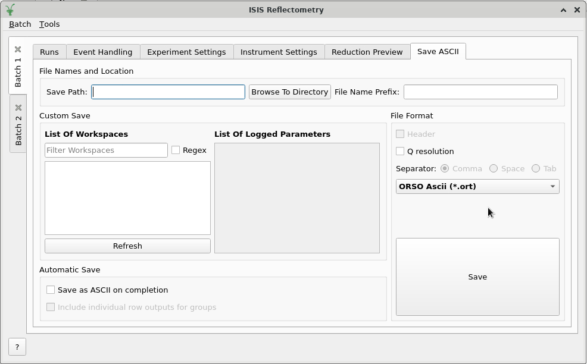

=====================
Reflectometry Changes
=====================

.. contents:: Table of Contents
   :local:

New Features
------------
- Algorithm :ref:`algm-SaveISISReflectometryORSO` has been added to allow reduced Reflectometry data from experiments at the ISIS facility to be saved into the ORSO ASCII format.

Bugfixes
--------
- Fixed a bug where live data reduction via the :ref:`ISIS Reflectometry Interface <interface-isis-refl>` would not work if ROI Detector IDs had been specified in the interface.
- Made it possible to provide a negative ``dQ/Q`` value on the Experiment Settings and Runs tab of the
  :ref:`ISIS Reflectometry Interface <interface-isis-refl>` to indicate that linear binning should be performed.
- Fixed a regression introduced in Mantid version 6.8 where creating new batch tabs or deleting all batch tabs in the :ref:`ISIS Reflectometry Interface <interface-isis-refl>` causes Mantid to crash.
- Fixed a crash that would occur if invalid inputs were given in the options column of the Runs Table in the
  :ref:`ISIS Reflectometry Interface <interface-isis-refl>`.
- Fixed a bug with live data on OFFSPEC where the alternative method for looking up the vertical gap for slit 2 in :ref:`algm-ReflectometryReductionOneLiveData` was incorrectly returning the vertical gap for slit 1.
- Fixed a crash that would occur when trying to save a batch to an invalid location.

:ref:`Release 6.9.0 <v6.9.0>`